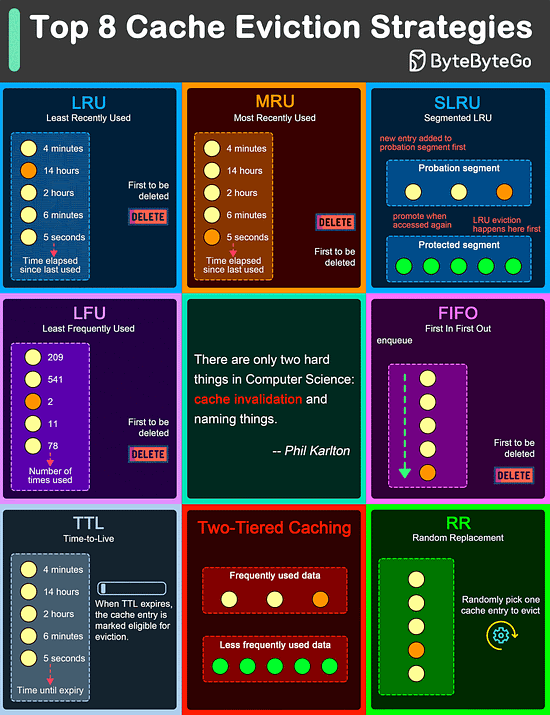

# Cache Eviction Strategy Comparison

| Strategy         | Best Use Case                       | Space Overhead       | Time Complexity       | Pros                                      | Cons                                      | Key Takeaway                              |
|------------------|-------------------------------------|----------------------|-----------------------|------------------------------------------|------------------------------------------|------------------------------------------|
| FIFO (First-In-First-Out) | - Sequential access patterns - When age of entry matters - Batch processing systems | Low - Queue: O(n) - Hash set for tracking | - Add: O(1) - Remove: O(1) - Access: O(1) | - Simple to implement - Low overhead - Predictable behavior - Good scan-resistance | - No consideration for usage frequency - Can evict commonly used items - No adaptation to changing access patterns | Best for workloads with uniform access or where recency of data is more important than frequency |
| LIFO (Last-In-First-Out) | - Short-lived temporary data - Stack-based computations - Navigation history | Low - Stack: O(n) - Hash set for tracking | - Add: O(1) - Remove: O(1) - Access: O(1) | - Simple to implement - Very low overhead - Works well for temporary data | - Terrible locality properties - Can quickly evict useful data - No consideration for usage patterns | Only suitable for very specific use cases where newest items are least valuable |
| LRU (Least Recently Used) | - General-purpose caching - Systems with temporal locality - Database buffer pools | Medium - Doubly linked list: O(n) - HashMap for O(1) lookup | - Add: O(1) - Remove: O(1) - Access: O(1) | - Adapts to changing access patterns - Respects temporal locality - Well-balanced performance - Intuitive behavior | - Does not consider access frequency - Vulnerable to scan pollution - Movement on each access | The most widely used strategy for general caching needs due to good balance of complexity and effectiveness |
| LFU (Least Frequently Used) | - Static content caching - Read-heavy workloads - Pattern recognition systems | High - Frequency counter for each key - Multiple data structures | - Add: O(1) - Remove: O(1) - Access: O(log n) or O(1) with optimization | - Excellent for stable access patterns - Less vulnerable to cache pollution - Maintains hot items longer | - Slow to adapt to changing patterns - Complex implementation - Historical frequency can dominate | Best for workloads where access frequency is more important than recency, like content delivery networks |
| Random           | - Large-scale distributed caches - Systems where eviction speed matters most - When simplicity is preferred over optimization | Very Low - Just a hash set for keys | - Add: O(1) - Remove: O(1) - Access: O(1) - Eviction: O(1) | - Extremely simple implementation - No algorithm bias - Good performance at scale | - No intelligence in eviction choices - Unpredictable behavior - May evict important items | Surprisingly effective in large-scale systems where the law of large numbers provides statistical fairness |
| Time-Based       | - Data with well-defined lifespans - Credentials and authentication - Tokens - Regulatory compliance requirements | Medium - Expiration timestamps - Sorted time index | - Add: O(log n) - Remove: O(log n) - Access: O(1) + check | - Self-cleaning - Clear data lifecycle - Easy to reason about - Compliance friendly | - Requires periodic cleanup - No adaptation to usage patterns - May evict useful data prematurely | Best when data has natural expiration requirements, independent of access patterns |
| Size-Based       | - Multimedia caching - Variable-sized objects - Memory-constrained environments | Variable - Size tracking per item - Sorted size index | - Add: O(log n) - Remove: O(log n) - Access: O(1) | - Efficient space utilization - Prevents single large items from dominating - Better memory management | - Items over few large ones - Complex size calculation - Overhead of tracking sizes | Ideal for caches storing variable-sized objects where memory footprint is a primary constraint |
| Priority-Based   | - Multi-tenant systems - Quality-of-service requirements - Business-critical applications | Medium - High - Priority value per item - Sorted priority index | - Add: O(log n) - Remove: O(log n) - Access: O(1) | - Business logic can drive caching - Flexible prioritization - Can incorporate multiple factors | - Manual priority assignment complexity - May require application-specific logic - Difficult to automate | Best when different cache entries have clearly differentiated importance levels based on business requirements |
| TinyLFU / W-TinyLFU | - Modern, high-performance caches - Systems needing both recency and frequency - Scan-resistant applications | Medium - Frequency sketches - Window tracking | - Add: O(1) - Remove: O(1) - Access: O(1) | - Excellent scan resistance - Balances recency and frequency - Low overhead frequency counting - Adaptive to changing patterns | - More complex implementation - Requires tuning window sizes - Probabilistic nature | State-of-the-art approach that combines the best aspects of LRU and LFU with overhead lower than advanced strategies |
| ARC (Adaptive Replacement Cache) | - Database systems - Performance-critical applications | High - Maintains four separate lists | - Add: O(1) - Remove: O(1) - Access: O(1) | - Self-tuning - Balances recency and frequency - Scan-resistant - Adapts to workload changes | - Complex implementation - Higher memory overhead - Patent encumbered (historically) | Advanced strategy that dynamically adjusts between recency and frequency based on workload patterns |
| Clock / Second Chance | - Operating systems - Virtual memory management - Simplified LRU approximation | Low - Single bit per entry - Circular buffer structure | - Add: O(1) - Remove: O(1) - Access: O(1) | - Approximates LRU with lower overhead - No list reorganization on access - Simple and efficient | - Less precise than true LRU - May require multiple passes to find candidate - Limited adaptability | Excellent compromise between implementation simplicity and effectiveness when true LRU would be too expensive |

# Additional Considerations for Strategy Selection

## Workload Characteristics
- **Read-heavy vs. Write-heavy:** LRU works better for read-heavy workloads, while FIFO might be better for write-heavy scenarios
- **Scan Resistance:** LFU, TinyLFU, and ARC provide better resistance to scanning operations that could pollute the cache
- **Temporal Locality:** LRU works best when recently accessed items are likely to be accessed again soon

## System Constraints
- **Memory Constraints:** Size-based strategies become critical when memory is limited
- **Processing Overhead:** Random and CLOCK strategies minimize CPU usage for eviction decisions
- **Implementation Complexity:** FIFO and Random are easiest to implement; ARC and TinyLFU are most complex

## Advanced Hybrid Strategies
- Many modern systems combine multiple strategies:
  - **Segmented LRU:** Divides cache into multiple segments with different policies
  - **Multi-Queue:** Uses multiple queues with different priorities and policies
  - **W-TinyLFU:** Combines a small window cache (for bursty access) with a frequency-based main cache

## Metrics for Evaluating Cache Effectiveness
- **Hit Ratio:** Percentage of requests served from cache
- **Latency:** Time to retrieve items from cache
- **Throughput:** Number of requests served per time unit
- **Space Amplification:** Extra memory used by the caching mechanism beyond the cached data itself
- **CPU Utilization:** Processing overhead of the caching algorithm

# Executive Summary
- **FIFO:** Ideal for simple, predictable systems where recency trumps frequency, but lacks adaptability.
- **LIFO:** Best for temporary stacks or navigation, though it ignores usage patterns entirely.
- **LRU:** Versatile for general caching with temporal locality, though vulnerable to scan pollution.
- **LFU:** Excels in stable, frequency-driven workloads but struggles with dynamic patterns.
- **Random:** Great for large-scale simplicity, yet lacks intelligence in evictions.
- **Time-Based:** Perfect for expiring data like tokens, requiring periodic cleanup.
- **Size-Based:** Optimizes memory-constrained caches but adds size-tracking overhead.
- **Priority-Based:** Suits business-critical needs with manual tuning challenges.
- **TinyLFU/W-TinyLFU:** Balances recency and frequency with low overhead, ideal for modern caches.
- **ARC:** Dynamically adapts to workloads but incurs higher complexity.
- **Clock/Second Chance:** Lightweight LRU approximation, less precise but efficient.

# Definitions & Terminology
- **Cache:** Temporary storage to speed up data access.
- **Hit/Miss:** Successful/failed retrieval from cache.
- **TTL:** Time-to-live, expiration duration for cache entries.
- **Cold/Warm Cache:** Initially empty vs. pre-warmed cache state.
- **Eviction:** Removing items from cache when full.
- **Recency vs Frequency:** Prioritizing recently used vs. often used items.

# When to Use Which Strategy
- **Read-heavy:** LRU, TinyLFU.
- **Write-heavy:** FIFO.
- **Scan-prone:** LFU, ARC, TinyLFU.
- **Temporal locality:** LRU, Clock.
- **Frequency-driven:** LFU, W-TinyLFU.
- **Expiring data:** Time-Based.
- **Memory-constrained:** Size-Based.
- **Business-critical:** Priority-Based.

# Metrics & Evaluation
- **Hit Ratio:** % of cache hits.
- **Miss Penalty:** Delay on cache miss.
- **Latency:** Retrieval time.
- **Throughput:** Requests per unit time.
- **Memory Overhead:** Extra space used.
- **CPU Cost:** Processing overhead.

# Complexity & Resource Table
| Strategy         | Space Overhead       | Time Complexity       | Metadata Overhead     |
|------------------|----------------------|-----------------------|-----------------------|
| FIFO             | Low (Queue: O(n))    | O(1) all             | Hash set              |
| LIFO             | Low (Stack: O(n))    | O(1) all             | Hash set              |
| LRU              | Medium (Doubly list) | O(1) all             | HashMap, list         |
| LFU              | High (Counters)      | O(log n) or O(1)     | Frequency counters    |
| Random           | Very Low (Hash)      | O(1) all             | Hash set              |
| Time-Based       | Medium (Timestamps)  | O(log n) add/remove  | Sorted index          |
| Size-Based       | Variable (Size)      | O(log n) add/remove  | Sorted size index     |
| Priority-Based   | Medium-High (Priority) | O(log n) add/remove | Sorted priority index |
| TinyLFU          | Medium (Sketches)    | O(1) all             | Window, sketches      |
| ARC              | High (Four lists)    | O(1) all             | Multiple lists        |
| Clock            | Low (Bit per entry)  | O(1) all             | Circular buffer       |

# Worked Examples
- **LRU (Cache size 3):** [1, 2, 3, 2, 4] → Evict 1, cache [2, 3, 4].
- **LFU (Cache size 3):** [1, 2, 3, 2, 1] → Evict 3 (freq 1), cache [1(2), 2(2)].
- **TinyLFU (Cache size 3):** [1, 2, 3, 2, 1] → Window tracks recency, evict least frequent.
- **ARC (Cache size 3):** [1, 2, 3, 2, 4] → Adapts, evicts based on recency/frequency balance.
- **Clock (Cache size 3):** [1, 2, 3, 2, 4] → Second chance bit, evict unmarked 1.

# Implementation Notes & Pitfalls
- **Common Bugs:** Off-by-one errors, incorrect eviction logic.
- **Concurrency:** Use locks or atomic operations.
- **Cost of Updates:** LRU moves on access, LFU updates counters.
- **Scan Pollution:** Impacts LRU, mitigated by TinyLFU/ARC.
- **Starvation:** Priority-Based may neglect low-priority items.

# Variants & Hybrids
- **Segmented LRU:** Multiple LRU segments for priorities.
- **W-TinyLFU:** Window + frequency cache.
- **CLOCK-Pro:** Enhanced Clock with frequency.
- **Priority+LRU:** Combines business logic with recency.

# Tuning Guidelines
- **Parameters:** Cache size, window size (TinyLFU), TTL (Time-Based).
- **Measurement:** Monitor hit ratio, latency post-tune.

# Benchmarks & Testing
- **Workloads:** Read-heavy, scan-heavy traces.
- **Tools:** Cachegrind, synthetic datasets.
- **Metrics:** Hit ratio, throughput.

# Interview Questions
1. What’s the difference between LRU and LFU? (LRU: recency, LFU: frequency)
2. How does FIFO handle cache pollution? (Poorly, no adaptation)
3. Explain ARC’s adaptive nature. (Balances recency/frequency dynamically)
4. When would you use Time-Based eviction? (Expiring data like tokens)
5. What’s a drawback of Random eviction? (Unpredictable evictions)
6. How does Clock approximate LRU? (Second chance bit)
7. What’s TinyLFU’s advantage? (Scan resistance, low overhead)
8. How do you handle concurrency in LRU? (Locks or CAS)
9. What metrics evaluate cache performance? (Hit ratio, latency)
10. Why might Priority-Based be complex? (Manual tuning)

# Coding Exercises
1. **Implement LRU (Easy):** Use HashMap + DoublyLinkedList, hint: track head/tail.
2. **LFU Sketch (Medium):** Use frequency counter, hint: heap or map.
3. **CLOCK (Hard):** Circular buffer with bit, hint: rotate pointer.

# Real-world Case Studies
- **CDN:** LFU for static content.
- **DB Buffer:** LRU for temporal locality.
- **Session Store:** Time-Based for expiration.
- **Auth Tokens:** Time-Based for compliance.

# Migration & Rollout Considerations
- **Carrying:** Test on subset of traffic.
- **Metrics:** Hit ratio, latency drops.
- **Fallback:** Revert to old strategy if issues.

# Reference Implementations & Libraries
- **Caffeine:** Java, modern LRU/LFU.
- **Guava:** Java caching utilities.
- **Redis:** Configurable eviction policies.

# Glossary & Further Reading
- **Papers:** LRU paper (1976), ARC (2003).
- **Blogs:** HighScalability on caching.
- **Books:** "Cache and Memory Hierarchy Design".
