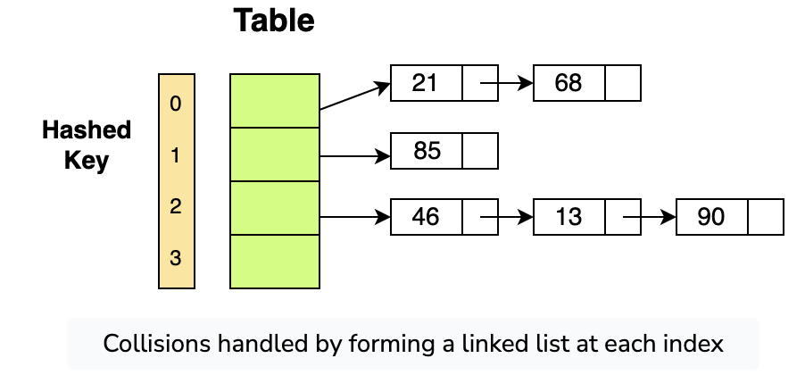

# Hash Tables

Hashing is a process used to store an object according to a unique key. This means that hashing always creates a **key-value pair**. A collection of such pairs forms a *dictionary* where every object or value can be looked up according to its key. Hence, the search operation can be performed in *O(1)*.

The concept of hashing has given birth to several new data structures, but the most prominent one is the **hash table**.

Hash tables are generally implemented by using arrays, as they provide access to elements in constant time.


## 1. Fundamentals of Hashing

### 1.1 Hash Functions

A hash function takes an item's key and returns the corresponding index in the array for that item. A good hash function will give you very few collisions.

#### Common Hash Function Techniques:

- **Arithmetic Modular**
    ```csharp
    int hashModular(int key, int size)
    {  //takes key and size of the list
        return key % size;    // return the index
    }
    ```
    The `index` will always stay between `0` and `tableSize - 1`.

- **Truncation**
    - Select a part of the key as the index rather than the whole key
    - Example: key=123456 → index=3456

- **Folding**
    - Divide the key into small chunks, and apply a different arithmetic strategy at each chunk
    - Example: key=456789, chunk=2 → index=45+67+89
- **Properties of good hash functions**
    - Deterministic: Same input always produce same output
    - Uniform distribution: Keys should be distributed evenly across buckets
    - Efficient: Fast to compute
    - Avalanche Effect:Small changes in input cause large changes in output

### 1.2 Collision Handling

Collision occurs when two keys have been assigned the same slot. When you map large keys into a small range of numbers from 0-N, where **N** is the size of the array, there is a huge possibility that two different keys may return the same index.


#### Methods to Avoid Collisions:

1. **Low Load Factor**
   - Once your load factor is greater than 0.7, it's time to resize your hash table.

2. **Good Hash Function**
   - A good hash function distributes values in the array evenly.

#### Collision Resolution Strategies:

1. **Linear Probing**
   - If your hash function returns an index that is already filled, move to the next index
   - If that index is also filled, traverse further until a free spot is found
   - Drawback: If offset isn't chosen wisely, you may end up back where you started

   

2. **Chaining**
   - Each slot holds a pointer to another data structure (linked list, tree)
   - Every entry at that index will be inserted into the linked list for that index
   - Increases performance but is costly in terms of space

   

3. **Resizing Array**
   - Set a threshold (typically 0.6 or 60% filled)
   - Once crossed, create a new table double the size of the original
   - Copy elements from the previous table
   - Reduces collisions but the resize operation itself is costly

### 1.3 Load Factor
Load factor is the ratio of number of elements in the hash table to the number of buckets.
Load factor measures how full your hash table is:

```
Load Factor = Number of items / Number of slots
```

### 1.4 Implementation Using Bucket Chaining

Hash tables are implemented using arrays. Using the chaining strategy, all elements with the same hash key will be stored in an array at that index. These arrays are called **buckets**.

The size of the hash table is set as *n***m* where *n* is the number of keys it can hold, and *m* is the number of slots each bucket contains. Each slot holds a key/value pair.


## 2. Hash Tables in Practice

### 2.1 When to Use Hash Tables

- When you need incredibly quick lookups
- When order of data is not important
- When you need frequent insertions and deletions

**Disadvantages:**
- Unordered storage
- Slow key iteration (must traverse entire memory space)
- Requires a reliable collision solution

### 2.2 Hash Table vs. Trie

| Aspect | Hash Table | Trie |
|--------|------------|------|
| Basic Operations | O(1) average, O(n) worst | O(n) usually, O(n*m) worst |
| Hash Function | Requires a smart hash function | No hash function needed |
| Order of Data | Random order | Maintains specific sequence |
| Use Case | When order doesn't matter | When order is important |

### 2.3 Time Complexity

| Operation | Average | Worst |
|-----------|---------|-------|
| Search    | O(1)    | O(n)  |
| Insertion | O(1)    | O(n)  |
| Deletion  | O(1)    | O(n)  |
| Space     | O(n)    | O(n)  |

### 2.4 Hash Table vs. Array


- Hash tables are usually faster for lookups
- With arrays, you must loop over all items to find what you're looking for
- With hash tables, you go directly to the item's location
- Insertion is faster in hash tables (hash the key and insert)
- Arrays require shifting items before insertion

### 2.5 Hash Table vs. Dictionary vs. HashSet

- **`Hashtable`**: Non-generic collection of key/value pairs
- **`Dictionary`**: Generic collection for key/value pairs
- **`HashSet`**: Container implementing the `ISet` interface
  - Stores values only (not key-value pairs)
  - Each value acts as its own key
  - Does not allow duplicate elements (unique values only)


## 4. Advanced Topic: Consistent Hashing

Consistent hashing is a distributed hashing scheme that maps **keys** (e.g., cache keys like user1) and **servers** (nodes) to a shared hash space, typically visualized as a **circular ring**. It assigns each key to the server closest to it in the ring (usually clockwise), ensuring data distribution with minimal disruption when the number of servers changes.

### 4.1 Why Use Consistent Hashing?

- **Adding/Removing Servers**: Changing N in hash(key) % N remaps most keys, causing massive data reshuffling
- **Fault Tolerance**: A server failure triggers global remapping in traditional hashing
- **Load Imbalance**: Uneven key distribution can overload some servers

### 4.2 How Consistent Hashing Works

#### 1. Hash Space and Ring
- **Hash Space**: Large, fixed range of values (e.g., 0 to 2³²-1)
- **Ring Structure**: The range visualized as a circle where highest value wraps to 0
- **Hash Function**: Maps keys and servers to points in this space (e.g., hash("user1") = 1200)

#### 2. Mapping Servers to the Ring
- Each server is assigned one or more points on the ring based on its hash
- Example with three servers:
  - ServerA: hash("ServerA") = 500
  - ServerB: hash("ServerB") = 1500
  - ServerC: hash("ServerC") = 3000

#### 3. Mapping Keys to Servers
- A key is hashed to a point on the ring
- The key is assigned to the **first server clockwise** from its hash
- Example: Key user1 (hash=1200) is assigned to ServerB (1500)

#### 4. Handling Server Changes
- **Adding a Server**: Only keys between new server and next server move
- **Removing a Server**: Only keys from that server move to next server
- In both cases, only ~1/N of keys need to move

#### 5. Virtual Nodes
- **Problem**: With few servers, key distribution can be uneven
- **Solution**: Assign each server multiple points (virtual nodes) on the ring
- **Benefits**: Better load balancing, smoother transitions

### 4.3 Advantages of Consistent Hashing

1. **Minimal Data Movement**: Only ~1/N keys remapped when servers change
2. **Dynamic Scaling**: Supports adding/removing servers with minimal disruption
3. **Fault Tolerance**: A server failure affects only its keys
4. **Load Balancing**: Virtual nodes ensure even key distribution
5. **Replication Support**: Easily store keys on multiple servers

### 4.4 Virtual Nodes in Detail

#### How They Work
- Each physical server gets multiple virtual nodes on the ring
- For N servers with 100 virtual nodes each, ring has N×100 points
- Keys map to nearest virtual node clockwise, then to physical server

#### Benefits
- **Improved Load Balancing**: More even distribution of keys
- **Smoother Scaling**: Adding/removing servers affects smaller chunks
- **Better Fault Tolerance**: Failed server's load spreads to multiple servers

#### Challenges
- **Metadata Overhead**: Storing many vnodes increases ring size
- **Configuration Complexity**: Requires coordination for vnode assignments
- **Hash Computation Cost**: Computing multiple hashes per server adds overhead

### 4.5 Comparison: Simple vs. Consistent Hashing

| **Aspect** | **Simple Hashing (hash % N)** | **Consistent Hashing** |
|------------|-------------------------------|------------------------|
| Data Movement | ~100% keys remap when adding/removing a server | ~1/N keys remap |
| Scalability | Poor due to massive reshuffling | Excellent with minimal disruption |
| Fault Tolerance | Poor: failure remaps all keys | Good: failure affects ~1/N keys |
| Load Balancing | Uneven distribution possible | Even with virtual nodes |
| Replication | Complex implementation | Simple: store on next N servers |
| Complexity | Simple to implement | Moderate complexity |
| Use Case | Static systems | Dynamic systems (caches, databases) |


- Advantages
    1. **Minimal Data Movement (Scalability)**:
        - When a server is added or removed, only ~1/N keys are remapped (e.g., ~10% for 10 servers).
        - Contrast with simple hashing: ~100% of keys remap, causing massive network I/O and cache misses.
        - Example: For a cache with 1M keys, adding a server moves ~100K keys vs. 1M with simple hashing.
    2. **Dynamic Scaling (Scalability)**:
        - Supports adding/removing servers with minimal disruption, ideal for dynamic workloads (e.g., traffic spikes during a viral Instagram post).
        - Example: Scaling from 10 to 11 servers to handle 10M to 11M events/s moves only ~10% of keys, keeping latency low.
    3. **Fault Tolerance**:
        - A server failure affects only its keys, which shift to the next server clockwise.
        - Example: If one of 10 servers fails, ~10% of keys move, and replicas (if used) prevent data loss.
        - Contrast with simple hashing: A failure remaps all keys, causing widespread cache misses.
    4. **Load Balancing**:
        - Virtual nodes ensure even key distribution, preventing hot spots (overloaded servers).
        - Example: With 100 virtual nodes/server, a 10-server cache distributes 1M keys as ~100K/server, vs. simple hashing where one server might get 50%.
    5. **Replication Support**:
        - Easily store keys on multiple servers (e.g., next N servers clockwise) for redundancy.
        - Example: user1 on ServerB (primary), ServerC (replica) ensures availability if ServerB fails.

    ---

- Virtual nodes

    **Virtual nodes** (or vnodes) are a critical enhancement to consistent hashing, addressing load balancing and scalability challenges. Let’s explore their mechanics, benefits, trade-offs, and practical considerations in detail.

    - In basic consistent hashing, each server occupies one point on the hash ring (e.g., ServerA at 500).
    - Virtual nodes assign **multiple ring positions** to each physical server (e.g., ServerA at 500, 510, 520, ..., for 100 vnodes).
    - Each virtual node is treated as a distinct point on the ring but maps to the same physical server.
    - Example: With 3 servers and 100 vnodes each, the ring has 300 points, making key distribution finer-grained.
    - Mechanic

        **Assignment**

        - For each server, generate N virtual node IDs (e.g., ServerA-v0, ServerA-v1, ..., ServerA-v99).
        - Hash each ID to a ring position (e.g., hash("ServerA-v0") = 500, hash("ServerA-v1") = 510).
        - Store in the ring: {500: ServerA, 510: ServerA, ..., 1500: ServerB, ...}.

        **Key Mapping**

        - A key’s hash (e.g., 1200) maps to the next virtual node clockwise (e.g., ServerB-v10 at 1500).
        - The physical server (ServerB) handles the key.

        **Server Changes**

        - **Add Server**: New server’s vnodes (e.g., ServerD-v0 to ServerD-v99) split existing ranges, moving ~1/N keys.
        - **Remove Server**: Its vnodes are removed, and keys shift to the next server’s vnodes.
    - Why

        **Improved Load Balancing**

        - **Without Vnodes**: With 3 servers, one might cover a large ring range (e.g., 500–3000), getting 60% of keys, while others get 20% each.
        - **With Vnodes**: 100 vnodes/server (300 total points) spreads keys evenly, approximating ~33% per server.
        - **Example**: For 1M keys, each of 3 servers gets ~333K keys (vs. 600K/200K/200K without vnodes).
        - **Impact**: Prevents hot spots, ensuring each server handles ~1M events/s in a 10M events/s system.

        **Smoother Scaling**

        - More vnodes mean smaller ring segments, so adding/removing a server affects fewer keys per segment.
        - Example: With 3 servers and 300 vnodes, adding a 4th server moves ~1/4 of keys (~250K of 1M), but each move is small (e.g., 1K keys per vnode), reducing latency spikes.
        - **Impact**: Minimizes reshuffling, supporting dynamic scaling (e.g., adding servers during a traffic spike).

        **Better Fault Tolerance**

        - A server failure redistributes its vnodes to multiple other servers, not just one, spreading the load.
        - Example: If ServerB (100 vnodes) fails, its ~333K keys spread across ServerA and ServerC’s vnodes, not all to ServerC.
        - **Impact**: Isolates failures, maintaining performance during outages.
    - Challenges

        **Metadata Overhead**

        - Storing 100 vnodes/server increases ring size (e.g., 1000 entries for 10 servers).
        - **Impact**: Higher memory usage for the SortedDictionary (e.g., ~MBs for 1000 vnodes).
        - **Mitigation**: Use compact data structures or limit vnodes (e.g., 50–200).

        **Configuration Complexity**

        - Managing vnode assignments requires coordination (e.g., via ZooKeeper).
        - **Mitigation**: Automate via cluster management tools (e.g., Redis Cluster’s slot mapping).

        **Hash Computation Cost**

        - Computing hashes for N vnodes per server adds initialization time.
        - **Impact**: Negligible for runtime performance but noticeable during startup.
        - **Mitigation**: Precompute or cache hashes.

| **Aspect** | **Simple Hashing (hash % N)** | **Consistent Hashing** |
| --- | --- | --- |
| **Data Movement** | ~100% keys remap when adding/removing a server. | ~1/N keys remap (e.g., ~10% for 10 servers). |
| **Scalability** | Poor: Massive reshuffling disrupts operations. | Excellent: Minimal disruption during scaling. |
| **Fault Tolerance** | Poor: Failure remaps all keys, causing misses. | Good: Failure affects only ~1/N keys. |
| **Load Balancing** | Uneven: Modulo can cluster keys on few servers. | Even: Virtual nodes ensure balanced load. |
| **Replication** | Complex: Remapping affects all replicas. | Simple: Store on next N servers clockwise. |
| **Complexity** | Simple: Easy to implement. | Moderate: Requires ring and virtual nodes. |
| **Use Case** | Static systems with fixed servers. | Dynamic systems (e.g., caches, databases). |

---
