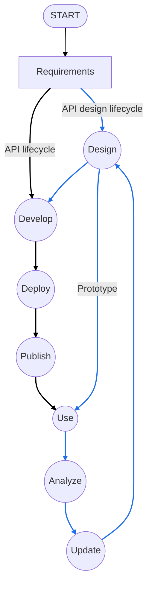
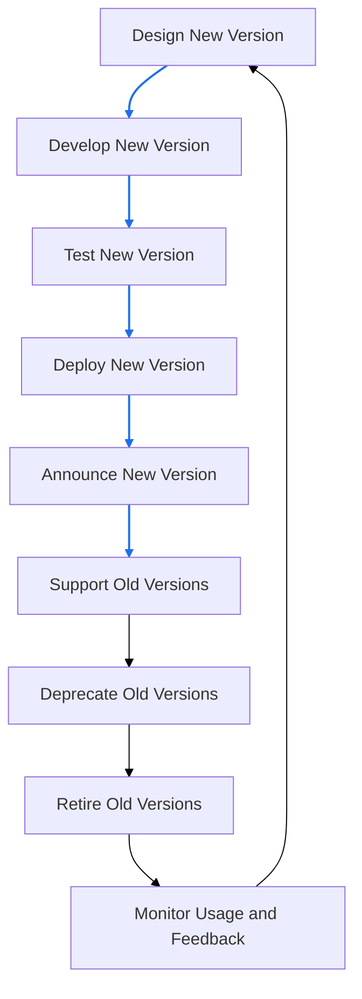

# API (Application Programming Interface)
An API (Application Programming Interface) is a set of rules and protocols that allows different software applications to communicate with each other. APIs define the methods and data formats that applications can use to request and exchange information.

## Introduction
### API Design
API design is carefully planning, preparing, and developing programming interfaces (APIs) to expose data and the system’s functionality to consumers. APIs enable system-to-system communication and are essential for digital organizations because they add new capabilities to their products, operations, partnership strategies, and more. An effective API design is one that has satisfactory answers to the following queries of a developer:

    - Why is the API being developed?
    - What would be the outcome regarding the impact and output of the system?
    - How will the API be designed to meet the requirements?
    - What will be the structure of our resources?
    - How will we document our resources?

#### Types of APIs

| API type     | Authentication type                                              | Potential users                                            | Examples                                 |
|--------------|------------------------------------------------------------------|------------------------------------------------------------|------------------------------------------|
| Public APIs  | Publicly accessible with API keys                                 | B2C (business-to-consumer)                                 | Google Maps, Weather APIs                |
| Private APIs | No authentication                                                 | B2B (business-to-business), B2C, B2E (business-to-employee)| Educative APIs for creating courses      |
| Partner APIs | Authorized access with access tokens/license                      | B2B, B2C                                                  | Amazon APIs for partners                 |
| Composite APIs | Depends on the connected API's authentication                   | B2B, B2C, B2E                                             | Payment APIs (Stripe, PayPal)            |

#### API design lifecycle

#### API design considerations
- **Identify user types**
    - Partners, customers, external developers
    - Determines access levels, authentication, and architectural style (REST, gRPC, etc.)

- **Developer problems & business value**
    - Address needs based on business relationship and critical requirements
    - Value addition: improved revenue, task speed, cost efficiency

- **API responses & error handling**
    - Clearly define success and error responses for endpoints
    - Implement robust exception and error handling

- **Real-life use cases & testability**
    - Apply practical scenarios to validate effectiveness
    - Analyze performance under various use cases

- **Scalability**
    - Design for future growth and increased customer demand

- **Documentation**
    - Provide comprehensive guides for integration, behaviors, structures, and parameters

#### Characteristics of a good API design

| Characteristics                                   | Explanation                                                                                                                                                                                                                           |
|---------------------------------------------------|---------------------------------------------------------------------------------------------------------------------------------------------------------------------------------------------------------------------------------------|
| Separation between API specification and its implementation | • Includes separation between the specification and its implementation, that is, the behavior with the internal structural details   • Clean designs allow iterative improvements and changes to the API implementation             |
| Concurrency                                       | • Amount of API calls that can be active simultaneously in a specified period   • Useful in ensuring that computing resources are available for all users                                                                          |
| Dynamic rate-limiting                             | • Strategy to limit access to API within a timeframe   • Avoids overwhelming the API with an onslaught of requests                                                                          |
| Security                                          | • Well-defined security mechanisms for authentication and authorization protocols that will define who can access the API and what parts of the API they can access                             |
| Error warnings and handling                       | • Allows error handling effectively to prevent frustration on the consumer end   • Reduces debugging efforts for developers                                                                 |
| Architectural styles of an API                    | • Possible to follow different architectural styles according to its requirements                                                                                                              |
| Minimal but comprehensive and cohesive            | • API should be as terse as possible but fulfill its goals                                                                                                                                    |
| Stateless or state-bearing                        | • API functions can be stateless and/or maintain their state, but idempotency (operations that yield the same result when they are performed multiple times [Source: Wikipedia]) is a desired feature                                |
| User adoption                                     | • APIs that have good adoption often have a devoted user community that helps improve the API over many iterations                                                                             |
| Fault tolerance                                   | • Failures are inevitable, but a well-designed API can be made fault-tolerant by using mechanisms that ensure the continued operation of the API, even if some components malfunction           |
| Performance measurement                           | • There should be appropriate provisions for collecting monitoring data and early warning systems                                                                                              |

## API Security
API security is the practice of protecting APIs from malicious attacks and unauthorized access. It involves implementing various security measures to ensure that APIs are secure and reliable.

### Transport Layer Security (TLS)
Transport layer security (TLS) is a cryptographic protocol that permits safe transmission between the client and API provider. TLS ensures message authentication, encryption, and data integrity.

In a client-server communication, the server usually requests authentication from clients using sensitive credentials, like a username and password, an API key, and tokens (we’ll explore these techniques in the coming lessons). However, using TLS, the client is able to authenticate the server prior to client authentication. TLS achieves this with the help of digital certificates that a client receives directly from the server.

### Common API Security Threats

| Threat Type | Attack | Description | Impact | Attacker Motivation |
|-------------|--------|-------------|--------|-------------------|
| **Injection Attacks** | Malicious code or commands injected into API inputs (SQL injection, NoSQL injection, command injection) | Attackers exploit vulnerabilities in input validation to insert malicious code that gets executed by the API backend systems | Data breach, unauthorized data access, system compromise, data corruption, complete system takeover | Financial gain through data theft, corporate espionage, system disruption, or establishing persistent access for future attacks |
| **Cross-Site Scripting (XSS)** | Malicious scripts injected into web pages or API responses that execute in users' browsers | Attackers inject client-side scripts through API endpoints that return user-generated content or inadequately sanitized data | Session hijacking, credential theft, unauthorized actions on behalf of users, malware distribution, defacement | Identity theft, session stealing for unauthorized access, spreading malware, or damaging brand reputation |
| **Cross-Site Request Forgery (CSRF)** | Tricking authenticated users into making unwanted requests to the API without their knowledge | Attackers craft malicious requests that appear to come from legitimate users, exploiting the user's existing authentication session | Unauthorized transactions, data modification, account takeover, privilege escalation, financial loss | Financial fraud, unauthorized data manipulation, account compromise, or performing actions that benefit the attacker |
| **Broken Authentication and Authorization** | Exploiting weak authentication mechanisms, session management flaws, or authorization bypass vulnerabilities | Attackers target poorly implemented authentication systems, weak passwords, session fixation, or inadequate access controls | Unauthorized API access, privilege escalation, data breach, account takeover, complete system compromise | Gaining elevated privileges, accessing sensitive data, bypassing security controls, or establishing long-term unauthorized access |
| **Data Exposure** | Unauthorized access to sensitive information through inadequate data protection or over-permissive API responses | APIs inadvertently expose sensitive data through verbose error messages, excessive data in responses, or insufficient access controls | Privacy violations, regulatory compliance breaches, identity theft, competitive intelligence loss, legal liability | Selling personal data, competitive advantage, regulatory exploitation, blackmail, or building profiles for targeted attacks |
| **Denial of Service (DoS) Attacks** | Overwhelming the API with excessive requests to exhaust resources and disrupt service availability | Attackers flood the API with a high volume of requests, exploiting resource limitations or vulnerabilities to cause service outages | Service downtime, degraded performance, resource exhaustion, loss of customer trust, financial loss | Disrupting business operations, extortion through ransom demands, competitive sabotage, or ideological motives |
| **CORS Misconfiguration** | Exploiting improperly configured Cross-Origin Resource Sharing (CORS) policies to access restricted resources | Attackers leverage lax CORS settings to make unauthorized cross-origin requests, potentially accessing sensitive data or performing actions on behalf of users | Data leakage, unauthorized actions, session hijacking, privilege escalation | Gaining access to sensitive information, performing unauthorized operations, or exploiting user sessions for further attacks |

### Best Practices for API Security
- **Use HTTPS**: Always use HTTPS to encrypt data transmitted between the client and server.
- **Implement authentication and authorization**: Use strong authentication and authorization mechanisms to ensure that only authorized users can access the API.
- **Validate input**: Always validate input data to prevent injection attacks.
- **Use rate limiting**: Implement rate limiting to prevent abuse and denial-of-service attacks.
- **Monitor and log API activity**: Monitor and log API activity to detect and respond to security incidents.
- **Keep software up to date**: Regularly update the API and its dependencies to patch security vulnerabilities.
- **Use API gateways**: Use API gateways to manage and secure API traffic.
- **Implement CORS policies**: Use Cross-Origin Resource Sharing (CORS) policies to control which domains can access the API.
- **Encrypt sensitive data**: Encrypt sensitive data both in transit and at rest.
- **Conduct regular security assessments**: Regularly assess the security of the API to identify and address vulnerabilities.
- **Attack**: Exploiting weak authentication mechanisms, session management flaws, or authorization bypass vulnerabilities
- **Description**: Attackers target poorly implemented authentication systems, weak passwords, session fixation, or inadequate access controls
- **Impact**: Unauthorized API access, privilege escalation, data breach, account takeover, complete system compromise
- **Attacker Motivation**: Gaining elevated privileges, accessing sensitive data, bypassing security controls, or establishing long-term unauthorized access

#### Data Exposure
- **Attack**: Unauthorized access to sensitive information through inadequate data protection or over-permissive API responses
- **Description**: APIs inadvertently expose sensitive data through verbose error messages, excessive data in responses, or insufficient access controls
- **Impact**: Privacy violations, regulatory compliance breaches, identity theft, competitive intelligence loss, legal liability
- **Attacker Motivation**: Selling personal data, competitive advantage, regulatory exploitation, blackmail, or building profiles for targeted attacks

### Best Practices for API Security
- **Use HTTPS**: Always use HTTPS to encrypt data transmitted between the client and server.
- **Implement authentication and authorization**: Use strong authentication and authorization mechanisms to ensure that only authorized users can access the API.
- **Validate input**: Always validate input data to prevent injection attacks.
- **Use rate limiting**: Implement rate limiting to prevent abuse and denial-of-service attacks.
- **Monitor and log API activity**: Monitor and log API activity to detect and respond to security incidents.
- **Keep software up to date**: Regularly update the API and its dependencies to patch security vulnerabilities.
- **Use API gateways**: Use API gateways to manage and secure API traffic.
- **Implement CORS policies**: Use Cross-Origin Resource Sharing (CORS) policies to control which domains can access the API.
- **Encrypt sensitive data**: Encrypt sensitive data both in transit and at rest.
- **Conduct regular security assessments**: Regularly assess the security of the API to identify and address vulnerabilities.

## Concepts
### API versioning
API versioning is the practice of managing changes to an API over time. It allows developers to introduce new features, fix bugs, and make other changes to the API without breaking existing clients.

#### Versioning Principles
- **Backward compatibility**: New versions of the API should be backward compatible with previous versions. This means that existing clients should be able to continue using the API without any changes.
- **Deprecation policy**: A clear deprecation policy should be established to inform clients of upcoming changes and provide a timeline for when old versions will be retired.
- **Documentation**: Each version of the API should be well-documented, including information about new features, changes, and deprecations.
- **Versioning strategy**: A consistent versioning strategy should be adopted, such as semantic versioning (e.g., v1.0.0, v1.1.0, v2.0.0) or date-based versioning (e.g., 2023-01-01).
- **Communication**: Regular communication with API consumers is essential to ensure they are aware of changes and can plan accordingly.

#### Strategies for versioning APIs
- **URI versioning**: Including the version number in the URI of the API endpoint (e.g., /v1/resource).
- **Header versioning**: Including the version number in the HTTP headers of the API request (e.g., Accept: application/vnd.myapi.v1+json).
- **Query parameter versioning**: Including the version number as a query parameter in the API request (e.g., /resource?version=1).
- **Content negotiation**: Allowing clients to specify the desired version of the API through the Accept header (e.g., Accept: application/vnd.myapi.v1+json). application/vnd.myapi.v1+json).

#### API Version Lifecycle Management

### Rate limiting
Rate limiting manages API traffic by setting constraints on the number of requests or data usage clients can make within a specific timeframe. It prevents untethered access, protects API gateways from being overwhelmed, ensures fair availability for all users, and acts as a security feature against bot and DoS attacks by throttling excessive requests.
#### Characteristics & HTTP Headers
| Characteristic          | Description                                                                                      | Example HTTP Header                         |
|-------------------------|--------------------------------------------------------------------------------------------------|---------------------------------------------|
| Request Count Limit     | Maximum number of requests allowed within a specified time window.                               | `X-RateLimit-Limit: 1000`                   |
| Time Window             | The duration in which the request count limit applies (e.g., per minute, hour, day).            | `X-RateLimit-Reset: 1618886400` (epoch time)|
| Remaining Requests      | Number of requests remaining in the current time window.                                         | `X-RateLimit-Remaining: 750`                 |
| Retry-After Header      | Indicates how long the client should wait before making another request after hitting the limit.| `Retry-After: 120` (seconds)                |
| Quota Management        | Total data usage or bandwidth limits over a longer period.                                       | `X-Quota-Limit: 500MB`                       |
| Burst Control           | Allows short bursts of traffic exceeding the standard rate limit but within a defined threshold. | `X-Burst-Limit: 200`                         |
| User-Specific Limits    | Different rate limits based on user roles or subscription tiers.                                 | `X-User-RateLimit-Limit: 2000`              |
| Global vs. Endpoint-Specific Limits | Global limits apply to all endpoints, while endpoint-specific limits apply to individual endpoints.| `X-Global-RateLimit-Limit: 5000`            |

### Data fetching patterns
#### Common Data Fetching Patterns
- **Pagination**: Dividing large datasets into smaller, manageable chunks (pages) to reduce load times and improve performance. Common methods include offset-based and cursor-based pagination.
- **Filtering**: Allowing clients to specify criteria to narrow down the data returned by the API. This can be done using query parameters (e.g., ?status=active).
- **Sorting**: Enabling clients to sort data based on specific fields (e.g., ?sort=created_at&order=desc).
- **Field Selection**: Allowing clients to specify which fields they want in the response to reduce payload size (e.g., ?fields=id,name,email).
- **Batch Requests**: Allowing clients to send multiple requests in a single call to reduce the number of HTTP requests and improve efficiency.
- **Caching**: Storing frequently accessed data temporarily to reduce latency and server load. This can be implemented using HTTP caching headers (e.g., ETag, Cache-Control).
- **GraphQL**: A query language that allows clients to request exactly the data they need, reducing over-fetching and under-fetching issues common in REST APIs.
- **Webhooks**: A way for APIs to push real-time updates to clients when certain events occur, rather than requiring clients to poll for changes.

#### Considerations for Choosing Data Fetching Patterns
- **Use Case Requirements**: Understand the specific needs of your application and users.
- **Performance**: Evaluate how different patterns impact response times and server load.
- **Complexity**: Consider the complexity of implementation and maintenance.
- **Scalability**: Choose patterns that can handle growth in data volume and user base.
- **User Experience**: Aim for patterns that provide a seamless experience for end-users.

By carefully selecting and implementing appropriate data fetching patterns, you can enhance the performance, scalability, and usability of your API.

### Key API Metrics to Monitor
| Metric               | Description                                                                                     | Importance                                                                                       |
|----------------------|-------------------------------------------------------------------------------------------------|--------------------------------------------------------------------------------------------------|
| Request Rate         | The number of API requests received per unit of time (e.g., requests per second).               | Indicates API usage and helps identify traffic patterns.                                         |
| Error Rate           | The percentage of API requests that result in errors (4xx and 5xx status codes).                | Helps identify issues with the API and areas for improvement.                                    |
| Latency              | The time taken to process an API request from receipt to response.                              | Affects user experience; lower latency is generally better.                                      |
| Uptime               | The percentage of time the API is available and operational.                                    | Critical for reliability; high uptime is essential for user trust.                               |
| Throughput           | The amount of data transferred through the API over a specific period (e.g., bytes per second). | Measures the capacity of the API to handle data transfer.                                        |
| Active Users         | The number of unique users or clients interacting with the API over a given period.             | Provides insights into user engagement and growth.                                                |
| Rate Limiting Events | The number of times clients hit rate limits imposed by the API.                                 | Indicates potential abuse or high demand, helping to adjust rate limiting policies.               |
| Cache Hit Ratio      | The percentage of requests served from cache versus those requiring a full backend call.        | Higher cache hit ratios improve performance and reduce backend load.                             |
| Average Response Size| The average size of the API responses sent to clients.                                          | Helps understand data transfer efficiency and optimize payload sizes.                             |
| User Retention       | The percentage of users who continue to use the API over time.                                 | Indicates user satisfaction and the value provided by the API.                                   |

Monitoring these metrics provides valuable insights into the performance, reliability, and user experience of your API, enabling proactive management and continuous improvement.
