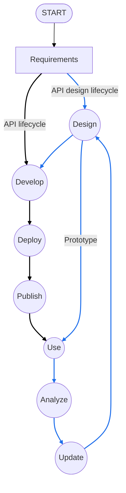
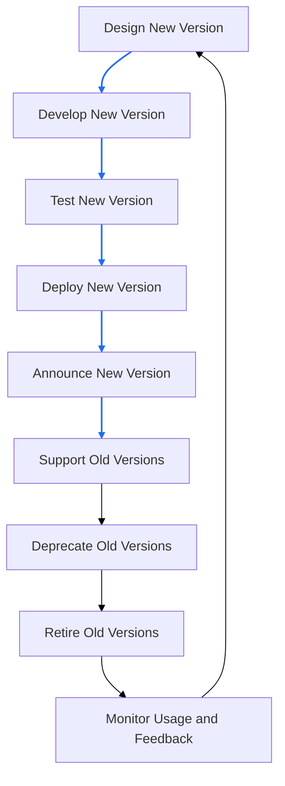
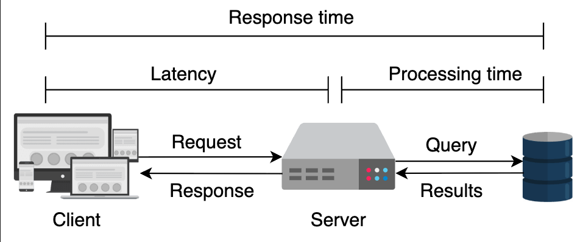
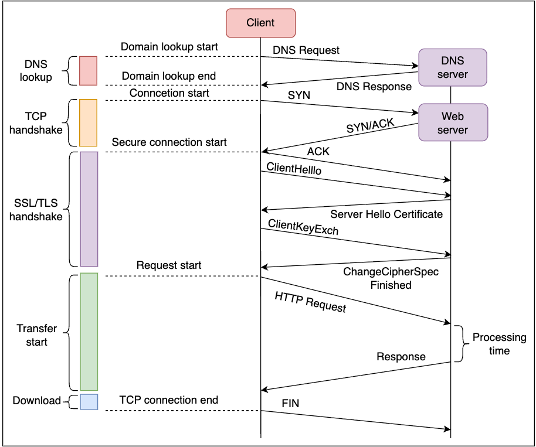

# API (Application Programming Interface)
An API (Application Programming Interface) is a set of rules and protocols that allows different software applications to communicate with each other. APIs define the methods and data formats that applications can use to request and exchange information.

## Table of Contents
- [Introduction](#introduction)
  - [API Design](#api-design)
    - [Types of APIs](#types-of-apis)
    - [API Design Lifecycle](#api-design-lifecycle)
    - [API Design Considerations](#api-design-considerations)
    - [Characteristics of a Good API Design](#characteristics-of-a-good-api-design)
  - [API Architectural Styles: REST vs GraphQL vs gRPC](#api-architectural-styles-rest-vs-graphql-vs-grpc)
    - [Comparison Table](#comparison-table)
    - [When to Choose Each Style](#when-to-choose-each-style)
- [API Security](#api-security)
  - [Transport Layer Security (TLS)](#transport-layer-security-tls)
  - [Common API Security Threats](#common-api-security-threats)
  - [Security Threat Mitigations & Checklists](#security-threat-mitigations--checklists)
  - [Best Practices for API Security](#best-practices-for-api-security)
- [Concepts](#concepts)
  - [API Versioning](#api-versioning)
  - [Rate Limiting](#rate-limiting)
  - [Data Fetching Patterns](#data-fetching-patterns)
  - [Key API Metrics to Monitor](#key-api-metrics-to-monitor)
- [Back of Envelope (BOE) Calculations](#back-of-envelope-boe-calculations)
  - [Key Performance Questions](#key-performance-questions)
  - [Core Metrics and Formulas](#core-metrics-and-formulas)
  - [Capacity Planning Calculations](#capacity-planning-calculations)
  - [Performance Optimization Strategies](#performance-optimization-strategies)
  - [Real-World Example: E-Commerce API](#real-world-example-e-commerce-api)
  - [Network Transfer Time Calculations](#network-transfer-time-calculations)
  - [Error Budget & SLA Calculations](#error-budget--sla-calculations)
  - [Cost Estimation](#cost-estimation)
  - [Geographic Distribution](#geographic-distribution)
  - [WebSocket/Real-time Connections](#websocketreal-time-connections)
  - [Key Takeaways](#key-takeaways)

## Introduction
### API Design
API design is carefully planning, preparing, and developing programming interfaces (APIs) to expose data and the system's functionality to consumers. APIs enable system-to-system communication and are essential for digital organizations because they add new capabilities to their products, operations, partnership strategies, and more. An effective API design is one that has satisfactory answers to the following queries of a developer:

- Why is the API being developed?
- What would be the outcome regarding the impact and output of the system?
- How will the API be designed to meet the requirements?
- What will be the structure of our resources?
- How will we document our resources?

#### Types of APIs

| API type     | Authentication type                                              | Potential users                                            | Examples                                 |
|--------------|------------------------------------------------------------------|------------------------------------------------------------|------------------------------------------|
| Public APIs  | Publicly accessible with API keys                                 | B2C (business-to-consumer)                                 | Google Maps, Weather APIs                |
| Private APIs | No authentication                                                 | B2B (business-to-business), B2C, B2E (business-to-employee)| Educative APIs for creating courses      |
| Partner APIs | Authorized access with access tokens/license                      | B2B, B2C                                                  | Amazon APIs for partners                 |
| Composite APIs | Depends on the connected API's authentication                   | B2B, B2C, B2E                                             | Payment APIs (Stripe, PayPal)            |

#### API design lifecycle



#### API design considerations
- **Identify user types**
    - Partners, customers, external developers
    - Determines access levels, authentication, and architectural style (REST, gRPC, etc.)

- **Developer problems & business value**
    - Address needs based on business relationship and critical requirements
    - Value addition: improved revenue, task speed, cost efficiency

- **API responses & error handling**
    - Clearly define success and error responses for endpoints
    - Implement robust exception and error handling

- **Real-life use cases & testability**
    - Apply practical scenarios to validate effectiveness
    - Analyze performance under various use cases

- **Scalability**
    - Design for future growth and increased customer demand

- **Documentation**
    - Provide comprehensive guides for integration, behaviors, structures, and parameters

#### Characteristics of a good API design

| Characteristics                                   | Explanation                                                                                                                                                                                                                           |
|---------------------------------------------------|---------------------------------------------------------------------------------------------------------------------------------------------------------------------------------------------------------------------------------------|
| Separation between API specification and its implementation | • Includes separation between the specification and its implementation, that is, the behavior with the internal structural details <br> • Clean designs allow iterative improvements and changes to the API implementation             |
| Concurrency                                       | • Amount of API calls that can be active simultaneously in a specified period <br> • Useful in ensuring that computing resources are available for all users                                                                          |
| Dynamic rate-limiting                             | • Strategy to limit access to API within a timeframe <br> • Avoids overwhelming the API with an onslaught of requests                                                                          |
| Security                                          | • Well-defined security mechanisms for authentication and authorization protocols that will define who can access the API and what parts of the API they can access                             |
| Error warnings and handling                       | • Allows error handling effectively to prevent frustration on the consumer end <br> • Reduces debugging efforts for developers                                                                 |
| Architectural styles of an API                    | • Possible to follow different architectural styles according to its requirements                                                                                                              |
| Minimal but comprehensive and cohesive            | • API should be as terse as possible but fulfill its goals                                                                                                                                    |
| Stateless or state-bearing                        | • API functions can be stateless and/or maintain their state, but idempotency (operations that yield the same result when they are performed multiple times [Source: Wikipedia]) is a desired feature                                |
| User adoption                                     | • APIs that have good adoption often have a devoted user community that helps improve the API over many iterations                                                                             |
| Fault tolerance                                   | • Failures are inevitable, but a well-designed API can be made fault-tolerant by using mechanisms that ensure the continued operation of the API, even if some components malfunction           |
| Performance measurement                           | • There should be appropriate provisions for collecting monitoring data and early warning systems                                                                                              |

### API Architectural Styles: REST vs GraphQL vs gRPC

Different API architectural styles serve different use cases. Understanding their tradeoffs helps in making informed design decisions.

#### Comparison Table

| Feature | REST | GraphQL | gRPC |
|---------|------|---------|------|
| **Protocol** | HTTP/HTTPS | HTTP/HTTPS | HTTP/2 |
| **Data Format** | JSON, XML | JSON | Protocol Buffers (binary) |
| **Data Fetching** | Fixed endpoints return fixed data | Client specifies exactly what data needed | Predefined service contracts |
| **Over-fetching** | Common (returns all fields) | Eliminated (request only needed fields) | Minimal (strongly typed contracts) |
| **Under-fetching** | Common (multiple requests needed) | Eliminated (single query for related data) | Minimal (batch operations supported) |
| **Versioning** | URL or header versioning required | Schema evolution, rarely needs versions | Backward-compatible protobuf changes |
| **Caching** | Native HTTP caching support | Complex (requires custom implementation) | Limited (requires custom implementation) |
| **Real-time** | Polling or WebSockets | Subscriptions built-in | Bidirectional streaming built-in |
| **Learning Curve** | Low | Medium | High |
| **Tooling** | Extensive, mature | Growing, good | Specialized, language-specific |
| **Performance** | Good | Good for complex queries | Excellent (binary, HTTP/2 multiplexing) |
| **Bandwidth** | Higher (text-based, verbose) | Medium (only requested data) | Lower (binary, compressed) |
| **Browser Support** | Native | Native | Limited (requires grpc-web) |
| **Mobile-Friendly** | Good | Excellent (reduces requests) | Excellent (efficient, low bandwidth) |
| **Microservices** | Good | Good for BFF pattern | Excellent for inter-service communication |
| **Public APIs** | Excellent | Good | Limited (tooling complexity) |

#### When to Choose Each Style

**Choose REST when:**
- Building public-facing APIs consumed by diverse clients
- Simplicity and widespread adoption are priorities
- You need robust HTTP caching mechanisms
- Teams have limited API expertise
- API consumers expect standard HTTP semantics
- Building CRUD operations for well-defined resources
- Integration with third-party services is important

**Example Use Cases:**
- Public APIs (Twitter API, GitHub API)
- Simple CRUD applications
- Mobile apps with standard data requirements
- Legacy system integrations

**Choose GraphQL when:**
- Clients need flexible data fetching (mobile apps, SPAs)
- Over-fetching and under-fetching are significant problems
- You have diverse client needs (web, mobile, different versions)
- Real-time features (subscriptions) are required
- Rapid frontend development without backend changes
- Building a Backend-for-Frontend (BFF) layer

**Example Use Cases:**
- Mobile applications with limited bandwidth
- Dashboards with complex, nested data requirements
- Multi-platform applications (iOS, Android, Web)
- APIs serving multiple frontend applications

**Choose gRPC when:**
- Building microservices with inter-service communication
- Performance and efficiency are critical (low latency, high throughput)
- Strong typing and contract enforcement are important
- Bidirectional streaming is needed
- Polyglot environments (multiple programming languages)
- Internal APIs not exposed to browsers

**Example Use Cases:**
- Microservices architecture communication
- Real-time streaming (IoT, live video, gaming)
- Mobile backends (efficient battery usage)
- High-performance computing
- Service mesh implementations

**Hybrid Approach:**
Many organizations use multiple styles:
- gRPC for internal microservices communication
- GraphQL as a BFF layer for client applications
- REST for public APIs and third-party integrations

## API Security
API security is the practice of protecting APIs from malicious attacks and unauthorized access. It involves implementing various security measures to ensure that APIs are secure and reliable.

### Transport Layer Security (TLS)
Transport layer security (TLS) is a cryptographic protocol that permits safe transmission between the client and API provider. TLS ensures message authentication, encryption, and data integrity.

In a client-server communication, the server usually requests authentication from clients using sensitive credentials, like a username and password, an API key, and tokens (we'll explore these techniques in the coming lessons). However, using TLS, the client is able to authenticate the server prior to client authentication. TLS achieves this with the help of digital certificates that a client receives directly from the server.

### Common API Security Threats

| Threat Type | Attack | Description | Impact | Attacker Motivation |
|-------------|--------|-------------|--------|-------------------|
| **Injection Attacks** | Malicious code or commands injected into API inputs (SQL injection, NoSQL injection, command injection) | Attackers exploit vulnerabilities in input validation to insert malicious code that gets executed by the API backend systems | Data breach, unauthorized data access, system compromise, data corruption, complete system takeover | Financial gain through data theft, corporate espionage, system disruption, or establishing persistent access for future attacks |
| **Cross-Site Scripting (XSS)** | Malicious scripts injected into web pages or API responses that execute in users' browsers | Attackers inject client-side scripts through API endpoints that return user-generated content or inadequately sanitized data | Session hijacking, credential theft, unauthorized actions on behalf of users, malware distribution, defacement | Identity theft, session stealing for unauthorized access, spreading malware, or damaging brand reputation |
| **Cross-Site Request Forgery (CSRF)** | Tricking authenticated users into making unwanted requests to the API without their knowledge | Attackers craft malicious requests that appear to come from legitimate users, exploiting the user's existing authentication session | Unauthorized transactions, data modification, account takeover, privilege escalation, financial loss | Financial fraud, unauthorized data manipulation, account compromise, or performing actions that benefit the attacker |
| **Broken Authentication and Authorization** | Exploiting weak authentication mechanisms, session management flaws, or authorization bypass vulnerabilities | Attackers target poorly implemented authentication systems, weak passwords, session fixation, or inadequate access controls | Unauthorized API access, privilege escalation, data breach, account takeover, complete system compromise | Gaining elevated privileges, accessing sensitive data, bypassing security controls, or establishing long-term unauthorized access |
| **Data Exposure** | Unauthorized access to sensitive information through inadequate data protection or over-permissive API responses | APIs inadvertently expose sensitive data through verbose error messages, excessive data in responses, or insufficient access controls | Privacy violations, regulatory compliance breaches, identity theft, competitive intelligence loss, legal liability | Selling personal data, competitive advantage, regulatory exploitation, blackmail, or building profiles fortargeted attacks |
| **Denial of Service (DoS) Attacks** | Overwhelming the API with excessive requests to exhaust resources and disrupt service availability | Attackers flood the API with a high volume of requests, exploiting resource limitations or vulnerabilities to cause service outages | Service downtime, degraded performance, resource exhaustion, loss of customer trust, financial loss | Disrupting business operations, extortion through ransom demands, competitive sabotage, or ideological motives |
| **CORS Misconfiguration** | Exploiting improperly configured Cross-Origin Resource Sharing (CORS) policies to access restricted resources | Attackers leverage lax CORS settings to make unauthorized cross-origin requests, potentially accessing sensitive data or performing actions on behalf of users | Data leakage, unauthorized actions, session hijacking, privilege escalation | Gaining access to sensitive information, performing unauthorized operations, or exploiting user sessions for further attacks |

### Security Threat Mitigations & Checklists

#### 1. Injection Attacks

**Mitigations:**
- Implement strict input validation and sanitization
- Use parameterized queries and prepared statements
- Apply principle of least privilege to database accounts
- Use ORM frameworks that handle escaping automatically
- Implement Web Application Firewall (WAF) rules
- Regular security scanning and penetration testing

**Security Checklist:**
- [ ] All user inputs are validated against whitelist patterns
- [ ] SQL queries use parameterized statements (no string concatenation)
- [ ] Input length limits are enforced
- [ ] Special characters are properly escaped
- [ ] Database accounts have minimal necessary permissions
- [ ] Error messages don't reveal system internals
- [ ] Regular expression (regex) validators are in place for structured data
- [ ] Command execution is avoided or strictly sandboxed

#### 2. Cross-Site Scripting (XSS)

**Mitigations:**
- Implement Content Security Policy (CSP) headers
- Encode all output data based on context (HTML, JavaScript, URL)
- Use HTTP-only and Secure flags on cookies
- Validate and sanitize all user-generated content
- Use modern frameworks with built-in XSS protection

**Security Checklist:**
- [ ] Content-Security-Policy header is configured (e.g., `default-src 'self'`)
- [ ] All dynamic content is HTML-encoded before rendering
- [ ] JavaScript context encoding is applied where needed
- [ ] URL parameters are properly encoded
- [ ] Cookies have HttpOnly and Secure flags set
- [ ] X-Content-Type-Options: nosniff header is set
- [ ] User-generated HTML is sanitized with trusted library
- [ ] Template engines auto-escape by default

**Example CSP Header:**
```
Content-Security-Policy: default-src 'self'; script-src 'self' 'nonce-{random}'; object-src 'none'; base-uri 'self'
```

#### 3. Cross-Site Request Forgery (CSRF)

**Mitigations:**
- Implement anti-CSRF tokens (synchronizer token pattern)
- Use SameSite cookie attribute
- Verify Origin and Referer headers
- Require re-authentication for sensitive operations
- Use custom headers for AJAX requests

**Security Checklist:**
- [ ] CSRF tokens are generated per session/request
- [ ] Tokens are validated on state-changing operations
- [ ] SameSite=Strict or Lax is set on cookies
- [ ] Origin header is validated for sensitive endpoints
- [ ] Double-submit cookie pattern is implemented (if applicable)
- [ ] Custom X-Requested-With header is required for AJAX
- [ ] GET requests never modify server state
- [ ] Critical actions require step-up authentication
- [ ] Session expiration and logout mechanisms are effective

**Example:**
```
Set-Cookie: session=abc123; SameSite=Strict; Secure; HttpOnly
X-CSRF-Token: {unique-token-per-request}
```

#### 4. Broken Authentication and Authorization

**Mitigations:**
- Implement multi-factor authentication (MFA)
- Use strong password policies and hashing (bcrypt, Argon2)
- Implement account lockout after failed attempts
- Use short-lived access tokens with refresh tokens
- Implement proper session management
- Apply principle of least privilege for authorization

**Security Checklist:**
- [ ] Passwords are hashed with bcrypt/Argon2 (min cost factor 10)
- [ ] MFA is available/enforced for sensitive accounts
- [ ] Session tokens are cryptographically random (min 128 bits)
- [ ] Account lockout after 5-10 failed login attempts
- [ ] Tokens expire within reasonable time (15-60 minutes)
- [ ] Refresh tokens are rotated on use
- [ ] Authorization checks on every protected endpoint
- [ ] Role-Based Access Control (RBAC) is implemented
- [ ] Sensitive operations require step-up authentication
- [ ] Session invalidation on logout works correctly

**Example Token Configuration:**
```
Access Token Lifetime: 15 minutes
Refresh Token Lifetime: 7 days (rotated on use)
Password Requirements: min 12 chars, uppercase, lowercase, number, special char
Account Lockout: 5 attempts, 15 minute lockout
```

#### 5. Data Exposure

**Mitigations:**
- Minimize data in API responses (return only necessary fields)
- Implement field-level encryption for sensitive data
- Use generic error messages
- Apply data classification and handling policies
- Implement proper logging (without sensitive data)
- Use HTTPS/TLS for all communications

**Security Checklist:**
- [ ] API responses include only necessary fields
- [ ] Sensitive data (SSN, credit cards) is masked/encrypted
- [ ] Error messages don't expose stack traces or system info
- [ ] PII (Personally Identifiable Information) is encrypted at rest
- [ ] Database backups are encrypted
- [ ] API keys and secrets are not in responses or logs
- [ ] HTTPS/TLS 1.2+ is enforced
- [ ] Data retention policies are implemented
- [ ] Sensitive fields are excluded from logs

**Field-Level Response Example:**
```json
// Bad: Exposing all user data
{"id": 123, "name": "John", "email": "john@example.com", "ssn": "123-45-6789", "internal_notes": "..."}

// Good: Minimal necessary data
{"id": 123, "name": "John", "email": "j***@example.com"}
```

#### 6. Denial of Service (DoS) Protection

**Mitigations:**
- Implement rate limiting (per IP, per user, per endpoint)
- Use API quotas and throttling
- Implement request size limits
- Deploy CDN and DDoS protection services
- Use connection pooling and timeouts
- Implement circuit breakers

**Security Checklist:**
- [ ] Rate limiting is configured (e.g., 100 req/min per IP)
- [ ] Request payload size limits enforced (e.g., 1MB max)
- [ ] Timeout values set for all operations (e.g., 30s)
- [ ] CAPTCHA for public endpoints prone to abuse
- [ ] IP-based throttling for repeated violations
- [ ] CDN/WAF DDoS protection is active
- [ ] Connection limits per client are configured
- [ ] Resource-intensive endpoints have stricter limits
- [ ] Circuit breakers prevent cascade failures

**Rate Limiting Example:**
```
X-RateLimit-Limit: 1000
X-RateLimit-Remaining: 750
X-RateLimit-Reset: 1618886400
Retry-After: 60
```

#### 7. CORS Misconfiguration

**Mitigations:**
- Whitelist specific origins (avoid wildcards in production)
- Validate Origin header server-side
- Limit exposed headers and methods
- Use credentials carefully with CORS
- Implement proper preflight request handling

**Security Checklist:**
- [ ] Access-Control-Allow-Origin uses specific domains (not *)
- [ ] Credentials are not allowed with wildcard origins
- [ ] Access-Control-Allow-Methods lists only necessary methods
- [ ] Access-Control-Allow-Headers is restrictive
- [ ] Access-Control-Max-Age is set appropriately
- [ ] Dynamic origin validation checks against whitelist
- [ ] Sensitive endpoints have stricter CORS policies
- [ ] Preflight requests are handled correctly

**Secure CORS Configuration:**
```javascript
// Bad
Access-Control-Allow-Origin: *
Access-Control-Allow-Credentials: true

// Good
Access-Control-Allow-Origin: https://trusted-app.com
Access-Control-Allow-Methods: GET, POST
Access-Control-Allow-Headers: Content-Type, Authorization
Access-Control-Max-Age: 3600
Access-Control-Allow-Credentials: true
```

### Best Practices for API Security
- **Use HTTPS**: Always use HTTPS to encrypt data transmitted between the client and server.
- **Implement authentication and authorization**: Use strong authentication and authorization mechanisms to ensure that only authorized users can access the API.
- **Validate input**: Always validate input data to prevent injection attacks.
- **Use rate limiting**: Implement rate limiting to prevent abuse and denial-of-service attacks.
- **Monitor and log API activity**: Monitor and log API activity to detect and respond to security incidents.
- **Keep software up to date**: Regularly update the API and its dependencies to patch security vulnerabilities.
- **Use API gateways**: Use API gateways to manage and secure API traffic.
- **Implement CORS policies**: Use Cross-Origin Resource Sharing (CORS) policies to control which domains can access the API.
- **Encrypt sensitive data**: Encrypt sensitive data both in transit and at rest.
- **Conduct regular security assessments**: Regularly assess the security of the API to identify and address vulnerabilities.

## Concepts
### API versioning
API versioning is the practice of managing changes to an API over time. It allows developers to introduce new features, fix bugs, and make other changes to the API without breaking existing clients.

#### Versioning Principles
- **Backward compatibility**: New versions of the API should be backward compatible with previous versions. This means that existing clients should be able to continue using the API without any changes.
- **Deprecation policy**: A clear deprecation policy should be established to inform clients of upcoming changes and provide a timeline for when old versions will be retired.
- **Documentation**: Each version of the API should be well-documented, including information about new features, changes, and deprecations.
- **Versioning strategy**: A consistent versioning strategy should be adopted, such as semantic versioning (e.g., v1.0.0, v1.1.0, v2.0.0) or date-based versioning (e.g., 2023-01-01).
- **Communication**: Regular communication with API consumers is essential to ensure they are aware of changes and can plan accordingly.


#### Strategies for versioning APIs
- **URI versioning**: Including the version number in the URI of the API endpoint (e.g., /v1/resource).
- **Header versioning**: Including the version number in the HTTP headers of the API request (e.g., Accept: application/vnd.myapi.v1+json).
- **Query parameter versioning**: Including the version number as a query parameter in the API request (e.g., /resource?version=1).
- **Content negotiation**: Allowing clients to specify the desired version of the API through the Accept header (e.g., Accept: application/vnd.myapi.v1+json). application/vnd.myapi.v1+json).

#### API Version Lifecycle Management


### Rate limiting
Rate limiting manages API traffic by setting constraints on the number of requests or data usage clients can make within a specific timeframe. It prevents untethered access, protects API gateways from being overwhelmed, ensures fair availability for all users, and acts as a security feature against bot and DoS attacks by throttling excessive requests.
#### Characteristics & HTTP Headers
| Characteristic          | Description                                                                                      | Example HTTP Header                         |
|-------------------------|--------------------------------------------------------------------------------------------------|---------------------------------------------|
| Request Count Limit     | Maximum number of requests allowed within a specified time window.                               | `X-RateLimit-Limit: 1000`                   |
| Time Window             | The duration in which the request count limit applies (e.g., per minute, hour, day).            | `X-RateLimit-Reset: 1618886400` (epoch time)|
| Remaining Requests      | Number of requests remaining in the current time window.                                         | `X-RateLimit-Remaining: 750`                 |
| Retry-After Header      | Indicates how long the client should wait before making another request after hitting the limit.| `Retry-After: 120` (seconds)                |
| Quota Management        | Total data usage or bandwidth limits over a longer period.                                       | `X-Quota-Limit: 500MB`                       |
| Burst Control           | Allows short bursts of traffic exceeding the standard rate limit but within a defined threshold. | `X-Burst-Limit: 200`                         |
| User-Specific Limits    | Different rate limits based on user roles or subscription tiers.                                 | `X-User-RateLimit-Limit: 2000`              |
| Global vs. Endpoint-Specific Limits | Global limits apply to all endpoints, while endpoint-specific limits apply to individual endpoints.| `X-Global-RateLimit-Limit: 5000`            |


### Data fetching patterns
#### Common Data Fetching Patterns
- **Pagination**: Dividing large datasets into smaller, manageable chunks (pages) to reduce load times and improve performance. Common methods include offset-based and cursor-based pagination.
- **Filtering**: Allowing clients to specify criteria to narrow down the data returned by the API. This can be done using query parameters (e.g., ?status=active).
- **Sorting**: Enabling clients to sort data based on specific fields (e.g., ?sort=created_at&order=desc).
- **Field Selection**: Allowing clients to specify which fields they want in the response to reduce payload size (e.g., ?fields=id,name,email).
- **Batch Requests**: Allowing clients to send multiple requests in a single call to reduce the number of HTTP requests and improve efficiency.
- **Caching**: Storing frequently accessed data temporarily to reduce latency and server load. This can be implemented using HTTP caching headers (e.g., ETag, Cache-Control).
- **GraphQL**: A query language that allows clients to request exactly the data they need, reducing over-fetching and under-fetching issues common in REST APIs.
- **Webhooks**: A way for APIs to push real-time updates to clients when certain events occur, rather than requiring clients to poll for changes.

#### Considerations for Choosing Data Fetching Patterns
- **Use Case Requirements**: Understand the specific needs of your application and users.
- **Performance**: Evaluate how different patterns impact response times and server load.
- **Complexity**: Consider the complexity of implementation and maintenance.
- **Scalability**: Choose patterns that can handle growth in data volume and user base.
- **User Experience**: Aim for patterns that provide a seamless experience for end-users.

By carefully selecting and implementing appropriate data fetching patterns, you can enhance the performance, scalability, and usability of your API.

### Key API Metrics to Monitor
| Metric               | Description                                                                                     | Importance                                                                                       |
|----------------------|-------------------------------------------------------------------------------------------------|--------------------------------------------------------------------------------------------------|
| Request Rate         | The number of API requests received per unit of time (e.g., requests per second).               | Indicates API usage and helps identify traffic patterns.                                         |
| Error Rate           | The percentage of API requests that result in errors (4xx and 5xx status codes).                | Helps identify issues with the API and areas for improvement.                                    |
| Latency              | The time taken to process an API request from receipt to response.                              | Affects user experience; lower latency is generally better.                                      |
| Uptime               | The percentage of time the API is available and operational.                                    | Critical for reliability; high uptime is essential for user trust.                               |
| Throughput           | The amount of data transferred through the API over a specific period (e.g., bytes per second). | Measures the capacity of the API to handle data transfer.                                        |
| Active Users         | The number of unique users or clients interacting with the API over a given period.             | Provides insights into user engagement and growth.                                                |
| Rate Limiting Events | The number of times clients hit rate limits imposed by the API.                                 | Indicates potential abuse or high demand, helping to adjust rate limiting policies.               |
| Cache Hit Ratio      | The percentage of requests served from cache versus those requiring a full backend call.        | Higher cache hit ratios improve performance and reduce backend load.                             |
| Average Response Size| The average size of the API responses sent to clients.                                          | Helps understand data transfer efficiency and optimize payload sizes.                             |
| User Retention       | The percentage of users who continue to use the API over time.                                 | Indicates user satisfaction and the value provided by the API.                                   |

Monitoring these metrics provides valuable insights into the performance, reliability, and user experience of your API, enabling proactive management and continuous improvement.

## Back of Envelope (BOE) Calculations
Back-of-envelope calculations help API designers establish realistic Service Level Agreements (SLAs) within technological and budget constraints. These estimations are crucial for:
- Setting performance expectations aligned with customer demands
- Planning infrastructure capacity
- Optimizing resource allocation
- Identifying performance bottlenecks

### Key Performance Questions
- How quickly does an API process requests and send responses?
- How does increasing request volume affect API performance?
- What is the maximum throughput the API can sustain while maintaining acceptable response times?
- What infrastructure resources are needed to meet SLA targets?

### Core Metrics and Formulas
#### 0. Latency
Is the propagation time of a message (request and response) between the client and server, excluding the processing time.


#### 1. Response Time
 Is the time an API takes to respond to a request. It includes both network latency and processing time. It begins as the request starts and ends when the client receives the response. Although some references may use latency and response times interchangeably, they measure two entirely different time frames.


**Formula:**
```
Total_Response_Time = Network_Latency + Server_Processing_Time + Response_Transmission_Time
```

**Components:**
- **Network Latency**: Round-trip time (RTT) for request/response over the network
- **Server Processing Time**: Time for business logic, database queries, and response preparation
- **Response Transmission Time**: Time to transmit the response payload

**Example:**
```
Network Latency (RTT): 100 ms
Server Processing Time: 200 ms
Response Transmission Time: 50 ms

Total_Response_Time = 100 + 200 + 50 = 350 ms
```




**Factors affecting response time:**

#### 2. Server Processing Time
The duration the server takes to handle a request internally.

**Formula:**
```
Processing_Time = Request_Parsing + Business_Logic + Database_Operations + Response_Formatting
```

**Example:**
```
Request Parsing: 50 ms
Business Logic: 100 ms
Database Operations: 150 ms
Response Formatting: 30 ms

Processing_Time = 50 + 100 + 150 + 30 = 330 ms
```

#### 3. Requests Per Second (RPS)
The number of requests an API can handle per second, determined by either CPU or memory constraints.

**CPU-Bound RPS:**
```
RPS_CPU = Number_of_Threads × (1 / Task_Time_seconds)
```

**Memory-Bound RPS:**
```
RPS_Memory = (Total_RAM_MB / Memory_per_Worker_MB) × (1 / Task_Time_seconds)
```

**Effective RPS:**
```
RPS_Effective = min(RPS_CPU, RPS_Memory)
```

**Example 1: CPU-Bound System**
```
System: 72 cores (144 threads), 128 GB RAM
CPU task time: 100 ms (0.1 seconds)
Worker memory: 200 MB

RPS_CPU = 144 × (1 / 0.1) = 1,440 RPS
RPS_Memory = (131,072 / 200) × (1 / 0.1) = 655 × 10 = 6,550 RPS

Effective RPS = min(1,440, 6,550) = 1,440 RPS (CPU-bound)
```

**Example 2: Memory-Bound System**
```
System: 8 cores (16 threads), 16 GB RAM
CPU task time: 50 ms (0.05 seconds)
Worker memory: 500 MB

RPS_CPU = 16 × (1 / 0.05) = 320 RPS
RPS_Memory = (16,384 / 500) × (1 / 0.05) = 32.8 × 20 = 656 RPS

Effective RPS = min(320, 656) = 320 RPS (CPU-bound despite lower RAM)
```

#### 4. Throughput
The amount of data transferred through the API over time.

**Formula:**
```
Throughput_bytes/sec = RPS × Average_Response_Size_bytes
Throughput_Mbps = (Throughput_bytes/sec × 8) / 1,000,000
```

**Example:**
```
RPS: 1,000 requests/second
Average Response Size: 5 KB (5,120 bytes)

Throughput = 1,000 × 5,120 = 5,120,000 bytes/second
Throughput = 5.12 MB/second = 40.96 Mbps
```

#### 5. Complete Latency Breakdown
A comprehensive view of all latency components in an API request.

**Formula:**
```
Total_Latency = Base_Time + RTT_Request + Server_Processing + Download_Time
```

Where:
```
Base_Time = DNS_Lookup + TCP_Handshake + TLS_Handshake
```

**Detailed Example:**
```
DNS Lookup: 20 ms
TCP Handshake: 30 ms (1.5 RTT)
TLS Handshake: 50 ms (2 RTT)
Request RTT: 40 ms
Server Processing: 200 ms
Download Time: 60 ms (for 150 KB response)

Base_Time = 20 + 30 + 50 = 100 ms
Total_Latency = 100 + 40 + 200 + 60 = 400 ms
```

### Capacity Planning Calculations

#### Concurrent Users Support
Estimate the number of concurrent users your API can support.

**Formula:**
```
Max_Concurrent_Users = (RPS × Average_Session_Duration) / Requests_Per_User_Session
```

**Example:**
```
RPS: 1,500 requests/second
Average Session Duration: 300 seconds (5 minutes)
Requests Per User Session: 10 requests

Max_Concurrent_Users = (1,500 × 300) / 10 = 45,000 users
```

#### Storage Requirements
Estimate storage needs based on request logs and data retention.

**Formula:**
```
Daily_Storage_GB = (RPS × Seconds_Per_Day × Average_Log_Size_KB) / 1,048,576
Monthly_Storage_GB = Daily_Storage_GB × 30
```

**Example:**
```
RPS: 500 requests/second
Average Log Size: 2 KB per request
Seconds Per Day: 86,400

Daily_Storage = (500 × 86,400 × 2) / 1,048,576 = 82.4 GB/day
Monthly_Storage = 82.4 × 30 = 2,472 GB ≈ 2.4 TB/month
```

#### Bandwidth Requirements
Calculate network bandwidth needed to support API traffic.

**Formula:**
```
Bandwidth_Required_Mbps = (RPS × Average_Request_Size + RPS × Average_Response_Size) × 8 / 1,000,000 × Safety_Factor
```

**Example:**
```
RPS: 1,000 requests/second
Average Request Size: 1 KB (1,024 bytes)
Average Response Size: 10 KB (10,240 bytes)
Safety Factor: 1.5 (50% overhead)

Data_Per_Second = 1,000 × (1,024 + 10,240) = 11,264,000 bytes/second
Bandwidth = (11,264,000 × 8 / 1,000,000) × 1.5 = 135.17 Mbps
```

#### Serverless vs Dedicated Comparison
Compare costs between serverless and dedicated infrastructure.

**Serverless Cost Model:**
```
Serverless_Cost = (Requests × Cost_Per_Request) + (Compute_Time_seconds × Cost_Per_Second) + (Data_Transfer_GB × Cost_Per_GB)
```

**Example Comparison:**
```
Monthly Requests: 10,000,000
Average Execution Time: 200 ms per request
Data Transfer: 1 TB

Serverless (AWS Lambda):
Request_Cost = 10,000,000 × $0.0000002 = $2
Compute_Cost = (10,000,000 × 0.2 × 128 MB) / 1024 × $0.0000166667 = $416
Data_Transfer = 1,000 GB × $0.09 = $90
Total_Serverless = $2 + $416 + $90 = $508/month

Dedicated (EC2):
2 × t3.medium instances = 2 × $30 = $60
Load Balancer = $20
Data Transfer = $90
Total_Dedicated = $60 + $20 + $90 = $170/month

Result: Dedicated is cheaper at this scale
Break-even point: ~3-5 million requests/month
```

#### Database Cost Estimation
Calculate database hosting and operation costs.

**Formula:**
```
Database_Cost = Instance_Cost + Storage_Cost + IOPS_Cost + Backup_Cost
```

**Example:**
```
Database Instance: db.r5.large
Instance Cost: $180/month
Storage: 200 GB SSD
Storage Cost: $0.23/GB/month = $46
Provisioned IOPS: 3,000 IOPS
IOPS Cost: $0.10 per IOPS/month = $300
Backup Storage: 100 GB
Backup Cost: $0.095/GB = $9.50

Total_Database_Cost = $180 + $46 + $300 + $9.50 = $535.50/month
```

#### CDN Cost Analysis
Calculate content delivery network expenses.

**Formula:**
```
CDN_Cost = (Requests / 10,000) × Cost_Per_10k_Requests + (Data_Transfer_GB × Cost_Per_GB_Zone)
```

**Example:**
```
Monthly Requests: 50,000,000
Data Transfer: 3 TB
CDN Provider: Cloudflare/CloudFront

Request_Cost = (50,000,000 / 10,000) × $0.0075 = $37.50
Data_Transfer_Cost (first 10 TB): 3,000 GB × $0.085 = $255

Total_CDN_Cost = $37.50 + $255 = $292.50/month

Savings vs Origin:
- 80% traffic offloaded = $800 in origin bandwidth saved
- Net Savings: $800 - $292.50 = $507.50/month
```

#### API Gateway Cost
Calculate managed API gateway service costs.

**Formula:**
```
Gateway_Cost = (Requests_Millions × Cost_Per_Million) + (Data_Transfer_GB × Cost_Per_GB) + (Cache_Memory_GB × Cost_Per_GB_Hour × Hours)
```

**Example:**
```
Monthly Requests: 100 million
Data Transfer: 500 GB
Cache: 1.6 GB memory

Gateway_Requests = 100 × 3.50 = $350
Data_Transfer = 500 × $0.09 = $45
Cache_Cost = 1.6 × $0.02 × 730 = $23.36

Total_Gateway_Cost = $350 + $45 + $23.36 = $418.36/month
```

#### Monitoring and Logging Costs
Estimate observability infrastructure expenses.

**Formula:**
```
Monitoring_Cost = Log_Ingestion_Cost + Metric_Collection_Cost + Retention_Storage_Cost + Alert_Cost
```

**Example:**
```
Log Volume: 100 GB/day = 3 TB/month
Ingestion Cost: $0.50/GB = 3,000 × $0.50 = $1,500
Metrics: 5,000 custom metrics
Metrics Cost: $0.30 per metric = 5,000 × $0.30 = $1,500
Storage (90 days): 9 TB × $0.03/GB = $270
Alerts: 50 alerts × $0.10 = $5

Total_Monitoring_Cost = $1,500 + $1,500 + $270 + $5 = $3,275/month
```

#### Scaling Cost Projection
Project costs as traffic grows.

**Formula:**
```
Future_Cost = Current_Cost × (Future_RPS / Current_RPS)^Scaling_Factor
```

Where Scaling_Factor typically ranges from 0.7-1.0 (economies of scale).

**Example:**
```
Current Monthly Cost: $10,000
Current RPS: 1,000
Target RPS: 5,000 (5x growth)
Scaling Factor: 0.85 (some efficiency gains)

Future_Cost = $10,000 × (5,000 / 1,000)^0.85
Future_Cost = $10,000 × 5^0.85
Future_Cost = $10,000 × 4.22 = $42,200/month

Growth Impact: 5x traffic = 4.2x cost (15% efficiency gain)
```

#### Break-Even Analysis
Determine when different pricing tiers make financial sense.

**Example:**
```
Scenario: Free tier vs Paid tier

Free Tier:
- 1 million requests/month: $0
- Overage: $0.50 per 10,000 requests

Paid Tier:
- Base cost: $500/month
- 50 million requests included
- Overage: $0.10 per 10,000 requests

Break-even calculation:
At X million requests, costs are equal:
Free_Cost = (X - 1) million × $0.50 per 10k × 100
Paid_Cost = $500 + max(0, (X - 50)) million × $0.10 per 10k × 100

Break-even: ~11 million requests/month
Below 11M: Use free tier
Above 11M: Use paid tier
```

#### Total Cost of Ownership (TCO)
Calculate comprehensive cost including hidden expenses.

**Formula:**
```
TCO = Infrastructure_Cost + Personnel_Cost + Licensing_Cost + Maintenance_Cost + Downtime_Cost
```

**Example:**
```
Infrastructure: $15,000/month
DevOps Team (2 engineers): $20,000/month (loaded cost)
Licenses (monitoring, security, etc.): $2,000/month
Maintenance (updates, patches): $1,000/month
Downtime Cost (0.1% of revenue): $5,000/month

TCO = $15,000 + $20,000 + $2,000 + $1,000 + $5,000 = $43,000/month
TCO_Annual = $43,000 × 12 = $516,000/year

Cost Per Request = $516,000 / (100M requests × 12) = $0.00043
```

#### Cost Optimization Strategies
Calculate potential savings from optimization techniques.

**Caching Optimization:**
```
Without Cache:
Database queries: 10,000/sec
Database cost: $0.001 per query
Daily Cost = 10,000 × 86,400 × $0.001 = $864/day

With 80% Cache Hit Rate:
Database queries: 2,000/sec
Cache cost: $200/month ≈ $6.67/day
Daily Cost = (2,000 × 86,400 × $0.001) + $6.67 = $179.47/day

Savings: $864 - $179.47 = $684.53/day = $20,536/month (79% reduction)
```

**Compression Savings:**
```
Data Transfer Without Compression: 10 TB/month
Cost at $0.09/GB: 10,000 × $0.09 = $900

With 70% Compression:
Data Transfer: 3 TB/month
Cost: 3,000 × $0.09 = $270

Savings: $900 - $270 = $630/month
```

#### Reserved Instance Savings
Calculate savings from commitment-based pricing.

**Formula:**
```
RI_Savings = (On_Demand_Cost - Reserved_Cost) / On_Demand_Cost × 100
```

**Example:**
```
On-Demand: 10 × m5.xlarge = 10 × $140 = $1,400/month
1-Year Reserved (No upfront): 10 × $98 = $980/month
3-Year Reserved (All upfront): 10 × $60 = $600/month

1-Year Savings = ($1,400 - $980) / $1,400 = 30% savings
3-Year Savings = ($1,400 - $600) / $1,400 = 57% savings
Annual Savings (3-year): $1,400 - $600 = $800/month = $9,600/year
```

### Geographic Distribution

Geographic distribution involves deploying API infrastructure across multiple regions to reduce latency and improve availability for global users.

#### Multi-Region Latency Calculation
Calculate latency differences when serving users from various geographic locations.

**Formula:**
```
Geographic_Latency = (Distance_km × 2) / Speed_of_Light_in_Fiber_km_per_ms
Total_Response_Time = Geographic_Latency + Processing_Time + Network_Overhead
```

**Speed of light in fiber:** ~200 km/ms (or ~200,000 km/s)

**Example:**
```
User Location: Tokyo, Japan
Origin Server: Virginia, USA
Distance: 10,900 km

Single Region (Virginia only):
Geographic_RTT = (10,900 × 2) / 200 = 109 ms
Total_Latency = 109 + 50 + 200 + 60 = 179 ms

Multi-Region (with Tokyo edge):
Geographic_RTT = (100 × 2) / 200 = 1 ms (local edge server)
Total_Latency = 1 + 50 + 20 = 71 ms

Improvement: 179 - 71 = 108 ms faster (60% reduction)
```

#### Regional Distribution Strategy
Calculate optimal number of regions based on user distribution.

**Formula:**
```
Coverage_Percent = (Users_Within_Threshold / Total_Users) × 100
Cost_Per_Region = Infrastructure_Cost × Region_Multiplier
```

**Example:**
```
Total Users: 1,000,000
Target Latency: < 100 ms

Single Region (US-East):
- Covered Users: 350,000 (35%)
- Average Latency: 180 ms
- Cost: $10,000/month

Three Regions (US, EU, APAC):
- Covered Users: 920,000 (92%)
- Average Latency: 65 ms
- Cost: $10,000 × 3 × 1.2 = $36,000/month

Five Regions (US-East, US-West, EU, APAC, SA):
- Covered Users: 985,000 (98.5%)
- Average Latency: 45 ms
- Cost: $10,000 × 5 × 1.15 = $57,500/month

Cost per 1% additional coverage: ~$4,300/month
```

#### Data Replication Time
Calculate time to replicate data across geographic regions.

**Formula:**
```
Replication_Time = (Data_Size_bytes × 8) / (Inter_Region_Bandwidth_bps) + Replication_Overhead
```

**Example:**
```
Database Size: 50 GB
Inter-region Bandwidth: 10 Gbps
Replication Overhead: 5 seconds (protocol overhead)

Replication_Time = (50 × 1024³ × 8) / (10 × 10⁹) + 5
Replication_Time = 429,496,729,600 / 10,000,000,000 + 5
Replication_Time = 42.9 + 5 = 47.9 seconds

For incremental replication (1 GB changes/hour):
Incremental_Time = (1 × 1024³ × 8) / (10 × 10⁹) + 1 = 1.86 seconds
```

#### Cross-Region Request Routing
Calculate latency for different routing strategies.

**DNS-based Routing:**
```
Total_Latency = DNS_Lookup + Geographic_RTT + Processing_Time

Example:
DNS Lookup: 20-50 ms (first request)
Geographic RTT: 10 ms (nearest region)
Processing: 50 ms
Total: 80-110 ms (first request), 60 ms (cached DNS)
```

**Anycast Routing:**
```
Total_Latency = Anycast_Routing + Geographic_RTT + Processing_Time

Example:
Anycast Routing: 5 ms
Geographic RTT: 8 ms (optimal routing)
Processing: 50 ms
Total: 63 ms (consistent, no DNS caching needed)
```

#### Global Load Distribution
Calculate request distribution across regions.

**Formula:**
```
Region_Load_Percent = (Region_Users / Total_Users) × Traffic_Weight
Requests_Per_Region = Total_RPS × Region_Load_Percent
```

**Example:**
```
Total RPS: 10,000
User Distribution:
- North America: 40% (4,000 users)
- Europe: 30% (3,000 users)
- Asia-Pacific: 25% (2,500 users)
- Other: 5% (500 users)

Regional Request Distribution:
NA_RPS = 10,000 × 0.40 = 4,000 RPS
EU_RPS = 10,000 × 0.30 = 3,000 RPS
APAC_RPS = 10,000 × 0.25 = 2,500 RPS
Other_RPS = 10,000 × 0.05 = 500 RPS

Infrastructure Requirements per Region:
NA: 4,000 RPS / 100 RPS per server = 40 servers
EU: 3,000 RPS / 100 RPS per server = 30 servers
APAC: 2,500 RPS / 100 RPS per server = 25 servers
Other: 500 RPS / 100 RPS per server = 5 servers
```

#### Failover Time Calculation
Calculate downtime during regional failures.

**Formula:**
```
Failover_Time = Detection_Time + DNS_Propagation + Connection_Drain
Affected_Users = Region_Users × (Failover_Time / 3600)
```

**Example:**
```
Detection Time: 30 seconds (health checks)
DNS Propagation: 60 seconds (TTL)
Connection Drain: 10 seconds

Total_Failover_Time = 30 + 60 + 10 = 100 seconds

For region with 100,000 active users:
Potentially_Affected = 100,000 × (100 / 3600) = 2,778 users

With Anycast (no DNS):
Failover_Time = 30 + 10 = 40 seconds
Potentially_Affected = 100,000 × (40 / 3600) = 1,111 users
```

#### Geo-Redundancy Cost-Benefit
Analyze cost vs benefit of geographic redundancy.

**Example: Single Region vs Multi-Region Setup**
```
Single Region Setup:
- Cost: $15,000/month
- Uptime: 99.9%
- Downtime: 43.2 minutes/month
- Revenue Loss per Hour Downtime: $50,000
- Expected Monthly Loss: $50,000 × (43.2 / 60) = $36,000

Multi-Region Setup (Active-Active):
- Cost: $45,000/month (3 regions)
- Uptime: 99.99%
- Downtime: 4.32 minutes/month
- Expected Monthly Loss: $50,000 × (4.32 / 60) = $3,600

Net Benefit:
Additional Cost: $30,000/month
Risk Reduction: $36,000 - $3,600 = $32,400/month
ROI: ($32,400 - $30,000) / $30,000 = 8% positive return
```

### WebSocket/Real-time Connections

WebSocket and real-time connection calculations are essential for applications requiring persistent, bidirectional communication.

#### Concurrent WebSocket Connection Capacity
Calculate maximum concurrent WebSocket connections a server can handle.

**Formula:**
```
Max_Connections = min(
    (Available_Memory_MB / Memory_Per_Connection_KB) × 1024,
    Max_File_Descriptors,
    (CPU_Cores × Connections_Per_Core)
)
```

**Example:**
```
Server Specs:
- RAM: 16 GB (16,384 MB)
- CPU: 8 cores
- Max File Descriptors: 65,536
- Memory per Connection: 50 KB
- Connections per Core: 5,000

Memory_Limit = (16,384 / 50) × 1024 = 335,544 connections
FD_Limit = 65,536 connections
CPU_Limit = 8 × 5,000 = 40,000 connections

Max_Connections = min(335,544, 65,536, 40,000) = 40,000 connections
Bottleneck: CPU capacity
```

#### Memory Per Connection Estimation
Calculate memory requirements for WebSocket connections.

**Formula:**
```
Total_Memory = (Base_Connection_Memory + Message_Buffer + SSL_Overhead) × Concurrent_Connections
Memory_Per_Request = Object_Memory + Stack_Memory + Heap_Allocations
Memory_Growth_Rate = (Current_Memory - Initial_Memory) / Uptime_hours
```

**Cache Memory Calculations:**
```
Cache_Memory_Required = Cache_Entries × (Key_Size + Value_Size + Overhead)
Cache_Hit_Ratio = Cache_Hits / (Cache_Hits + Cache_Misses)
Effective_Memory_Usage = Cache_Memory × Cache_Hit_Ratio
```

**Example:**
```
Web Server Memory Analysis:
Base Process: 500 MB
Concurrent Requests: 1,000
Memory per Request: 2 MB (including objects, variables, buffers)
Cache Size: 2 GB
Buffer Pool: 1 GB

Total_Memory = 500 + (1,000 × 2) + 2,000 + 1,000 = 5.5 GB
With 20% OS overhead: 5.5 × 1.2 = 6.6 GB
Recommended RAM: 8 GB (allows for growth and swap avoidance)

Memory Efficiency:
Active_Memory_Ratio = 5.5 / 8 = 68.75% (good utilization)
Memory_Per_RPS = 5.5 GB / 2,000 RPS = 2.75 MB per req/sec

Scaling Projection:
To handle 4,000 RPS: 500 + (2,000 × 2) + 2,000 + 1,000 = 7.5 GB
Required RAM: 10-12 GB
```

**Memory Leak Detection:**
```
Memory_Leak_Rate = (Memory_After_Load_Test - Memory_Before_Load_Test) / Test_Duration_hours
Projected_Memory_Consumption = Current_Memory + (Memory_Leak_Rate × Runtime_hours)
Time_To_Memory_Exhaustion = (Available_Memory - Current_Memory) / Memory_Leak_Rate

Example:
Memory before 8-hour load test: 2.1 GB
Memory after 8-hour load test: 2.8 GB
Memory_Leak_Rate = (2.8 - 2.1) / 8 = 0.0875 GB/hour = 90 MB/hour

Available System Memory: 8 GB
Time_To_Exhaustion = (8 - 2.8) / 0.0875 = 59.4 hours
Action Required: Fix memory leak before production deployment
```

**Garbage Collection Impact:**
```
GC_Overhead_Percent = (GC_Time / Total_Runtime) × 100
GC_Pause_Impact = Average_GC_Pause × GC_Frequency_per_second
Throughput_Loss = (GC_Overhead_Percent / 100) × Theoretical_Max_Throughput

Example (Java Application):
Total Runtime: 3600 seconds (1 hour)
Total GC Time: 180 seconds
GC Frequency: 2 GCs per second
Average GC Pause: 50 ms

GC_Overhead = (180 / 3600) × 100 = 5%
Max_RPS_Without_GC = 2,000
Effective_RPS = 2,000 × (1 - 0.05) = 1,900 RPS
Throughput_Loss = 100 RPS due to GC
```

#### Queue Depth Analysis
Calculate optimal queue sizing and processing capacity for asynchronous systems.

**Queue Sizing Formulas:**
```
Optimal_Queue_Depth = Arrival_Rate × Average_Processing_Time
Queue_Utilization = Current_Queue_Size / Max_Queue_Size × 100
Processing_Capacity = Number_of_Workers / Average_Processing_Time_per_Item
```

**Little's Law Application:**
```
Average_Queue_Length = Arrival_Rate × Average_Time_in_System
Average_Time_in_System = Queue_Wait_Time + Processing_Time
Throughput = Queue_Length / Average_Time_in_System
```

**Example:**
```
Message Queue Analysis:
- Message arrival rate: 500 messages/second
- Average processing time: 200 ms per message
- Number of workers: 4
- Worker capacity: Each worker processes 5 messages/second

Queue_Depth_Calculation:
Optimal_Depth = 500 × 0.2 = 100 messages
Total_Processing_Capacity = 4 × 5 = 20 messages/second

System Analysis:
Arrival_Rate = 500 msg/sec
Processing_Capacity = 20 msg/sec
System_Deficit = 500 - 20 = 480 msg/sec (queue grows infinitely!)

Required_Workers = 500 / 5 = 100 workers minimum
With 20% buffer: 100 × 1.2 = 120 workers

Corrected System:
Processing_Capacity = 120 × 5 = 600 msg/sec
Surplus_Capacity = 600 - 500 = 100 msg/sec
Queue_Depth_Stable = 500 × 0.2 = 100 messages average
Max_Queue_Size = 100 × 3 = 300 messages (burst handling)
```

**Queue Performance Metrics:**
```
Queue_Latency = Queue_Wait_Time + Processing_Time
Wait_Time = Queue_Length / Processing_Rate
Processing_Rate = Workers × (1 / Processing_Time_per_Worker)

Percentile_Queue_Times:
P50_Wait_Time = Median queue wait time
P95_Wait_Time = 95th percentile queue wait time
P99_Wait_Time = 99th percentile queue wait time

Example:
Queue with 50 messages average, processing rate 10 msg/sec:
Average_Wait_Time = 50 / 10 = 5 seconds
With exponential distribution:
P50_Wait_Time ≈ 3.5 seconds
P95_Wait_Time ≈ 15 seconds
P99_Wait_Time ≈ 23 seconds
```

**Dead Letter Queue Sizing:**
```
DLQ_Size = Failed_Message_Rate × Retention_Period_seconds
Failed_Message_Rate = Total_Message_Rate × Failure_Rate_percent
DLQ_Processing_Capacity = DLQ_Workers × Messages_Per_Worker_Per_Second

Example:
Total message rate: 1,000 msg/sec
Failure rate: 0.5%
Retention period: 7 days
Failed_Message_Rate = 1,000 × 0.005 = 5 msg/sec
DLQ_Size = 5 × (7 × 24 × 3600) = 3,024,000 messages
Storage_Required = 3,024,000 × 10 KB = 30.24 GB
```

#### Connection Pool Sizing
Optimize database connection pools for maximum efficiency and minimum resource waste.

**Pool Sizing Formulas:**
```
Optimal_Pool_Size = (Peak_Concurrent_Queries × Average_Query_Duration) / Query_Frequency
Pool_Efficiency = Active_Connections / Total_Pool_Connections × 100
Connection_Contention = (Connection_Wait_Time / Total_Request_Time) × 100
```

**Pool Utilization Metrics:**
```
Pool_Turnover_Rate = Total_Queries / Pool_Size / Time_Period
Connection_Lifespan = Total_Connection_Time / Number_of_Connections_Created
Idle_Connection_Ratio = Idle_Connections / Total_Pool_Size × 100
```

**Example:**
```
Application Analysis:
- Peak concurrent users: 2,000
- Queries per user request: 3
- Average query execution time: 50 ms
- Request frequency: 10 requests/minute per user
- Database connection overhead: 100 ms setup + 50 ms cleanup

Without Connection Pooling:
Queries_Per_Second = (2,000 × 3 × 10) / 60 = 1,000 QPS
Connection_Overhead_Per_Query = 100 + 50 = 150 ms
Total_Time_Per_Query = 50 + 150 = 200 ms
Required_Connections = 1,000 × 0.2 = 200 connections
Database_Load = Very High (constant connection churn)

With Connection Pooling:
Query_Time_Only = 50 ms
Required_Connections = 1,000 × 0.05 = 50 connections
Pool_Size = 50 × 1.5 = 75 connections (with buffer)
Connection_Reuse_Ratio = 95% (only 5% new connections)
Performance_Improvement = 200 / 50 = 4x faster
```

**Pool Configuration Optimization:**
```
Min_Pool_Size = Baseline_Load × Average_Query_Time
Max_Pool_Size = Peak_Load × Average_Query_Time × Safety_Factor
Connection_Timeout = Average_Query_Time × 10 (prevent hanging)
Idle_Timeout = Low_Traffic_Period / 2 (release unused connections)

Example Configuration:
Baseline QPS: 100
Peak QPS: 800
Average Query Time: 75 ms
Safety Factor: 1.3

Min_Pool_Size = 100 × 0.075 = 8 connections
Max_Pool_Size = 800 × 0.075 × 1.3 = 78 connections
Connection_Timeout = 75 × 10 = 750 ms
Idle_Timeout = 300 seconds (5 minutes)

Pool Behavior:
- Starts with 8 connections
- Grows to 78 during peak traffic
- Shrinks back to baseline during low traffic
- Prevents connection exhaustion and reduces database load
```

**Connection Pool Health Metrics:**
```
Pool_Exhaustion_Rate = Times_Max_Pool_Reached / Total_Requests × 100
Average_Wait_Time = Total_Connection_Wait_Time / Requests_That_Waited
Connection_Error_Rate = Failed_Connections / Total_Connection_Attempts × 100

Alerting Thresholds:
- Pool utilization > 80%: Scale up warning
- Pool utilization > 95%: Critical scaling needed
- Average wait time > 100ms: Pool too small
- Connection error rate > 1%: Database connectivity issues

Example Monitoring:
Pool size: 50 connections
Peak utilization: 47 connections (94%)
Average wait time: 15 ms
Connection errors: 0.2%

Status: HEALTHY but approaching limits
Recommendation: Increase max pool size to 60-70 connections
```

#### Time to First Byte (TTFB)
Measure initial response latency from request initiation to first byte received.

**TTFB Formula:**
```
TTFB = DNS_Lookup + TCP_Connection + TLS_Handshake + Server_Processing_Start + Network_Latency
Server_Processing_Start = Request_Queue_Wait + Authentication + Routing + First_Byte_Generation
```

**Component Breakdown:**
```
DNS_Lookup_Time = Cached ? 0 : (10-50 ms typical)
TCP_Handshake_Time = RTT × 1.5 (SYN, SYN-ACK, ACK)
TLS_Handshake_Time = RTT × 2 (ClientHello to Finished)
```

**Example:**
```
Scenario: First request to API endpoint
DNS Lookup: 30 ms (not cached)
TCP Handshake: 45 ms (RTT = 30 ms)
TLS Handshake: 60 ms (RTT = 30 ms)
Request Queue Wait: 10 ms
Authentication: 20 ms
Routing: 5 ms
First Byte Generation: 15 ms

TTFB = 30 + 45 + 60 + (10 + 20 + 5 + 15) = 185 ms

Subsequent Request (with connection reuse):
DNS Lookup: 0 ms (cached)
TCP Handshake: 0 ms (keep-alive)
TLS Handshake: 0 ms (session resumption)
Server Processing: 50 ms

TTFB_Optimized = 50 ms
Improvement = 185 - 50 = 135 ms (73% faster)
```

**TTFB Optimization Strategies:**
```
CDN_TTFB = Edge_Processing_Time + (Local_RTT × 0.5)
Origin_TTFB = Full_Network_Path + Server_Processing

Example with CDN:
Without CDN: 185 ms TTFB
With CDN (edge cache): 5-15 ms TTFB
Improvement: 170 ms (92% reduction)

Keep-Alive Impact:
First Request: 185 ms
Subsequent Requests: 50 ms
Average_Over_10_Requests = (185 + (9 × 50)) / 10 = 63.5 ms
```

**TTFB Performance Targets:**
```
Excellent: < 100 ms
Good: 100-200 ms
Fair: 200-500 ms
Poor: > 500 ms

Mobile Network Adjustments:
4G: Add 50-100 ms
3G: Add 200-400 ms
2G: Add 500-1000 ms
```

#### API Gateway Overhead
Calculate latency and resource costs introduced by API gateway layers.

**Gateway Latency Formula:**
```
Gateway_Overhead = Authentication_Time + Authorization_Time + Rate_Limiting_Check +
                   Routing_Decision + Request_Transformation + Logging_Time
Total_Request_Time = Gateway_Overhead + Backend_Processing_Time + Gateway_Response_Processing
```

**Component Analysis:**
```
Authentication_Check = Token_Validation + Cache_Lookup
Authorization_Check = Permission_Evaluation + Policy_Engine
Rate_Limiting = Counter_Check + Redis_Lookup
Request_Transformation = JSON_Parse + Schema_Validation + Header_Manipulation
```

**Example:**
```
API Gateway Performance Analysis:
Token Validation: 5 ms (JWT validation)
Authorization Check: 8 ms (role-based access control)
Rate Limiting: 2 ms (Redis counter check)
Routing Decision: 3 ms
Request Transformation: 7 ms
Logging: 4 ms

Gateway_Overhead = 5 + 8 + 2 + 3 + 7 + 4 = 29 ms

Complete Request:
Gateway Overhead: 29 ms
Backend Processing: 150 ms
Gateway Response Processing: 5 ms
Total_Time = 29 + 150 + 5 = 184 ms

Overhead_Percentage = (29 / 184) × 100 = 15.8%
```

**Gateway Scaling Impact:**
```
Single Gateway Instance:
Max RPS per Instance: 2,000
Latency at 50% Load (1,000 RPS): 30 ms overhead
Latency at 80% Load (1,600 RPS): 45 ms overhead
Latency at 95% Load (1,900 RPS): 80 ms overhead

Load Balancing (3 Instances):
Effective RPS: 6,000
Per-Instance Load: 33% at 2,000 total RPS
Overhead: 30 ms (consistent)
```

**Gateway Cost Analysis:**
```
Requests per Month: 100 million
Gateway Cost per Million: 3.50
Processing Time: 30 ms average

Monthly_Gateway_Cost = 100 × 3.50 = $350
Cost_Per_Request = $350 / 100,000,000 = $0.0000035

Added Latency Cost (SLA impact):
Target: 200 ms total
Without Gateway: 150 ms backend
With Gateway: 179 ms total
SLA Buffer Consumed: 29 ms (14.5% of budget)
```

#### Retry Logic Impact
Calculate performance and reliability costs of retry mechanisms.

**Retry Overhead Formula:**
```
Expected_Latency = Base_Latency + (Failure_Rate × Retry_Latency × Average_Retry_Count)
Total_Request_Count = Original_Requests × (1 + Failure_Rate × Average_Retry_Count)
Amplification_Factor = Total_Request_Count / Original_Requests
```

**Exponential Backoff Calculation:**
```
Retry_Delay_n = Min(Initial_Delay × (Backoff_Factor ^ Retry_Number), Max_Delay)
Total_Retry_Time = Sum(Retry_Delay_1 to Retry_Delay_N) + Sum(Request_Time_1 to Request_Time_N)

Example:
Initial_Delay = 100 ms
Backoff_Factor = 2
Max_Delay = 10,000 ms
Max_Retries = 5

Retry_1: 100 ms wait + 200 ms request = 300 ms
Retry_2: 200 ms wait + 200 ms request = 400 ms
Retry_3: 400 ms wait + 200 ms request = 600 ms
Retry_4: 800 ms wait + 200 ms request = 1,000 ms
Retry_5: 1,600 ms wait + 200 ms request = 1,800 ms

Total_Time_With_All_Retries = 300 + 400 + 600 + 1,000 + 1,800 = 4,100 ms
```

**Example:**
```
Scenario: Microservice with retry logic
Base Success Rate: 95%
Failure Rate: 5%
Base Latency: 100 ms
Retry Latency: 100 ms (same as base)
Max Retries: 3
Retry Success Rate: 90% on first retry

Calculation:
Original Requests: 10,000
Failed Requests: 10,000 × 0.05 = 500

First Retry: 500 requests
  Success: 500 × 0.9 = 450
  Fail: 50

Second Retry: 50 requests
  Success: 50 × 0.9 = 45
  Fail: 5

Third Retry: 5 requests
  Success: 5 × 0.9 = 4.5 ≈ 5
  Fail: 0

Total Requests Sent = 10,000 + 500 + 50 + 5 = 10,555
Amplification = 10,555 / 10,000 = 1.0555 (5.55% increase)

Average Latency:
Success_First_Try = 10,000 × 0.95 × 100 = 950,000 ms
Success_After_1_Retry = 450 × (100 + 100) = 90,000 ms
Success_After_2_Retries = 45 × (100 + 100 + 100) = 13,500 ms
Success_After_3_Retries = 5 × (100 + 100 + 100 + 100) = 2,000 ms

Total_Latency = 950,000 + 90,000 + 13,500 + 2,000 = 1,055,500 ms
Average_Latency = 1,055,500 / 10,000 = 105.55 ms
Overhead = 105.55 - 100 = 5.55 ms (5.55% increase)
```

**Retry Storm Prevention:**
```
Circuit_Breaker_Threshold = Failure_Rate_Percent × Time_Window
Open_Circuit_Duration = Base_Timeout × Backoff_Factor

Example:
Failure Threshold: 50% failures in 10 seconds
Circuit Opens: Stops all requests for 30 seconds
Half-Open Test: Allow 1 request after 30 seconds

Impact on Load:
Normal: 1,000 RPS
Retry Storm (without circuit breaker): 1,000 × 1.5 = 1,500 RPS (50% amplification)
With Circuit Breaker: 0 RPS during open (prevents cascade)
```

**Jitter Calculation:**
```
Retry_Delay_With_Jitter = Base_Delay × (1 + Random(-Jitter_Factor, +Jitter_Factor))

Example:
Base_Delay = 1000 ms
Jitter_Factor = 0.3 (±30%)

Possible_Delays = [700 ms, 1300 ms] range
Average_Delay = 1000 ms

Thundering Herd Prevention:
100 simultaneous retries without jitter: All retry at exactly 1000 ms
100 simultaneous retries with jitter: Spread over 700-1300 ms (reduces spike)
```

#### Distributed System Coordination
Calculate overhead from distributed consensus, synchronization, and coordination.

**Consensus Protocol Latency:**
```
Consensus_Time = (Network_RTT × Round_Trips) + Processing_Time
Quorum_Wait_Time = Max(Response_Time_Node_1, Response_Time_Node_2, ..., Response_Time_Quorum)
Total_Coordination_Time = Leader_Election_Time + Consensus_Time + Replication_Time
```

**Example (Raft Consensus):**
```
Cluster: 5 nodes
Quorum: 3 nodes (majority)
Network RTT between nodes: 5 ms
Processing per node: 2 ms

Write Operation:
Leader receives request: 0 ms
Leader to followers (parallel): 5 ms RTT
Follower processing: 2 ms
Followers to leader ACK: 5 ms RTT
Leader commits: 2 ms

Total_Consensus_Time = 5 + 2 + 5 + 2 = 14 ms

Read Operation (linearizable):
Query leader: 0 ms
Heartbeat to verify leadership: 5 ms RTT
Total_Read_Time = 5 ms

Read Operation (eventual consistency):
Query any node: 0 ms
Total_Read_Time = 0 ms (may be stale)
```

**Distributed Transaction Cost:**
```
Two_Phase_Commit_Time = Prepare_Phase + Commit_Phase
Prepare_Phase = Max(Participant_Prepare_Times) + Coordinator_Processing
Commit_Phase = Max(Participant_Commit_Times) + Coordinator_Processing

Example (3 participants):
Participant 1 Prepare: 50 ms
Participant 2 Prepare: 60 ms
Participant 3 Prepare: 45 ms
Coordinator Processing: 10 ms

Prepare_Phase = Max(50, 60, 45) + 10 = 70 ms
Commit_Phase = Max(30, 35, 28) + 10 = 45 ms

Total_2PC_Time = 70 + 45 = 115 ms

Compare to Single DB Transaction: 20 ms
Overhead = 115 - 20 = 95 ms (475% slower)
```

**Service Mesh Overhead:**
```
Sidecar_Proxy_Latency = Ingress_Processing + Egress_Processing + Policy_Evaluation
Service_Mesh_Overhead = Sidecar_Proxy_Latency × 2 (caller and callee)

Example:
Ingress Processing: 3 ms
Policy Evaluation: 2 ms
Egress Processing: 1 ms
Sidecar_Latency = 3 + 2 + 1 = 6 ms

Mesh_Overhead = 6 × 2 = 12 ms per request

Impact on microservice chain (5 hops):
Base Latency (direct): 5 × 50 = 250 ms
With Service Mesh: (5 × 50) + (5 × 12) = 310 ms
Overhead: 60 ms (24% increase)
```

**Distributed Cache Coordination:**
```
Cache_Update_Latency = Invalidation_Broadcast + Update_Propagation
Consistency_Window = Max(Propagation_Time_All_Nodes)

Example (Redis Cluster with 6 nodes):
Invalidation Broadcast: 10 ms
Update Propagation: 15 ms
Consistency Window: 15 ms

During Consistency Window:
Read from different nodes may return different values
Eventual Consistency Delay: 15 ms

Strong Consistency Cost:
Read Latency: 5 ms (local cache)
Write Latency: 25 ms (broadcast + propagation)
Trade-off: 5x slower writes for consistent reads
```

#### Percentile Response Times (P90, P95, P99)
Calculate and analyze tail latency metrics for SLA compliance.

**Percentile Calculation Concepts:**
```
P50 (Median) = 50% of requests complete faster than this time
P90 = 90% of requests complete faster than this time
P95 = 95% of requests complete faster than this time
P99 = 99% of requests complete faster than this time
P99.9 = 99.9% of requests complete faster than this time
```

**Statistical Distribution Example:**
```
Sample: 1,000 requests measured
Sorted response times (ms): [10, 15, 20, ..., 500, 800, 1200]

P50_Index = 1,000 × 0.50 = 500th request
P90_Index = 1,000 × 0.90 = 900th request
P95_Index = 1,000 × 0.95 = 950th request
P99_Index = 1,000 × 0.99 = 990th request

Example Values:
P50 = 45 ms (median)
P90 = 120 ms (90th percentile)
P95 = 180 ms (95th percentile)
P99 = 350 ms (99th percentile)

Interpretation:
- 50% of requests: ≤ 45 ms
- 90% of requests: ≤ 120 ms
- 95% of requests: ≤ 180 ms
- 99% of requests: ≤ 350 ms
- 1% of requests: > 350 ms (tail latency)
```

**Tail Latency Impact:**
```
User_Facing_Latency = Max(Dependency_1_Latency, Dependency_2_Latency, ..., Dependency_N_Latency)

Example (Fan-out request to 10 services):
Each service P50: 20 ms
Each service P99: 100 ms

Probability all services respond at P50:
(0.50)^10 = 0.00098 = 0.098%

Probability at least one service hits P99:
1 - (0.99)^10 = 1 - 0.904 = 9.6%

Expected Worst Case:
For 10 parallel calls, expect P90 latency or worse frequently
User experiences tail latency from any dependency
```

**SLA Compliance Calculation:**
```
SLA_Target = P95 < 200 ms
Measurement_Period = 30 days
Total_Requests = 100 million

Allowed_Violations = Total_Requests × (1 - 0.95) = 5 million
Measured_P95 = 185 ms ✓ (compliant)
Measured_Violations = 4.2 million (4.2%)

SLA_Compliance = (1 - 4.2/100) × 100 = 95.8% ✓

Percentile Budget:
P95 Target: 200 ms
Current P95: 185 ms
Available Budget: 15 ms (7.5% headroom)
```

**Latency Distribution Analysis:**
```
Normal Distribution (rare in practice):
Mean = 100 ms
StdDev = 20 ms
P95 ≈ Mean + 1.645 × StdDev = 100 + 33 = 133 ms
P99 ≈ Mean + 2.326 × StdDev = 100 + 47 = 147 ms

Long-Tail Distribution (common in real systems):
P50 = 50 ms
P90 = 120 ms (2.4x median)
P95 = 200 ms (4x median)
P99 = 500 ms (10x median)
P99.9 = 2,000 ms (40x median)

Tail Ratio:
P99_to_P50_Ratio = 500 / 50 = 10
High ratio indicates significant tail latency issues
```

**Hedged Requests Strategy:**
```
Hedge_Delay = P95_Latency
Duplicate_Request_After = Hedge_Delay

Example:
P95 Latency: 200 ms
Send initial request at t=0
If no response by t=200ms, send duplicate request
Use whichever responds first

Impact:
P99 Latency without hedging: 500 ms
P99 Latency with hedging: 220 ms (56% improvement)
Cost: 5% additional requests (sent hedges)

Trade-off:
Improved tail latency: -56%
Increased load: +5%
Worth it for latency-sensitive applications
```

**Aggregated Percentiles (Multi-Service):**
```
Service_Chain_Latency = Service_A + Service_B + Service_C

Individual Services:
Service_A_P99 = 100 ms
Service_B_P99 = 150 ms
Service_C_P99 = 80 ms

Sequential Chain P99 (worst case):
Chain_P99_Max = 100 + 150 + 80 = 330 ms

Actual Chain P99 (statistical):
Probability all at P99: 0.01 × 0.01 × 0.01 = 0.0001 (0.01%)
Typical Chain P99 ≈ Sum(P95) = 85 + 130 + 70 = 285 ms

Parallel Calls P99:
Parallel_P99 = Max(Service_A_P99, Service_B_P99, Service_C_P99) = 150 ms
```

#### Service Degradation Impact
Calculate performance impact when dependencies fail or degrade.

**Degradation Formulas:**
```
Degraded_Response_Time = Normal_Response_Time × (1 + Degradation_Factor)
Availability = (Uptime - Degraded_Time) / Uptime × 100
Partial_Availability = Functional_Features / Total_Features × 100
```

**Cascading Failure Analysis:**
```
System_Availability = Service_A_Availability × Service_B_Availability × ... × Service_N_Availability
Expected_Failures = Total_Requests × (1 - System_Availability)
```

**Example:**
```
E-commerce system with 4 critical services:
- User Service: 99.9% availability
- Product Service: 99.95% availability
- Payment Service: 99.5% availability
- Inventory Service: 99.8% availability

System_Availability = 0.999 × 0.9995 × 0.995 × 0.998 = 0.9925 = 99.25%

Monthly requests: 10 million
Expected_Failures = 10,000,000 × (1 - 0.9925) = 75,000 failed requests

Impact with degradation:
Payment Service degraded (10x slower): 50 ms → 500 ms
Average checkout time increases: 200 ms → 650 ms (225% slower)
Conversion rate impact: ~15-20% reduction per 100ms delay
```

**Graceful Degradation Strategy:**
```
Feature_Priority_Levels:
- Critical (must work): Authentication, checkout
- Important (degradable): Recommendations, reviews
- Optional (can fail): Analytics, third-party widgets

Degradation_Impact_Score = Sum(Failed_Feature_Weight × Feature_Usage_Percent)

Example:
Recommendations fail (weight: 0.3, usage: 40%): 0.3 × 0.4 = 0.12
Reviews fail (weight: 0.2, usage: 25%): 0.2 × 0.25 = 0.05
Total_Impact = 0.12 + 0.05 = 0.17 (17% degradation)

Revenue_Impact = Baseline_Revenue × Degradation_Impact × Conversion_Sensitivity
Revenue_Impact = $1M × 0.17 × 0.8 = $136K potential loss
```

**Circuit Breaker Metrics:**
```
Failure_Threshold = (Failed_Requests / Total_Requests) × 100
Time_To_Open = Consecutive_Failures × Request_Timeout

Example:
Failure threshold: 50% over 10 seconds
Request timeout: 5 seconds
Consecutive failures needed: 3

Circuit_Opens_After = 3 × 5 = 15 seconds of failures
Recovery_Time = Half_Open_Test_Period + Ramp_Up_Period = 30 + 60 = 90 seconds
```

#### Auto-Scaling Thresholds
Calculate optimal thresholds for automatic scaling decisions.

**Scaling Trigger Formulas:**
```
Scale_Up_Threshold = (Current_Load / Max_Capacity) × 100
Scale_Down_Threshold = (Current_Load / Min_Safe_Capacity) × 100
Target_Utilization = (Desired_Performance_Level / Max_Performance) × 100
```

**Predictive Scaling:**
```
Predicted_Load = Historical_Average + (Growth_Rate × Time_Period) + Seasonal_Factor
Required_Capacity = Predicted_Load / Target_Utilization
Scale_Up_Lead_Time = Instance_Startup_Time + Health_Check_Time + Warm_Up_Time
```

**Example:**
```
Current Configuration:
- 10 instances
- Each handles 100 RPS
- Total capacity: 1,000 RPS
- Current load: 650 RPS
- Target utilization: 70%

Current_Utilization = (650 / 1,000) × 100 = 65%

Scale-up trigger: 75% utilization
Scale_Up_At = 1,000 × 0.75 = 750 RPS

Scale-down trigger: 40% utilization
Scale_Down_At = 1,000 × 0.40 = 400 RPS

Required instances at 750 RPS:
Required

Effective RPS = min(320, 656) = 320 RPS (CPU-bound despite lower RAM)
```

#### 4. Throughput
The amount of data transferred through the API over time.

**Formula:**
```
Throughput_bytes/sec = RPS × Average_Response_Size_bytes
Throughput_Mbps = (Throughput_bytes/sec × 8) / 1,000,000
```

**Example:**
```
RPS: 1,000 requests/second
Average Response Size: 5 KB (5,120 bytes)

Throughput = 1,000 × 5,120 = 5,120,000 bytes/second
Throughput = 5.12 MB/second = 40.96 Mbps
```

#### 5. Complete Latency Breakdown
A comprehensive view of all latency components in an API request.

**Formula:**
```
Total_Latency = Base_Time + RTT_Request + Server_Processing + Download_Time
```

Where:
```
Base_Time = DNS_Lookup + TCP_Handshake + TLS_Handshake
```

**Detailed Example:**
```
DNS Lookup: 20 ms
TCP Handshake: 30 ms (1.5 RTT)
TLS Handshake: 50 ms (2 RTT)
Request RTT: 40 ms
Server Processing: 200 ms
Download Time: 60 ms (for 150 KB response)

Base_Time = 20 + 30 + 50 = 100 ms
Total_Latency = 100 + 40 + 200 + 60 = 400 ms
```

### Capacity Planning Calculations

#### Concurrent Users Support
Estimate the number of concurrent users your API can support.

**Formula:**
```
Max_Concurrent_Users = (RPS × Average_Session_Duration) / Requests_Per_User_Session
```

**Example:**
```
RPS: 1,500 requests/second
Average Session Duration: 300 seconds (5 minutes)
Requests Per User Session: 10 requests

Max_Concurrent_Users = (1,500 × 300) / 10 = 45,000 users
```

#### Storage Requirements
Estimate storage needs based on request logs and data retention.

**Formula:**
```
Daily_Storage_GB = (RPS × Seconds_Per_Day × Average_Log_Size_KB) / 1,048,576
Monthly_Storage_GB = Daily_Storage_GB × 30
```

**Example:**
```
RPS: 500 requests/second
Average Log Size: 2 KB per request
Seconds Per Day: 86,400

Daily_Storage = (500 × 86,400 × 2) / 1,048,576 = 82.4 GB/day
Monthly_Storage = 82.4 × 30 = 2,472 GB ≈ 2.4 TB/month
```

#### Bandwidth Requirements
Calculate network bandwidth needed to support API traffic.

**Formula:**
```
Bandwidth_Required_Mbps = (RPS × Average_Request_Size + RPS × Average_Response_Size) × 8 / 1,000,000 × Safety_Factor
```

**Example:**
```
RPS: 1,000 requests/second
Average Request Size: 1 KB (1,024 bytes)
Average Response Size: 10 KB (10,240 bytes)
Safety Factor: 1.5 (50% overhead)

Data_Per_Second = 1,000 × (1,024 + 10,240) = 11,264,000 bytes/second
Bandwidth = (11,264,000 × 8 / 1,000,000) × 1.5 = 135.17 Mbps
```

#### Serverless vs Dedicated Comparison
Compare costs between serverless and dedicated infrastructure.

**Serverless Cost Model:**
```
Serverless_Cost = (Requests × Cost_Per_Request) + (Compute_Time_seconds × Cost_Per_Second) + (Data_Transfer_GB × Cost_Per_GB)
```

**Example Comparison:**
```
Monthly Requests: 10,000,000
Average Execution Time: 200 ms per request
Data Transfer: 1 TB

Serverless (AWS Lambda):
Request_Cost = 10,000,000 × $0.0000002 = $2
Compute_Cost = (10,000,000 × 0.2 × 128 MB) / 1024 × $0.0000166667 = $416
Data_Transfer = 1,000 GB × $0.09 = $90
Total_Serverless = $2 + $416 + $90 = $508/month

Dedicated (EC2):
2 × t3.medium instances = 2 × $30 = $60
Load Balancer = $20
Data Transfer = $90
Total_Dedicated = $60 + $20 + $90 = $170/month

Result: Dedicated is cheaper at this scale
Break-even point: ~3-5 million requests/month
```

#### Database Cost Estimation
Calculate database hosting and operation costs.

**Formula:**
```
Database_Cost = Instance_Cost + Storage_Cost + IOPS_Cost + Backup_Cost
```

**Example:**
```
Database Instance: db.r5.large
Instance Cost: $180/month
Storage: 200 GB SSD
Storage Cost: $0.23/GB/month = $46
Provisioned IOPS: 3,000 IOPS
IOPS Cost: $0.10 per IOPS/month = $300
Backup Storage: 100 GB
Backup Cost: $0.095/GB = $9.50

Total_Database_Cost = $180 + $46 + $300 + $9.50 = $535.50/month
```

#### CDN Cost Analysis
Calculate content delivery network expenses.

**Formula:**
```
CDN_Cost = (Requests / 10,000) × Cost_Per_10k_Requests + (Data_Transfer_GB × Cost_Per_GB_Zone)
```

**Example:**
```
Monthly Requests: 50,000,000
Data Transfer: 3 TB
CDN Provider: Cloudflare/CloudFront

Request_Cost = (50,000,000 / 10,000) × $0.0075 = $37.50
Data_Transfer_Cost (first 10 TB): 3,000 GB × $0.085 = $255

Total_CDN_Cost = $37.50 + $255 = $292.50/month

Savings vs Origin:
- 80% traffic offloaded = $800 in origin bandwidth saved
- Net Savings: $800 - $292.50 = $507.50/month
```

#### API Gateway Cost
Calculate managed API gateway service costs.

**Formula:**
```
Gateway_Cost = (Requests_Millions × Cost_Per_Million) + (Data_Transfer_GB × Cost_Per_GB) + (Cache_Memory_GB × Cost_Per_GB_Hour × Hours)
```

**Example:**
```
Monthly Requests: 100 million
Data Transfer: 500 GB
Cache: 1.6 GB memory

Gateway_Requests = 100 × 3.50 = $350
Data_Transfer = 500 × $0.09 = $45
Cache_Cost = 1.6 × $0.02 × 730 = $23.36

Total_Gateway_Cost = $350 + $45 + $23.36 = $418.36/month
```

#### Monitoring and Logging Costs
Estimate observability infrastructure expenses.

**Formula:**
```
Monitoring_Cost = Log_Ingestion_Cost + Metric_Collection_Cost + Retention_Storage_Cost + Alert_Cost
```

**Example:**
```
Log Volume: 100 GB/day = 3 TB/month
Ingestion Cost: $0.50/GB = 3,000 × $0.50 = $1,500
Metrics: 5,000 custom metrics
Metrics Cost: $0.30 per metric = 5,000 × $0.30 = $1,500
Storage (90 days): 9 TB × $0.03/GB = $270
Alerts: 50 alerts × $0.10 = $5

Total_Monitoring_Cost = $1,500 + $1,500 + $270 + $5 = $3,275/month
```

#### Scaling Cost Projection
Project costs as traffic grows.

**Formula:**
```
Future_Cost = Current_Cost × (Future_RPS / Current_RPS)^Scaling_Factor
```

Where Scaling_Factor typically ranges from 0.7-1.0 (economies of scale).

**Example:**
```
Current Monthly Cost: $10,000
Current RPS: 1,000
Target RPS: 5,000 (5x growth)
Scaling Factor: 0.85 (some efficiency gains)

Future_Cost = $10,000 × (5,000 / 1,000)^0.85
Future_Cost = $10,000 × 5^0.85
Future_Cost = $10,000 × 4.22 = $42,200/month

Growth Impact: 5x traffic = 4.2x cost (15% efficiency gain)
```

#### Break-Even Analysis
Determine when different pricing tiers make financial sense.

**Example:**
```
Scenario: Free tier vs Paid tier

Free Tier:
- 1 million requests/month: $0
- Overage: $0.50 per 10,000 requests

Paid Tier:
- Base cost: $500/month
- 50 million requests included
- Overage: $0.10 per 10,000 requests

Break-even calculation:
At X million requests, costs are equal:
Free_Cost = (X - 1) million × $0.50 per 10k × 100
Paid_Cost = $500 + max(0, (X - 50)) million × $0.10 per 10k × 100

Break-even: ~11 million requests/month
Below 11M: Use free tier
Above 11M: Use paid tier
```

#### Total Cost of Ownership (TCO)
Calculate comprehensive cost including hidden expenses.

**Formula:**
```
TCO = Infrastructure_Cost + Personnel_Cost + Licensing_Cost + Maintenance_Cost + Downtime_Cost
```

**Example:**
```
Infrastructure: $15,000/month
DevOps Team (2 engineers): $20,000/month (loaded cost)
Licenses (monitoring, security, etc.): $2,000/month
Maintenance (updates, patches): $1,000/month
Downtime Cost (0.1% of revenue): $5,000/month

TCO = $15,000 + $20,000 + $2,000 + $1,000 + $5,000 = $43,000/month
TCO_Annual = $43,000 × 12 = $516,000/year

Cost Per Request = $516,000 / (100M requests × 12) = $0.00043
```

#### Cost Optimization Strategies
Calculate potential savings from optimization techniques.

**Caching Optimization:**
```
Without Cache:
Database queries: 10,000/sec
Database cost: $0.001 per query
Daily Cost = 10,000 × 86,400 × $0.001 = $864/day

With 80% Cache Hit Rate:
Database queries: 2,000/sec
Cache cost: $200/month ≈ $6.67/day
Daily Cost = (2,000 × 86,400 × $0.001) + $6.67 = $179.47/day

Savings: $864 - $179.47 = $684.53/day = $20,536/month (79% reduction)
```

**Compression Savings:**
```
Data Transfer Without Compression: 10 TB/month
Cost at $0.09/GB: 10,000 × $0.09 = $900

With 70% Compression:
Data Transfer: 3 TB/month
Cost: 3,000 × $0.09 = $270

Savings: $900 - $270 = $630/month
```

#### Reserved Instance Savings
Calculate savings from commitment-based pricing.

**Formula:**
```
RI_Savings = (On_Demand_Cost - Reserved_Cost) / On_Demand_Cost × 100
```

**Example:**
```
On-Demand: 10 × m5.xlarge = 10 × $140 = $1,400/month
1-Year Reserved (No upfront): 10 × $98 = $980/month
3-Year Reserved (All upfront): 10 × $60 = $600/month

1-Year Savings = ($1,400 - $980) / $1,400 = 30% savings
3-Year Savings = ($1,400 - $600) / $1,400 = 57% savings
Annual Savings (3-year): $1,400 - $600 = $800/month = $9,600/year
```

### Geographic Distribution

Geographic distribution involves deploying API infrastructure across multiple regions to reduce latency and improve availability for global users.

#### Multi-Region Latency Calculation
Calculate latency differences when serving users from various geographic locations.

**Formula:**
```
Geographic_Latency = (Distance_km × 2) / Speed_of_Light_in_Fiber_km_per_ms
Total_Response_Time = Geographic_Latency + Processing_Time + Network_Overhead
```

**Speed of light in fiber:** ~200 km/ms (or ~200,000 km/s)

**Example:**
```
User Location: Tokyo, Japan
Origin Server: Virginia, USA
Distance: 10,900 km

Single Region (Virginia only):
Geographic_RTT = (10,900 × 2) / 200 = 109 ms
Total_Latency = 109 + 50 + 200 + 60 = 179 ms

Multi-Region (with Tokyo edge):
Geographic_RTT = (100 × 2) / 200 = 1 ms (local edge server)
Total_Latency = 1 + 50 + 20 = 71 ms

Improvement: 179 - 71 = 108 ms faster (60% reduction)
```

#### Regional Distribution Strategy
Calculate optimal number of regions based on user distribution.

**Formula:**
```
Coverage_Percent = (Users_Within_Threshold / Total_Users) × 100
Cost_Per_Region = Infrastructure_Cost × Region_Multiplier
```

**Example:**
```
Total Users: 1,000,000
Target Latency: < 100 ms

Single Region (US-East):
- Covered Users: 350,000 (35%)
- Average Latency: 180 ms
- Cost: $10,000/month

Three Regions (US, EU, APAC):
- Covered Users: 920,000 (92%)
- Average Latency: 65 ms
- Cost: $10,000 × 3 × 1.2 = $36,000/month

Five Regions (US-East, US-West, EU, APAC, SA):
- Covered Users: 985,000 (98.5%)
- Average Latency: 45 ms
- Cost: $10,000 × 5 × 1.15 = $57,500/month

Cost per 1% additional coverage: ~$4,300/month
```

#### Data Replication Time
Calculate time to replicate data across geographic regions.

**Formula:**
```
Replication_Time = (Data_Size_bytes × 8) / (Inter_Region_Bandwidth_bps) + Replication_Overhead
```

**Example:**
```
Database Size: 50 GB
Inter-region Bandwidth: 10 Gbps
Replication Overhead: 5 seconds (protocol overhead)

Replication_Time = (50 × 1024³ × 8) / (10 × 10⁹) + 5
Replication_Time = 429,496,729,600 / 10,000,000,000 + 5
Replication_Time = 42.9 + 5 = 47.9 seconds

For incremental replication (1 GB changes/hour):
Incremental_Time = (1 × 1024³ × 8) / (10 × 10⁹) + 1 = 1.86 seconds
```

#### Cross-Region Request Routing
Calculate latency for different routing strategies.

**DNS-based Routing:**
```
Total_Latency = DNS_Lookup + Geographic_RTT + Processing_Time

Example:
DNS Lookup: 20-50 ms (first request)
Geographic RTT: 10 ms (nearest region)
Processing: 50 ms
Total: 80-110 ms (first request), 60 ms (cached DNS)
```

**Anycast Routing:**
```
Total_Latency = Anycast_Routing + Geographic_RTT + Processing_Time

Example:
Anycast Routing: 5 ms
Geographic RTT: 8 ms (optimal routing)
Processing: 50 ms
Total: 63 ms (consistent, no DNS caching needed)
```

#### Global Load Distribution
Calculate request distribution across regions.

**Formula:**
```
Region_Load_Percent = (Region_Users / Total_Users) × Traffic_Weight
Requests_Per_Region = Total_RPS × Region_Load_Percent
```

**Example:**
```
Total RPS: 10,000
User Distribution:
- North America: 40% (4,000 users)
- Europe: 30% (3,000 users)
- Asia-Pacific: 25% (2,500 users)
- Other: 5% (500 users)

Regional Request Distribution:
NA_RPS = 10,000 × 0.40 = 4,000 RPS
EU_RPS = 10,000 × 0.30 = 3,000 RPS
APAC_RPS = 10,000 × 0.25 = 2,500 RPS
Other_RPS = 10,000 × 0.05 = 500 RPS

Infrastructure Requirements per Region:
NA: 4,000 RPS / 100 RPS per server = 40 servers
EU: 3,000 RPS / 100 RPS per server = 30 servers
APAC: 2,500 RPS / 100 RPS per server = 25 servers
Other: 500 RPS / 100 RPS per server = 5 servers
```

#### Failover Time Calculation
Calculate downtime during regional failures.

**Formula:**
```
Failover_Time = Detection_Time + DNS_Propagation + Connection_Drain
Affected_Users = Region_Users × (Failover_Time / 3600)
```

**Example:**
```
Detection Time: 30 seconds (health checks)
DNS Propagation: 60 seconds (TTL)
Connection Drain: 10 seconds

Total_Failover_Time = 30 + 60 + 10 = 100 seconds

For region with 100,000 active users:
Potentially_Affected = 100,000 × (100 / 3600) = 2,778 users

With Anycast (no DNS):
Failover_Time = 30 + 10 = 40 seconds
Potentially_Affected = 100,000 × (40 / 3600) = 1,111 users
```

#### Geo-Redundancy Cost-Benefit
Analyze cost vs benefit of geographic redundancy.

**Example: Single Region vs Multi-Region Setup**
```
Single Region Setup:
- Cost: $15,000/month
- Uptime: 99.9%
- Downtime: 43.2 minutes/month
- Revenue Loss per Hour Downtime: $50,000
- Expected Monthly Loss: $50,000 × (43.2 / 60) = $36,000

Multi-Region Setup (Active-Active):
- Cost: $45,000/month (3 regions)
- Uptime: 99.99%
- Downtime: 4.32 minutes/month
- Expected Monthly Loss: $50,000 × (4.32 / 60) = $3,600

Net Benefit:
Additional Cost: $30,000/month
Risk Reduction: $36,000 - $3,600 = $32,400/month
ROI: ($32,400 - $30,000) / $30,000 = 8% positive return
```

### WebSocket/Real-time Connections

WebSocket and real-time connection calculations are essential for applications requiring persistent, bidirectional communication.

#### Concurrent WebSocket Connection Capacity
Calculate maximum concurrent WebSocket connections a server can handle.

**Formula:**
```
Max_Connections = min(
    (Available_Memory_MB / Memory_Per_Connection_KB) × 1024,
    Max_File_Descriptors,
    (CPU_Cores × Connections_Per_Core)
)
```

**Example:**
```
Server Specs:
- RAM: 16 GB (16,384 MB)
- CPU: 8 cores
- Max File Descriptors: 65,536
- Memory per Connection: 50 KB
- Connections per Core: 5,000

Memory_Limit = (16,384 / 50) × 1024 = 335,544 connections
FD_Limit = 65,536 connections
CPU_Limit = 8 × 5,000 = 40,000 connections

Max_Connections = min(335,544, 65,536, 40,000) = 40,000 connections
Bottleneck: CPU capacity
```

#### Memory Per Connection Estimation
Calculate memory requirements for WebSocket connections.

**Formula:**
```
Total_Memory = (Base_Connection_Memory + Message_Buffer + SSL_Overhead) × Concurrent_Connections
Memory_Per_Request = Object_Memory + Stack_Memory + Heap_Allocations
Memory_Growth_Rate = (Current_Memory - Initial_Memory) / Uptime_hours
```

**Cache Memory Calculations:**
```
Cache_Memory_Required = Cache_Entries × (Key_Size + Value_Size + Overhead)
Cache_Hit_Ratio = Cache_Hits / (Cache_Hits + Cache_Misses)
Effective_Memory_Usage = Cache_Memory × Cache_Hit_Ratio
```

**Example:**
```
Web Server Memory Analysis:
Base Process: 500 MB
Concurrent Requests: 1,000
Memory per Request: 2 MB (including objects, variables, buffers)
Cache Size: 2 GB
Buffer Pool: 1 GB

Total_Memory = 500 + (1,000 × 2) + 2,000 + 1,000 = 5.5 GB
With 20% OS overhead: 5.5 × 1.2 = 6.6 GB
Recommended RAM: 8 GB (allows for growth and swap avoidance)

Memory Efficiency:
Active_Memory_Ratio = 5.5 / 8 = 68.75% (good utilization)
Memory_Per_RPS = 5.5 GB / 2,000 RPS = 2.75 MB per req/sec

Scaling Projection:
To handle 4,000 RPS: 500 + (2,000 × 2) + 2,000 + 1,000 = 7.5 GB
Required RAM: 10-12 GB
```

**Memory Leak Detection:**
```
Memory_Leak_Rate = (Memory_After_Load_Test - Memory_Before_Load_Test) / Test_Duration_hours
Projected_Memory_Consumption = Current_Memory + (Memory_Leak_Rate × Runtime_hours)
Time_To_Memory_Exhaustion = (Available_Memory - Current_Memory) / Memory_Leak_Rate

Example:
Memory before 8-hour load test: 2.1 GB
Memory after 8-hour load test: 2.8 GB
Memory_Leak_Rate = (2.8 - 2.1) / 8 = 0.0875 GB/hour = 90 MB/hour

Available System Memory: 8 GB
Time_To_Exhaustion = (8 - 2.8) / 0.0875 = 59.4 hours
Action Required: Fix memory leak before production deployment
```

**Garbage Collection Impact:**
```
GC_Overhead_Percent = (GC_Time / Total_Runtime) × 100
GC_Pause_Impact = Average_GC_Pause × GC_Frequency_per_second
Throughput_Loss = (GC_Overhead_Percent / 100) × Theoretical_Max_Throughput

Example (Java Application):
Total Runtime: 3600 seconds (1 hour)
Total GC Time: 180 seconds
GC Frequency: 2 GCs per second
Average GC Pause: 50 ms

GC_Overhead = (180 / 3600) × 100 = 5%
Max_RPS_Without_GC = 2,000
Effective_RPS = 2,000 × (1 - 0.05) = 1,900 RPS
Throughput_Loss = 100 RPS due to GC
```

#### Queue Depth Analysis
Calculate optimal queue sizing and processing capacity for asynchronous systems.

**Queue Sizing Formulas:**
```
Optimal_Queue_Depth = Arrival_Rate × Average_Processing_Time
Queue_Utilization = Current_Queue_Size / Max_Queue_Size × 100
Processing_Capacity = Number_of_Workers / Average_Processing_Time_per_Item
```

**Little's Law Application:**
```
Average_Queue_Length = Arrival_Rate × Average_Time_in_System
Average_Time_in_System = Queue_Wait_Time + Processing_Time
Throughput = Queue_Length / Average_Time_in_System
```

**Example:**
```
Message Queue Analysis:
- Message arrival rate: 500 messages/second
- Average processing time: 200 ms per message
- Number of workers: 4
- Worker capacity: Each worker processes 5 messages/second

Queue_Depth_Calculation:
Optimal_Depth = 500 × 0.2 = 100 messages
Total_Processing_Capacity = 4 × 5 = 20 messages/second

System Analysis:
Arrival_Rate = 500 msg/sec
Processing_Capacity = 20 msg/sec
System_Deficit = 500 - 20 = 480 msg/sec (queue grows infinitely!)

Required_Workers = 500 / 5 = 100 workers minimum
With 20% buffer: 100 × 1.2 = 120 workers

Corrected System:
Processing_Capacity = 120 × 5 = 600 msg/sec
Surplus_Capacity = 600 - 500 = 100 msg/sec
Queue_Depth_Stable = 500 × 0.2 = 100 messages average
Max_Queue_Size = 100 × 3 = 300 messages (burst handling)
```

**Queue Performance Metrics:**
```
Queue_Latency = Queue_Wait_Time + Processing_Time
Wait_Time = Queue_Length / Processing_Rate
Processing_Rate = Workers × (1 / Processing_Time_per_Worker)

Percentile_Queue_Times:
P50_Wait_Time = Median queue wait time
P95_Wait_Time = 95th percentile queue wait time
P99_Wait_Time = 99th percentile queue wait time

Example:
Queue with 50 messages average, processing rate 10 msg/sec:
Average_Wait_Time = 50 / 10 = 5 seconds
With exponential distribution:
P50_Wait_Time ≈ 3.5 seconds
P95_Wait_Time ≈ 15 seconds
P99_Wait_Time ≈ 23 seconds
```

**Dead Letter Queue Sizing:**
```
DLQ_Size = Failed_Message_Rate × Retention_Period_seconds
Failed_Message_Rate = Total_Message_Rate × Failure_Rate_percent
DLQ_Processing_Capacity = DLQ_Workers × Messages_Per_Worker_Per_Second

Example:
Total message rate: 1,000 msg/sec
Failure rate: 0.5%
Retention period: 7 days
Failed_Message_Rate = 1,000 × 0.005 = 5 msg/sec
DLQ_Size = 5 × (7 × 24 × 3600) = 3,024,000 messages
Storage_Required = 3,024,000 × 10 KB = 30.24 GB
```

#### Connection Pool Sizing
Optimize database connection pools for maximum efficiency and minimum resource waste.

**Pool Sizing Formulas:**
```
Optimal_Pool_Size = (Peak_Concurrent_Queries × Average_Query_Duration) / Query_Frequency
Pool_Efficiency = Active_Connections / Total_Pool_Connections × 100
Connection_Contention = (Connection_Wait_Time / Total_Request_Time) × 100
```

**Pool Utilization Metrics:**
```
Pool_Turnover_Rate = Total_Queries / Pool_Size / Time_Period
Connection_Lifespan = Total_Connection_Time / Number_of_Connections_Created
Idle_Connection_Ratio = Idle_Connections / Total_Pool_Size × 100
```

**Example:**
```
Application Analysis:
- Peak concurrent users: 2,000
- Queries per user request: 3
- Average query execution time: 50 ms
- Request frequency: 10 requests/minute per user
- Database connection overhead: 100 ms setup + 50 ms cleanup

Without Connection Pooling:
Queries_Per_Second = (2,000 × 3 × 10) / 60 = 1,000 QPS
Connection_Overhead_Per_Query = 100 + 50 = 150 ms
Total_Time_Per_Query = 50 + 150 = 200 ms
Required_Connections = 1,000 × 0.2 = 200 connections
Database_Load = Very High (constant connection churn)

With Connection Pooling:
Query_Time_Only = 50 ms
Required_Connections = 1,000 × 0.05 = 50 connections
Pool_Size = 50 × 1.5 = 75 connections (with buffer)
Connection_Reuse_Ratio = 95% (only 5% new connections)
Performance_Improvement = 200 / 50 = 4x faster
```

**Pool Configuration Optimization:**
```
Min_Pool_Size = Baseline_Load × Average_Query_Time
Max_Pool_Size = Peak_Load × Average_Query_Time × Safety_Factor
Connection_Timeout = Average_Query_Time × 10 (prevent hanging)
Idle_Timeout = Low_Traffic_Period / 2 (release unused connections)

Example Configuration:
Baseline QPS: 100
Peak QPS: 800
Average Query Time: 75 ms
Safety Factor: 1.3

Min_Pool_Size = 100 × 0.075 = 8 connections
Max_Pool_Size = 800 × 0.075 × 1.3 = 78 connections
Connection_Timeout = 75 × 10 = 750 ms
Idle_Timeout = 300 seconds (5 minutes)

Pool Behavior:
- Starts with 8 connections
- Grows to 78 during peak traffic
- Shrinks back to baseline during low traffic
- Prevents connection exhaustion and reduces database load
```

**Connection Pool Health Metrics:**
```
Pool_Exhaustion_Rate = Times_Max_Pool_Reached / Total_Requests × 100
Average_Wait_Time = Total_Connection_Wait_Time / Requests_That_Waited
Connection_Error_Rate = Failed_Connections / Total_Connection_Attempts × 100

Alerting Thresholds:
- Pool utilization > 80%: Scale up warning
- Pool utilization > 95%: Critical scaling needed
- Average wait time > 100ms: Pool too small
- Connection error rate > 1%: Database connectivity issues

Example Monitoring:
Pool size: 50 connections
Peak utilization: 47 connections (94%)
Average wait time: 15 ms
Connection errors: 0.2%

Status: HEALTHY but approaching limits
Recommendation: Increase max pool size to 60-70 connections
```

#### Time to First Byte (TTFB)
Measure initial response latency from request initiation to first byte received.

**TTFB Formula:**
```
TTFB = DNS_Lookup + TCP_Connection + TLS_Handshake + Server_Processing_Start + Network_Latency
Server_Processing_Start = Request_Queue_Wait + Authentication + Routing + First_Byte_Generation
```

**Component Breakdown:**
```
DNS_Lookup_Time = Cached ? 0 : (10-50 ms typical)
TCP_Handshake_Time = RTT × 1.5 (SYN, SYN-ACK, ACK)
TLS_Handshake_Time = RTT × 2 (ClientHello to Finished)
```

**Example:**
```
Scenario: First request to API endpoint
DNS Lookup: 30 ms (not cached)
TCP Handshake: 45 ms (RTT = 30 ms)
TLS Handshake: 60 ms (RTT = 30 ms)
Request Queue Wait: 10 ms
Authentication: 20 ms
Routing: 5 ms
First Byte Generation: 15 ms

TTFB = 30 + 45 + 60 + (10 + 20 + 5 + 15) = 185 ms

Subsequent Request (with connection reuse):
DNS Lookup: 0 ms (cached)
TCP Handshake: 0 ms (keep-alive)
TLS Handshake: 0 ms (session resumption)
Server Processing: 50 ms

TTFB_Optimized = 50 ms
Improvement = 185 - 50 = 135 ms (73% faster)
```

**TTFB Optimization Strategies:**
```
CDN_TTFB = Edge_Processing_Time + (Local_RTT × 0.5)
Origin_TTFB = Full_Network_Path + Server_Processing

Example with CDN:
Without CDN: 185 ms TTFB
With CDN (edge cache): 5-15 ms TTFB
Improvement: 170 ms (92% reduction)

Keep-Alive Impact:
First Request: 185 ms
Subsequent Requests: 50 ms
Average_Over_10_Requests = (185 + (9 × 50)) / 10 = 63.5 ms
```

**TTFB Performance Targets:**
```
Excellent: < 100 ms
Good: 100-200 ms
Fair: 200-500 ms
Poor: > 500 ms

Mobile Network Adjustments:
4G: Add 50-100 ms
3G: Add 200-400 ms
2G: Add 500-1000 ms
```

#### API Gateway Overhead
Calculate latency and resource costs introduced by API gateway layers.

**Gateway Latency Formula:**
```
Gateway_Overhead = Authentication_Time + Authorization_Time + Rate_Limiting_Check +
                   Routing_Decision + Request_Transformation + Logging_Time
Total_Request_Time = Gateway_Overhead + Backend_Processing_Time + Gateway_Response_Processing
```

**Component Analysis:**
```
Authentication_Check = Token_Validation + Cache_Lookup
Authorization_Check = Permission_Evaluation + Policy_Engine
Rate_Limiting = Counter_Check + Redis_Lookup
Request_Transformation = JSON_Parse + Schema_Validation + Header_Manipulation
```

**Example:**
```
API Gateway Performance Analysis:
Token Validation: 5 ms (JWT validation)
Authorization Check: 8 ms (role-based access control)
Rate Limiting: 2 ms (Redis counter check)
Routing Decision: 3 ms
Request Transformation: 7 ms
Logging: 4 ms

Gateway_Overhead = 5 + 8 + 2 + 3 + 7 + 4 = 29 ms

Complete Request:
Gateway Overhead: 29 ms
Backend Processing: 150 ms
Gateway Response Processing: 5 ms
Total_Time = 29 + 150 + 5 = 184 ms

Overhead_Percentage = (29 / 184) × 100 = 15.8%
```

**Gateway Scaling Impact:**
```
Single Gateway Instance:
Max RPS per Instance: 2,000
Latency at 50% Load (1,000 RPS): 30 ms overhead
Latency at 80% Load (1,600 RPS): 45 ms overhead
Latency at 95% Load (1,900 RPS): 80 ms overhead

Load Balancing (3 Instances):
Effective RPS: 6,000
Per-Instance Load: 33% at 2,000 total RPS
Overhead: 30 ms (consistent)
```

**Gateway Cost Analysis:**
```
Requests per Month: 100 million
Gateway Cost per Million: 3.50
Processing Time: 30 ms average

Monthly_Gateway_Cost = 100 × 3.50 = $350
Cost_Per_Request = $350 / 100,000,000 = $0.0000035

Added Latency Cost (SLA impact):
Target: 200 ms total
Without Gateway: 150 ms backend
With Gateway: 179 ms total
SLA Buffer Consumed: 29 ms (14.5% of budget)
```

#### Retry Logic Impact
Calculate performance and reliability costs of retry mechanisms.

**Retry Overhead Formula:**
```
Expected_Latency = Base_Latency + (Failure_Rate × Retry_Latency × Average_Retry_Count)
Total_Request_Count = Original_Requests × (1 + Failure_Rate × Average_Retry_Count)
Amplification_Factor = Total_Request_Count / Original_Requests
```

**Exponential Backoff Calculation:**
```
Retry_Delay_n = Min(Initial_Delay × (Backoff_Factor ^ Retry_Number), Max_Delay)
Total_Retry_Time = Sum(Retry_Delay_1 to Retry_Delay_N) + Sum(Request_Time_1 to Request_Time_N)

Example:
Initial_Delay = 100 ms
Backoff_Factor = 2
Max_Delay = 10,000 ms
Max_Retries = 5

Retry_1: 100 ms wait + 200 ms request = 300 ms
Retry_2: 200 ms wait + 200 ms request = 400 ms
Retry_3: 400 ms wait + 200 ms request = 600 ms
Retry_4: 800 ms wait + 200 ms request = 1,000 ms
Retry_5: 1,600 ms wait + 200 ms request = 1,800 ms

Total_Time_With_All_Retries = 300 + 400 + 600 + 1,000 + 1,800 = 4,100 ms
```

**Example:**
```
Scenario: Microservice with retry logic
Base Success Rate: 95%
Failure Rate: 5%
Base Latency: 100 ms
Retry Latency: 100 ms (same as base)
Max Retries: 3
Retry Success Rate: 90% on first retry

Calculation:
Original Requests: 10,000
Failed Requests: 10,000 × 0.05 = 500

First Retry: 500 requests
  Success: 500 × 0.9 = 450
  Fail: 50

Second Retry: 50 requests
  Success: 50 × 0.9 = 45
  Fail: 5

Third Retry: 5 requests
  Success: 5 × 0.9 = 4.5 ≈ 5
  Fail: 0

Total Requests Sent = 10,000 + 500 + 50 + 5 = 10,555
Amplification = 10,555 / 10,000 = 1.0555 (5.55% increase)

Average Latency:
Success_First_Try = 10,000 × 0.95 × 100 = 950,000 ms
Success_After_1_Retry = 450 × (100 + 100) = 90,000 ms
Success_After_2_Retries = 45 × (100 + 100 + 100) = 13,500 ms
Success_After_3_Retries = 5 × (100 + 100 + 100 + 100) = 2,000 ms

Total_Latency = 950,000 + 90,000 + 13,500 + 2,000 = 1,055,500 ms
Average_Latency = 1,055,500 / 10,000 = 105.55 ms
Overhead = 105.55 - 100 = 5.55 ms (5.55% increase)
```

**Retry Storm Prevention:**
```
Circuit_Breaker_Threshold = Failure_Rate_Percent × Time_Window
Open_Circuit_Duration = Base_Timeout × Backoff_Factor

Example:
Failure Threshold: 50% failures in 10 seconds
Circuit Opens: Stops all requests for 30 seconds
Half-Open Test: Allow 1 request after 30 seconds

Impact on Load:
Normal: 1,000 RPS
Retry Storm (without circuit breaker): 1,000 × 1.5 = 1,500 RPS (50% amplification)
With Circuit Breaker: 0 RPS during open (prevents cascade)
```

**Jitter Calculation:**
```
Retry_Delay_With_Jitter = Base_Delay × (1 + Random(-Jitter_Factor, +Jitter_Factor))

Example:
Base_Delay = 1000 ms
Jitter_Factor = 0.3 (±30%)

Possible_Delays = [700 ms, 1300 ms] range
Average_Delay = 1000 ms

Thundering Herd Prevention:
100 simultaneous retries without jitter: All retry at exactly 1000 ms
100 simultaneous retries with jitter: Spread over 700-1300 ms (reduces spike)
```

#### Distributed System Coordination
Calculate overhead from distributed consensus, synchronization, and coordination.

**Consensus Protocol Latency:**
```
Consensus_Time = (Network_RTT × Round_Trips) + Processing_Time
Quorum_Wait_Time = Max(Response_Time_Node_1, Response_Time_Node_2, ..., Response_Time_Quorum)
Total_Coordination_Time = Leader_Election_Time + Consensus_Time + Replication_Time
```

**Example (Raft Consensus):**
```
Cluster: 5 nodes
Quorum: 3 nodes (majority)
Network RTT between nodes: 5 ms
Processing per node: 2 ms

Write Operation:
Leader receives request: 0 ms
Leader to followers (parallel): 5 ms RTT
Follower processing: 2 ms
Followers to leader ACK: 5 ms RTT
Leader commits: 2 ms

Total_Consensus_Time = 5 + 2 + 5 + 2 = 14 ms

Read Operation (linearizable):
Query leader: 0 ms
Heartbeat to verify leadership: 5 ms RTT
Total_Read_Time = 5 ms

Read Operation (eventual consistency):
Query any node: 0 ms
Total_Read_Time = 0 ms (may be stale)
```

**Distributed Transaction Cost:**
```
Two_Phase_Commit_Time = Prepare_Phase + Commit_Phase
Prepare_Phase = Max(Participant_Prepare_Times) + Coordinator_Processing
Commit_Phase = Max(Participant_Commit_Times) + Coordinator_Processing

Example (3 participants):
Participant 1 Prepare: 50 ms
Participant 2 Prepare: 60 ms
Participant 3 Prepare: 45 ms
Coordinator Processing: 10 ms

Prepare_Phase = Max(50, 60, 45) + 10 = 70 ms
Commit_Phase = Max(30, 35, 28) + 10 = 45 ms

Total_2PC_Time = 70 + 45 = 115 ms

Compare to Single DB Transaction: 20 ms
Overhead = 115 - 20 = 95 ms (475% slower)
```

**Service Mesh Overhead:**
```
Sidecar_Proxy_Latency = Ingress_Processing + Egress_Processing + Policy_Evaluation
Service_Mesh_Overhead = Sidecar_Proxy_Latency × 2 (caller and callee)

Example:
Ingress Processing: 3 ms
Policy Evaluation: 2 ms
Egress Processing: 1 ms
Sidecar_Latency = 3 + 2 + 1 = 6 ms

Mesh_Overhead = 6 × 2 = 12 ms per request

Impact on microservice chain (5 hops):
Base Latency (direct): 5 × 50 = 250 ms
With Service Mesh: (5 × 50) + (5 × 12) = 310 ms
Overhead: 60 ms (24% increase)
```

**Distributed Cache Coordination:**
```
Cache_Update_Latency = Invalidation_Broadcast + Update_Propagation
Consistency_Window = Max(Propagation_Time_All_Nodes)

Example (Redis Cluster with 6 nodes):
Invalidation Broadcast: 10 ms
Update Propagation: 15 ms
Consistency Window: 15 ms

During Consistency Window:
Read from different nodes may return different values
Eventual Consistency Delay: 15 ms

Strong Consistency Cost:
Read Latency: 5 ms (local cache)
Write Latency: 25 ms (broadcast + propagation)
Trade-off: 5x slower writes for consistent reads
```

#### Percentile Response Times (P90, P95, P99)
Calculate and analyze tail latency metrics for SLA compliance.

**Percentile Calculation Concepts:**
```
P50 (Median) = 50% of requests complete faster than this time
P90 = 90% of requests complete faster than this time
P95 = 95% of requests complete faster than this time
P99 = 99% of requests complete faster than this time
P99.9 = 99.9% of requests complete faster than this time
```

**Statistical Distribution Example:**
```
Sample: 1,000 requests measured
Sorted response times (ms): [10, 15, 20, ..., 500, 800, 1200]

P50_Index = 1,000 × 0.50 = 500th request
P90_Index = 1,000 × 0.90 = 900th request
P95_Index = 1,000 × 0.95 = 950th request
P99_Index = 1,000 × 0.99 = 990th request

Example Values:
P50 = 45 ms (median)
P90 = 120 ms (90th percentile)
P95 = 180 ms (95th percentile)
P99 = 350 ms (99th percentile)

Interpretation:
- 50% of requests: ≤ 45 ms
- 90% of requests: ≤ 120 ms
- 95% of requests: ≤ 180 ms
- 99% of requests: ≤ 350 ms
- 1% of requests: > 350 ms (tail latency)
```

**Tail Latency Impact:**
```
User_Facing_Latency = Max(Dependency_1_Latency, Dependency_2_Latency, ..., Dependency_N_Latency)

Example (Fan-out request to 10 services):
Each service P50: 20 ms
Each service P99: 100 ms

Probability all services respond at P50:
(0.50)^10 = 0.00098 = 0.098%

Probability at least one service hits P99:
1 - (0.99)^10 = 1 - 0.904 = 9.6%

Expected Worst Case:
For 10 parallel calls, expect P90 latency or worse frequently
User experiences tail latency from any dependency
```

**SLA Compliance Calculation:**
```
SLA_Target = P95 < 200 ms
Measurement_Period = 30 days
Total_Requests = 100 million

Allowed_Violations = Total_Requests × (1 - 0.95) = 5 million
Measured_P95 = 185 ms ✓ (compliant)
Measured_Violations = 4.2 million (4.2%)

SLA_Compliance = (1 - 4.2/100) × 100 = 95.8% ✓

Percentile Budget:
P95 Target: 200 ms
Current P95: 185 ms
Available Budget: 15 ms (7.5% headroom)
```

**Latency Distribution Analysis:**
```
Normal Distribution (rare in practice):
Mean = 100 ms
StdDev = 20 ms
P95 ≈ Mean + 1.645 × StdDev = 100 + 33 = 133 ms
P99 ≈ Mean + 2.326 × StdDev = 100 + 47 = 147 ms

Long-Tail Distribution (common in real systems):
P50 = 50 ms
P90 = 120 ms (2.4x median)
P95 = 200 ms (4x median)
P99 = 500 ms (10x median)
P99.9 = 2,000 ms (40x median)

Tail Ratio:
P99_to_P50_Ratio = 500 / 50 = 10
High ratio indicates significant tail latency issues
```

**Hedged Requests Strategy:**
```
Hedge_Delay = P95_Latency
Duplicate_Request_After = Hedge_Delay

Example:
P95 Latency: 200 ms
Send initial request at t=0
If no response by t=200ms, send duplicate request
Use whichever responds first

Impact:
P99 Latency without hedging: 500 ms
P99 Latency with hedging: 220 ms (56% improvement)
Cost: 5% additional requests (sent hedges)

Trade-off:
Improved tail latency: -56%
Increased load: +5%
Worth it for latency-sensitive applications
```

**Aggregated Percentiles (Multi-Service):**
```
Service_Chain_Latency = Service_A + Service_B + Service_C

Individual Services:
Service_A_P99 = 100 ms
Service_B_P99 = 150 ms
Service_C_P99 = 80 ms

Sequential Chain P99 (worst case):
Chain_P99_Max = 100 + 150 + 80 = 330 ms

Actual Chain P99 (statistical):
Probability all at P99: 0.01 × 0.01 × 0.01 = 0.0001 (0.01%)
Typical Chain P99 ≈ Sum(P95) = 85 + 130 + 70 = 285 ms

Parallel Calls P99:
Parallel_P99 = Max(Service_A_P99, Service_B_P99, Service_C_P99) = 150 ms
```

