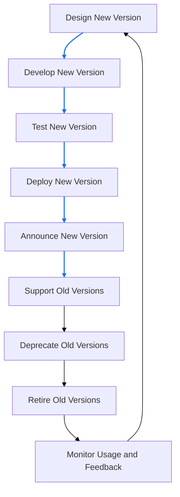

# API (Application Programming Interface)
An API (Application Programming Interface) is a set of rules and protocols that allows different software applications to communicate with each other. APIs define the methods and data formats that applications can use to request and exchange information.

## Introduction
### API Design
API design is carefully planning, preparing, and developing programming interfaces (APIs) to expose data and the system’s functionality to consumers. APIs enable system-to-system communication and are essential for digital organizations because they add new capabilities to their products, operations, partnership strategies, and more. An effective API design is one that has satisfactory answers to the following queries of a developer:

    - Why is the API being developed?
    - What would be the outcome regarding the impact and output of the system?
    - How will the API be designed to meet the requirements?
    - What will be the structure of our resources?
    - How will we document our resources?

#### Types of APIs

| API type     | Authentication type                                              | Potential users                                            | Examples                                 |
|--------------|------------------------------------------------------------------|------------------------------------------------------------|------------------------------------------|
| Public APIs  | Publicly accessible with API keys                                 | B2C (business-to-consumer)                                 | Google Maps, Weather APIs                |
| Private APIs | No authentication                                                 | B2B (business-to-business), B2C, B2E (business-to-employee)| Educative APIs for creating courses      |
| Partner APIs | Authorized access with access tokens/license                      | B2B, B2C                                                  | Amazon APIs for partners                 |
| Composite APIs | Depends on the connected API's authentication                   | B2B, B2C, B2E                                             | Payment APIs (Stripe, PayPal)            |


#### API design lifecycle


#### API design considerations
- **Identify user types**
    - Partners, customers, external developers
    - Determines access levels, authentication, and architectural style (REST, gRPC, etc.)

- **Developer problems & business value**
    - Address needs based on business relationship and critical requirements
    - Value addition: improved revenue, task speed, cost efficiency

- **API responses & error handling**
    - Clearly define success and error responses for endpoints
    - Implement robust exception and error handling

- **Real-life use cases & testability**
    - Apply practical scenarios to validate effectiveness
    - Analyze performance under various use cases

- **Scalability**
    - Design for future growth and increased customer demand

- **Documentation**
    - Provide comprehensive guides for integration, behaviors, structures, and parameters

#### Characteristics of a good API design

| Characteristics                                   | Explanation                                                                                                                                                                                                                           |
|---------------------------------------------------|---------------------------------------------------------------------------------------------------------------------------------------------------------------------------------------------------------------------------------------|
| Separation between API specification and its implementation | • Includes separation between the specification and its implementation, that is, the behavior with the internal structural details <br> • Clean designs allow iterative improvements and changes to the API implementation             |
| Concurrency                                       | • Amount of API calls that can be active simultaneously in a specified period <br> • Useful in ensuring that computing resources are available for all users                                                                          |
| Dynamic rate-limiting                             | • Strategy to limit access to API within a timeframe <br> • Avoids overwhelming the API with an onslaught of requests                                                                          |
| Security                                          | • Well-defined security mechanisms for authentication and authorization protocols that will define who can access the API and what parts of the API they can access                             |
| Error warnings and handling                       | • Allows error handling effectively to prevent frustration on the consumer end <br> • Reduces debugging efforts for developers                                                                 |
| Architectural styles of an API                    | • Possible to follow different architectural styles according to its requirements                                                                                                              |
| Minimal but comprehensive and cohesive            | • API should be as terse as possible but fulfill its goals                                                                                                                                    |
| Stateless or state-bearing                        | • API functions can be stateless and/or maintain their state, but idempotency (operations that yield the same result when they are performed multiple times [Source: Wikipedia]) is a desired feature                                |
| User adoption                                     | • APIs that have good adoption often have a devoted user community that helps improve the API over many iterations                                                                             |
| Fault tolerance                                   | • Failures are inevitable, but a well-designed API can be made fault-tolerant by using mechanisms that ensure the continued operation of the API, even if some components malfunction           |
| Performance measurement                           | • There should be appropriate provisions for collecting monitoring data and early warning systems                                                                                              |

## API Security
API security is the practice of protecting APIs from malicious attacks and unauthorized access. It involves implementing various security measures to ensure that APIs are secure and reliable.


### Transport Layer Security (TLS)
Transport layer security (TLS) is a cryptographic protocol that permits safe transmission between the client and API provider. TLS ensures message authentication, encryption, and data integrity.

In a client-server communication, the server usually requests authentication from clients using sensitive credentials, like a username and password, an API key, and tokens (we’ll explore these techniques in the coming lessons). However, using TLS, the client is able to authenticate the server prior to client authentication. TLS achieves this with the help of digital certificates that a client receives directly from the server.


### Common API Security Threats

| Threat Type | Attack | Description | Impact | Attacker Motivation |
|-------------|--------|-------------|--------|-------------------|
| **Injection Attacks** | Malicious code or commands injected into API inputs (SQL injection, NoSQL injection, command injection) | Attackers exploit vulnerabilities in input validation to insert malicious code that gets executed by the API backend systems | Data breach, unauthorized data access, system compromise, data corruption, complete system takeover | Financial gain through data theft, corporate espionage, system disruption, or establishing persistent access for future attacks |
| **Cross-Site Scripting (XSS)** | Malicious scripts injected into web pages or API responses that execute in users' browsers | Attackers inject client-side scripts through API endpoints that return user-generated content or inadequately sanitized data | Session hijacking, credential theft, unauthorized actions on behalf of users, malware distribution, defacement | Identity theft, session stealing for unauthorized access, spreading malware, or damaging brand reputation |
| **Cross-Site Request Forgery (CSRF)** | Tricking authenticated users into making unwanted requests to the API without their knowledge | Attackers craft malicious requests that appear to come from legitimate users, exploiting the user's existing authentication session | Unauthorized transactions, data modification, account takeover, privilege escalation, financial loss | Financial fraud, unauthorized data manipulation, account compromise, or performing actions that benefit the attacker |
| **Broken Authentication and Authorization** | Exploiting weak authentication mechanisms, session management flaws, or authorization bypass vulnerabilities | Attackers target poorly implemented authentication systems, weak passwords, session fixation, or inadequate access controls | Unauthorized API access, privilege escalation, data breach, account takeover, complete system compromise | Gaining elevated privileges, accessing sensitive data, bypassing security controls, or establishing long-term unauthorized access |
| **Data Exposure** | Unauthorized access to sensitive information through inadequate data protection or over-permissive API responses | APIs inadvertently expose sensitive data through verbose error messages, excessive data in responses, or insufficient access controls | Privacy violations, regulatory compliance breaches, identity theft, competitive intelligence loss, legal liability | Selling personal data, competitive advantage, regulatory exploitation, blackmail, or building profiles for targeted attacks |
| **Denial of Service (DoS) Attacks** | Overwhelming the API with excessive requests to exhaust resources and disrupt service availability | Attackers flood the API with a high volume of requests, exploiting resource limitations or vulnerabilities to cause service outages | Service downtime, degraded performance, resource exhaustion, loss of customer trust, financial loss | Disrupting business operations, extortion through ransom demands, competitive sabotage, or ideological motives |
| **CORS Misconfiguration** | Exploiting improperly configured Cross-Origin Resource Sharing (CORS) policies to access restricted resources | Attackers leverage lax CORS settings to make unauthorized cross-origin requests, potentially accessing sensitive data or performing actions on behalf of users | Data leakage, unauthorized actions, session hijacking, privilege escalation | Gaining access to sensitive information, performing unauthorized operations, or exploiting user sessions for further attacks |

### Best Practices for API Security
- **Use HTTPS**: Always use HTTPS to encrypt data transmitted between the client and server.
- **Implement authentication and authorization**: Use strong authentication and authorization mechanisms to ensure that only authorized users can access the API.
- **Validate input**: Always validate input data to prevent injection attacks.
- **Use rate limiting**: Implement rate limiting to prevent abuse and denial-of-service attacks.
- **Monitor and log API activity**: Monitor and log API activity to detect and respond to security incidents.
- **Keep software up to date**: Regularly update the API and its dependencies to patch security vulnerabilities.
- **Use API gateways**: Use API gateways to manage and secure API traffic.
- **Implement CORS policies**: Use Cross-Origin Resource Sharing (CORS) policies to control which domains can access the API.
- **Encrypt sensitive data**: Encrypt sensitive data both in transit and at rest.
- **Conduct regular security assessments**: Regularly assess the security of the API to identify and address vulnerabilities.
- **Attack**: Exploiting weak authentication mechanisms, session management flaws, or authorization bypass vulnerabilities
- **Description**: Attackers target poorly implemented authentication systems, weak passwords, session fixation, or inadequate access controls
- **Impact**: Unauthorized API access, privilege escalation, data breach, account takeover, complete system compromise
- **Attacker Motivation**: Gaining elevated privileges, accessing sensitive data, bypassing security controls, or establishing long-term unauthorized access

#### Data Exposure
- **Attack**: Unauthorized access to sensitive information through inadequate data protection or over-permissive API responses
- **Description**: APIs inadvertently expose sensitive data through verbose error messages, excessive data in responses, or insufficient access controls
- **Impact**: Privacy violations, regulatory compliance breaches, identity theft, competitive intelligence loss, legal liability
- **Attacker Motivation**: Selling personal data, competitive advantage, regulatory exploitation, blackmail, or building profiles for targeted attacks

### Best Practices for API Security
- **Use HTTPS**: Always use HTTPS to encrypt data transmitted between the client and server.
- **Implement authentication and authorization**: Use strong authentication and authorization mechanisms to ensure that only authorized users can access the API.
- **Validate input**: Always validate input data to prevent injection attacks.
- **Use rate limiting**: Implement rate limiting to prevent abuse and denial-of-service attacks.
- **Monitor and log API activity**: Monitor and log API activity to detect and respond to security incidents.
- **Keep software up to date**: Regularly update the API and its dependencies to patch security vulnerabilities.
- **Use API gateways**: Use API gateways to manage and secure API traffic.
- **Implement CORS policies**: Use Cross-Origin Resource Sharing (CORS) policies to control which domains can access the API.
- **Encrypt sensitive data**: Encrypt sensitive data both in transit and at rest.
- **Conduct regular security assessments**: Regularly assess the security of the API to identify and address vulnerabilities.

## Concepts
### API versioning
API versioning is the practice of managing changes to an API over time. It allows developers to introduce new features, fix bugs, and make other changes to the API without breaking existing clients.

#### Versioning Principles
- **Backward compatibility**: New versions of the API should be backward compatible with previous versions. This means that existing clients should be able to continue using the API without any changes.
- **Deprecation policy**: A clear deprecation policy should be established to inform clients of upcoming changes and provide a timeline for when old versions will be retired.
- **Documentation**: Each version of the API should be well-documented, including information about new features, changes, and deprecations.
- **Versioning strategy**: A consistent versioning strategy should be adopted, such as semantic versioning (e.g., v1.0.0, v1.1.0, v2.0.0) or date-based versioning (e.g., 2023-01-01).
- **Communication**: Regular communication with API consumers is essential to ensure they are aware of changes and can plan accordingly.


#### Strategies for versioning APIs
- **URI versioning**: Including the version number in the URI of the API endpoint (e.g., /v1/resource).
- **Header versioning**: Including the version number in the HTTP headers of the API request (e.g., Accept: application/vnd.myapi.v1+json).
- **Query parameter versioning**: Including the version number as a query parameter in the API request (e.g., /resource?version=1).
- **Content negotiation**: Allowing clients to specify the desired version of the API through the Accept header (e.g., Accept: application/vnd.myapi.v1+json). application/vnd.myapi.v1+json).

#### API Version Lifecycle Management


### Rate limiting
Rate limiting manages API traffic by setting constraints on the number of requests or data usage clients can make within a specific timeframe. It prevents untethered access, protects API gateways from being overwhelmed, ensures fair availability for all users, and acts as a security feature against bot and DoS attacks by throttling excessive requests.
#### Characteristics & HTTP Headers
| Characteristic          | Description                                                                                      | Example HTTP Header                         |
|-------------------------|--------------------------------------------------------------------------------------------------|---------------------------------------------|
| Request Count Limit     | Maximum number of requests allowed within a specified time window.                               | `X-RateLimit-Limit: 1000`                   |
| Time Window             | The duration in which the request count limit applies (e.g., per minute, hour, day).            | `X-RateLimit-Reset: 1618886400` (epoch time)|
| Remaining Requests      | Number of requests remaining in the current time window.                                         | `X-RateLimit-Remaining: 750`                 |
| Retry-After Header      | Indicates how long the client should wait before making another request after hitting the limit.| `Retry-After: 120` (seconds)                |
| Quota Management        | Total data usage or bandwidth limits over a longer period.                                       | `X-Quota-Limit: 500MB`                       |
| Burst Control           | Allows short bursts of traffic exceeding the standard rate limit but within a defined threshold. | `X-Burst-Limit: 200`                         |
| User-Specific Limits    | Different rate limits based on user roles or subscription tiers.                                 | `X-User-RateLimit-Limit: 2000`              |
| Global vs. Endpoint-Specific Limits | Global limits apply to all endpoints, while endpoint-specific limits apply to individual endpoints.| `X-Global-RateLimit-Limit: 5000`            |


### Data fetching patterns
#### Common Data Fetching Patterns
- **Pagination**: Dividing large datasets into smaller, manageable chunks (pages) to reduce load times and improve performance. Common methods include offset-based and cursor-based pagination.
- **Filtering**: Allowing clients to specify criteria to narrow down the data returned by the API. This can be done using query parameters (e.g., ?status=active).
- **Sorting**: Enabling clients to sort data based on specific fields (e.g., ?sort=created_at&order=desc).
- **Field Selection**: Allowing clients to specify which fields they want in the response to reduce payload size (e.g., ?fields=id,name,email).
- **Batch Requests**: Allowing clients to send multiple requests in a single call to reduce the number of HTTP requests and improve efficiency.
- **Caching**: Storing frequently accessed data temporarily to reduce latency and server load. This can be implemented using HTTP caching headers (e.g., ETag, Cache-Control).
- **GraphQL**: A query language that allows clients to request exactly the data they need, reducing over-fetching and under-fetching issues common in REST APIs.
- **Webhooks**: A way for APIs to push real-time updates to clients when certain events occur, rather than requiring clients to poll for changes.

#### Considerations for Choosing Data Fetching Patterns
- **Use Case Requirements**: Understand the specific needs of your application and users.
- **Performance**: Evaluate how different patterns impact response times and server load.
- **Complexity**: Consider the complexity of implementation and maintenance.
- **Scalability**: Choose patterns that can handle growth in data volume and user base.
- **User Experience**: Aim for patterns that provide a seamless experience for end-users.

By carefully selecting and implementing appropriate data fetching patterns, you can enhance the performance, scalability, and usability of your API.

### Key API Metrics to Monitor
| Metric               | Description                                                                                     | Importance                                                                                       |
|----------------------|-------------------------------------------------------------------------------------------------|--------------------------------------------------------------------------------------------------|
| Request Rate         | The number of API requests received per unit of time (e.g., requests per second).               | Indicates API usage and helps identify traffic patterns.                                         |
| Error Rate           | The percentage of API requests that result in errors (4xx and 5xx status codes).                | Helps identify issues with the API and areas for improvement.                                    |
| Latency              | The time taken to process an API request from receipt to response.                              | Affects user experience; lower latency is generally better.                                      |
| Uptime               | The percentage of time the API is available and operational.                                    | Critical for reliability; high uptime is essential for user trust.                               |
| Throughput           | The amount of data transferred through the API over a specific period (e.g., bytes per second). | Measures the capacity of the API to handle data transfer.                                        |
| Active Users         | The number of unique users or clients interacting with the API over a given period.             | Provides insights into user engagement and growth.                                                |
| Rate Limiting Events | The number of times clients hit rate limits imposed by the API.                                 | Indicates potential abuse or high demand, helping to adjust rate limiting policies.               |
| Cache Hit Ratio      | The percentage of requests served from cache versus those requiring a full backend call.        | Higher cache hit ratios improve performance and reduce backend load.                             |
| Average Response Size| The average size of the API responses sent to clients.                                          | Helps understand data transfer efficiency and optimize payload sizes.                             |
| User Retention       | The percentage of users who continue to use the API over time.                                 | Indicates user satisfaction and the value provided by the API.                                   |

Monitoring these metrics provides valuable insights into the performance, reliability, and user experience of your API, enabling proactive management and continuous improvement.

## Back of Envelope (BOE) Calculations
Back-of-envelope calculations help API designers establish realistic Service Level Agreements (SLAs) within technological and budget constraints. These estimations are crucial for:
- Setting performance expectations aligned with customer demands
- Planning infrastructure capacity
- Optimizing resource allocation
- Identifying performance bottlenecks

### Key Performance Questions
- How quickly does an API process requests and send responses?
- How does increasing request volume affect API performance?
- What is the maximum throughput the API can sustain while maintaining acceptable response times?
- What infrastructure resources are needed to meet SLA targets?

### Core Metrics and Formulas

#### 1. Response Time (Latency)
Response time is the total duration from when a client sends a request to when it receives the complete response.

**Formula:**
```
Total_Response_Time = Network_Latency + Server_Processing_Time + Response_Transmission_Time
```

**Components:**
- **Network Latency**: Round-trip time (RTT) for request/response over the network
- **Server Processing Time**: Time for business logic, database queries, and response preparation
- **Response Transmission Time**: Time to transmit the response payload

**Example:**
```
Network Latency (RTT): 100 ms
Server Processing Time: 200 ms
Response Transmission Time: 50 ms

Total_Response_Time = 100 + 200 + 50 = 350 ms
```

#### 2. Server Processing Time
The duration the server takes to handle a request internally.

**Formula:**
```
Processing_Time = Request_Parsing + Business_Logic + Database_Operations + Response_Formatting
```

**Example:**
```
Request Parsing: 50 ms
Business Logic: 100 ms
Database Operations: 150 ms
Response Formatting: 30 ms

Processing_Time = 50 + 100 + 150 + 30 = 330 ms
```

#### 3. Requests Per Second (RPS)
The number of requests an API can handle per second, determined by either CPU or memory constraints.

**CPU-Bound RPS:**
```
RPS_CPU = Number_of_Threads × (1 / Task_Time_seconds)
```

**Memory-Bound RPS:**
```
RPS_Memory = (Total_RAM_MB / Memory_per_Worker_MB) × (1 / Task_Time_seconds)
```

**Effective RPS:**
```
RPS_Effective = min(RPS_CPU, RPS_Memory)
```

**Example 1: CPU-Bound System**
```
System: 72 cores (144 threads), 128 GB RAM
CPU task time: 100 ms (0.1 seconds)
Worker memory: 200 MB

RPS_CPU = 144 × (1 / 0.1) = 1,440 RPS
RPS_Memory = (131,072 / 200) × (1 / 0.1) = 655 × 10 = 6,550 RPS

Effective RPS = min(1,440, 6,550) = 1,440 RPS (CPU-bound)
```

**Example 2: Memory-Bound System**
```
System: 8 cores (16 threads), 16 GB RAM
CPU task time: 50 ms (0.05 seconds)
Worker memory: 500 MB

RPS_CPU = 16 × (1 / 0.05) = 320 RPS
RPS_Memory = (16,384 / 500) × (1 / 0.05) = 32.8 × 20 = 656 RPS

Effective RPS = min(320, 656) = 320 RPS (CPU-bound despite lower RAM)
```

#### 4. Throughput
The amount of data transferred through the API over time.

**Formula:**
```
Throughput_bytes/sec = RPS × Average_Response_Size_bytes
Throughput_Mbps = (Throughput_bytes/sec × 8) / 1,000,000
```

**Example:**
```
RPS: 1,000 requests/second
Average Response Size: 5 KB (5,120 bytes)

Throughput = 1,000 × 5,120 = 5,120,000 bytes/second
Throughput = 5.12 MB/second = 40.96 Mbps
```

#### 5. Complete Latency Breakdown
A comprehensive view of all latency components in an API request.

**Formula:**
```
Total_Latency = Base_Time + RTT_Request + Server_Processing + Download_Time
```

Where:
```
Base_Time = DNS_Lookup + TCP_Handshake + TLS_Handshake
```

**Detailed Example:**
```
DNS Lookup: 20 ms
TCP Handshake: 30 ms (1.5 RTT)
TLS Handshake: 50 ms (2 RTT)
Request RTT: 40 ms
Server Processing: 200 ms
Download Time: 60 ms (for 150 KB response)

Base_Time = 20 + 30 + 50 = 100 ms
Total_Latency = 100 + 40 + 200 + 60 = 400 ms
```

### Capacity Planning Calculations

#### Concurrent Users Support
Estimate the number of concurrent users your API can support.

**Formula:**
```
Max_Concurrent_Users = (RPS × Average_Session_Duration) / Requests_Per_User_Session
```

**Example:**
```
RPS: 1,500 requests/second
Average Session Duration: 300 seconds (5 minutes)
Requests Per User Session: 10 requests

Max_Concurrent_Users = (1,500 × 300) / 10 = 45,000 users
```

#### Storage Requirements
Estimate storage needs based on request logs and data retention.

**Formula:**
```
Daily_Storage_GB = (RPS × Seconds_Per_Day × Average_Log_Size_KB) / 1,048,576
Monthly_Storage_GB = Daily_Storage_GB × 30
```

**Example:**
```
RPS: 500 requests/second
Average Log Size: 2 KB per request
Seconds Per Day: 86,400

Daily_Storage = (500 × 86,400 × 2) / 1,048,576 = 82.4 GB/day
Monthly_Storage = 82.4 × 30 = 2,472 GB ≈ 2.4 TB/month
```

#### Bandwidth Requirements
Calculate network bandwidth needed to support API traffic.

**Formula:**
```
Bandwidth_Required_Mbps = (RPS × Average_Request_Size + RPS × Average_Response_Size) × 8 / 1,000,000 × Safety_Factor
```

**Example:**
```
RPS: 1,000 requests/second
Average Request Size: 1 KB (1,024 bytes)
Average Response Size: 10 KB (10,240 bytes)
Safety Factor: 1.5 (50% overhead)

Data_Per_Second = 1,000 × (1,024 + 10,240) = 11,264,000 bytes/second
Bandwidth = (11,264,000 × 8 / 1,000,000) × 1.5 = 135.17 Mbps
```

### Performance Optimization Strategies

#### Caching Impact
Calculate the performance improvement from caching.

**Formula:**
```
Effective_Processing_Time = (Cache_Hit_Ratio × Cache_Response_Time) +
                             ((1 - Cache_Hit_Ratio) × Database_Response_Time)
RPS_Improvement = RPS_Without_Cache / (Effective_Processing_Time / Original_Processing_Time)
```

**Example:**
```
Cache Hit Ratio: 80% (0.8)
Cache Response Time: 10 ms
Database Response Time: 150 ms
Original Processing Time: 150 ms

Effective_Processing_Time = (0.8 × 10) + (0.2 × 150) = 8 + 30 = 38 ms
Performance_Improvement = 150 / 38 = 3.95x faster
```

#### Load Balancing Efficiency
Calculate the effective capacity with load balancing.

**Formula:**
```
Total_RPS = Number_of_Servers × RPS_Per_Server × Load_Balancer_Efficiency
```

**Example:**
```
Number of Servers: 5
RPS Per Server: 1,000 requests/second
Load Balancer Efficiency: 0.95 (95%)

Total_RPS = 5 × 1,000 × 0.95 = 4,750 RPS
```

### Real-World Example: E-Commerce API

**Requirements:**
- Expected users: 100,000 daily active users
- Peak hour traffic: 20% of daily users
- Average requests per user session: 15 requests
- Session duration: 10 minutes
- Average response size: 8 KB

**Calculations:**

1. **Peak Concurrent Users:**
```
Peak_Users = 100,000 × 0.20 = 20,000 users
```

2. **Required RPS:**
```
Requests_During_Peak = 20,000 × 15 = 300,000 requests
Peak_Hour_Duration = 3,600 seconds
Required_RPS = 300,000 / 3,600 = 83.3 RPS (minimum)

With safety factor (3x): 83.3 × 3 = 250 RPS required
```

3. **Server Capacity:**
```
Assuming each server handles 100 RPS:
Required_Servers = 250 / 100 = 3 servers (minimum)
Recommended: 5 servers (with redundancy)
```

4. **Bandwidth Requirements:**
```
Average Request Size: 2 KB
Average Response Size: 8 KB
Total Data Per Request: 10 KB

Bandwidth = 250 × 10 × 8 / 1,000 × 1.5 = 30 Mbps (with 50% overhead)
```

5. **Storage (30-day logs):**
```
Log Size Per Request: 3 KB
Daily Requests: 300,000 × 2 (assuming 12 peak hours) = 600,000 requests
Daily Storage: 600,000 × 3 KB = 1.8 GB/day
Monthly Storage: 1.8 × 30 = 54 GB/month
```

### Network Transfer Time Calculations

Network transfer time is critical for understanding end-to-end API performance, especially for data-intensive applications.

#### Data Transfer Time
Calculate the time to transfer data over the network based on bandwidth.

**Formula:**
```
Transfer_Time_seconds = (Data_Size_bytes × 8) / (Bandwidth_bps × Network_Efficiency)
Transfer_Time_ms = Transfer_Time_seconds × 1,000
```

**Example 1: Small Response**
```
Response Size: 50 KB (51,200 bytes)
Network Bandwidth: 10 Mbps (10,000,000 bps)
Network Efficiency: 0.8 (80% due to overhead)

Transfer_Time = (51,200 × 8) / (10,000,000 × 0.8)
Transfer_Time = 409,600 / 8,000,000 = 0.0512 seconds = 51.2 ms
```

**Example 2: Large Payload**
```
Response Size: 5 MB (5,242,880 bytes)
Network Bandwidth: 100 Mbps
Network Efficiency: 0.85

Transfer_Time = (5,242,880 × 8) / (100,000,000 × 0.85)
Transfer_Time = 41,943,040 / 85,000,000 = 0.493 seconds = 493 ms
```

#### Compression Benefits
Calculate bandwidth savings from data compression.

**Formula:**
```
Compressed_Size = Original_Size × (1 - Compression_Ratio)
Time_Saved = Transfer_Time_Original - Transfer_Time_Compressed
Bandwidth_Saved_Percent = (1 - (Compressed_Size / Original_Size)) × 100
```

**Example:**
```
Original Response: 200 KB
Compression Ratio: 70% (0.7)
Bandwidth: 50 Mbps
Network Efficiency: 0.8

Compressed_Size = 200 KB × (1 - 0.7) = 60 KB

Original_Transfer_Time = (204,800 × 8) / (50,000,000 × 0.8) = 40.96 ms
Compressed_Transfer_Time = (61,440 × 8) / (50,000,000 × 0.8) = 12.29 ms

Time_Saved = 40.96 - 12.29 = 28.67 ms (70% faster)
```

#### CDN Edge Location Impact
Calculate latency reduction when using CDN edge servers.

**Formula:**
```
Latency_Reduction = Origin_RTT - Edge_RTT
Performance_Improvement_Percent = (Latency_Reduction / Origin_RTT) × 100
```

**Example:**
```
Distance to Origin Server: 5,000 km
Distance to CDN Edge: 100 km
Speed of Light in Fiber: ~200,000 km/s

Origin_RTT = (5,000 × 2) / 200,000 = 0.05 seconds = 50 ms
Edge_RTT = (100 × 2) / 200,000 = 0.001 seconds = 1 ms

Latency_Reduction = 50 - 1 = 49 ms (98% improvement)
```

#### Payload Size Optimization
Calculate impact of reducing payload size.

**Formula:**
```
Requests_Per_Second_Improved = Original_RPS × (Original_Size / Optimized_Size)
Bandwidth_Saved = (Original_Size - Optimized_Size) × RPS × Seconds_Per_Day / (1024^3)
```

**Example:**
```
Original Response Size: 100 KB
Optimized Response Size: 25 KB (removed unnecessary fields)
Current RPS: 500 requests/second

Size_Reduction = 100 - 25 = 75 KB (75% reduction)
Bandwidth_Saved_Per_Day = 75 KB × 500 × 86,400 / (1024^3)
Bandwidth_Saved_Per_Day = 3.03 GB/day

With same bandwidth, potential RPS increase:
New_RPS = 500 × (100 / 25) = 2,000 RPS (4x improvement)
```

### Error Budget & SLA Calculations

Error budgets define acceptable downtime and error rates while maintaining SLA commitments.

#### SLA Uptime Calculations
Calculate allowed downtime based on SLA percentage.

**Formula:**
```
Allowed_Downtime = Total_Time × (1 - SLA_Percentage)
```

**Common SLA Tiers:**

| SLA Level | Uptime % | Downtime per Year | Downtime per Month | Downtime per Week | Downtime per Day |
|-----------|----------|-------------------|-------------------|-------------------|------------------|
| 90% (One nine) | 90% | 36.5 days | 72 hours | 16.8 hours | 2.4 hours |
| 99% (Two nines) | 99% | 3.65 days | 7.2 hours | 1.68 hours | 14.4 minutes |
| 99.9% (Three nines) | 99.9% | 8.76 hours | 43.2 minutes | 10.1 minutes | 1.44 minutes |
| 99.95% | 99.95% | 4.38 hours | 21.6 minutes | 5.04 minutes | 43.2 seconds |
| 99.99% (Four nines) | 99.99% | 52.56 minutes | 4.32 minutes | 1.01 minutes | 8.64 seconds |
| 99.999% (Five nines) | 99.999% | 5.26 minutes | 25.9 seconds | 6.05 seconds | 0.86 seconds |

**Example Calculation:**
```
Target SLA: 99.95%
Time Period: 1 month (30 days = 2,592,000 seconds)

Allowed_Downtime = 2,592,000 × (1 - 0.9995) = 1,296 seconds ≈ 21.6 minutes
```

#### Error Rate Budget
Calculate acceptable error rate to maintain SLA.

**Formula:**
```
Error_Budget = Total_Requests × (1 - SLA_Percentage)
Acceptable_Error_Rate_Percent = (1 - SLA_Percentage) × 100
```

**Example:**
```
Monthly Requests: 100,000,000
Target SLA: 99.9% success rate

Error_Budget = 100,000,000 × (1 - 0.999) = 100,000 errors allowed
Acceptable_Error_Rate = 0.1%

If current error count: 45,000 errors
Remaining_Budget = 100,000 - 45,000 = 55,000 errors
Budget_Consumed = (45,000 / 100,000) × 100 = 45%
```

#### Mean Time Between Failures (MTBF)
Calculate expected time between system failures.

**Formula:**
```
MTBF = Total_Operating_Time / Number_of_Failures
```

**Example:**
```
Operating Time: 720 hours (30 days)
Number of Failures: 3

MTBF = 720 / 3 = 240 hours (10 days between failures)
```

#### Mean Time To Recovery (MTTR)
Calculate average time to restore service after failure.

**Formula:**
```
MTTR = Total_Downtime / Number_of_Incidents
Availability = MTBF / (MTBF + MTTR)
```

**Example:**
```
Total Downtime in Month: 45 minutes
Number of Incidents: 5

MTTR = 45 / 5 = 9 minutes per incident

MTBF = 43,200 minutes/month
MTTR = 9 minutes
Availability = 43,200 / (43,200 + 9) = 99.979%
```

#### Error Budget Burn Rate
Track how quickly error budget is being consumed.

**Formula:**
```
Burn_Rate = (Current_Error_Rate / Target_Error_Rate)
Time_To_Exhaust_Budget = Remaining_Time_In_Period / Burn_Rate
```

**Example:**
```
SLA Target: 99.9% (0.1% error rate allowed)
Current Error Rate: 0.25%
Days Remaining in Month: 15 days

Burn_Rate = 0.25 / 0.1 = 2.5 (burning 2.5x faster than budget)
Time_To_Exhaust = 15 / 2.5 = 6 days

Action Required: Reduce error rate or risk SLA breach
```

#### Composite SLA Calculation
Calculate overall SLA when multiple dependent services are involved.

**Formula:**
```
Composite_SLA = SLA_Service1 × SLA_Service2 × ... × SLA_ServiceN
```

**Example:**
```
API Gateway SLA: 99.95%
Application Server SLA: 99.9%
Database SLA: 99.99%
External Payment API SLA: 99.5%

Composite_SLA = 0.9995 × 0.999 × 0.9999 × 0.995
Composite_SLA = 0.9935 = 99.35%

Note: Composite SLA is always lower than the weakest link
```

#### SLA vs Cost Trade-off
Estimate cost increase for higher SLA tiers.

**Formula:**
```
Cost_Multiplier = 10^(Number_of_Nines - Base_Nines)
```

**Example:**
```
Base Infrastructure Cost (99% SLA): $10,000/month
Target: 99.99% SLA (increase from 2 to 4 nines)

Cost_Multiplier = 10^(4 - 2) = 10^2 = 100
Estimated_Cost = $10,000 × (rough estimate: 5-10x for each additional nine)

Realistic Estimate:
99% to 99.9%: 2-3x cost increase = $20,000-$30,000/month
99.9% to 99.99%: 3-5x cost increase = $60,000-$150,000/month
99.99% to 99.999%: 5-10x cost increase = $300,000-$1,500,000/month
```

### Cost Estimation

Understanding the financial implications of API infrastructure is crucial for budget planning and ROI analysis.

#### Infrastructure Cost Per Request
Calculate the cost of serving a single API request.

**Formula:**
```
Cost_Per_Request = Total_Monthly_Cost / Total_Monthly_Requests
Cost_Per_Million_Requests = Cost_Per_Request × 1,000,000
```

**Example:**
```
Monthly Infrastructure Cost: $5,000
Monthly Requests: 50,000,000

Cost_Per_Request = $5,000 / 50,000,000 = $0.0001 per request
Cost_Per_Million_Requests = $0.0001 × 1,000,000 = $100 per million requests
```

#### Server Cost Calculation
Estimate monthly server costs based on requirements.

**Formula:**
```
Total_Server_Cost = (Number_of_Servers × Cost_Per_Server) + (Storage_GB × Cost_Per_GB) + (Bandwidth_GB × Cost_Per_GB_Transfer)
```

**Example:**
```
Servers Required: 10 instances (m5.xlarge equivalent)
Cost Per Server: $140/month each
Storage: 500 GB SSD
Storage Cost: $0.10/GB/month
Bandwidth: 5 TB/month
Bandwidth Cost: $0.09/GB

Server_Cost = 10 × $140 = $1,400
Storage_Cost = 500 × $0.10 = $50
Bandwidth_Cost = 5,000 × $0.09 = $450

Total_Monthly_Cost = $1,400 + $50 + $450 = $1,900/month
```

#### Serverless vs Dedicated Comparison
Compare costs between serverless and dedicated infrastructure.

**Serverless Cost Model:**
```
Serverless_Cost = (Requests × Cost_Per_Request) + (Compute_Time_seconds × Cost_Per_Second) + (Data_Transfer_GB × Cost_Per_GB)
```

**Example Comparison:**
```
Monthly Requests: 10,000,000
Average Execution Time: 200 ms per request
Data Transfer: 1 TB

Serverless (AWS Lambda):
Request_Cost = 10,000,000 × $0.0000002 = $2
Compute_Cost = (10,000,000 × 0.2 × 128 MB) / 1024 × $0.0000166667 = $416
Data_Transfer = 1,000 GB × $0.09 = $90
Total_Serverless = $2 + $416 + $90 = $508/month

Dedicated (EC2):
2 × t3.medium instances = 2 × $30 = $60
Load Balancer = $20
Data Transfer = $90
Total_Dedicated = $60 + $20 + $90 = $170/month

Result: Dedicated is cheaper at this scale
Break-even point: ~3-5 million requests/month
```

#### Database Cost Estimation
Calculate database hosting and operation costs.

**Formula:**
```
Database_Cost = Instance_Cost + Storage_Cost + IOPS_Cost + Backup_Cost
```

**Example:**
```
Database Instance: db.r5.large
Instance Cost: $180/month
Storage: 200 GB SSD
Storage Cost: $0.23/GB/month = $46
Provisioned IOPS: 3,000 IOPS
IOPS Cost: $0.10 per IOPS/month = $300
Backup Storage: 100 GB
Backup Cost: $0.095/GB = $9.50

Total_Database_Cost = $180 + $46 + $300 + $9.50 = $535.50/month
```

#### CDN Cost Analysis
Calculate content delivery network expenses.

**Formula:**
```
CDN_Cost = (Requests / 10,000) × Cost_Per_10k_Requests + (Data_Transfer_GB × Cost_Per_GB_Zone)
```

**Example:**
```
Monthly Requests: 50,000,000
Data Transfer: 3 TB
CDN Provider: Cloudflare/CloudFront

Request_Cost = (50,000,000 / 10,000) × $0.0075 = $37.50
Data_Transfer_Cost (first 10 TB): 3,000 GB × $0.085 = $255

Total_CDN_Cost = $37.50 + $255 = $292.50/month

Savings vs Origin:
- 80% traffic offloaded = $800 in origin bandwidth saved
- Net Savings: $800 - $292.50 = $507.50/month
```

#### API Gateway Cost
Calculate managed API gateway service costs.

**Formula:**
```
Gateway_Cost = (Requests_Millions × Cost_Per_Million) + (Data_Transfer_GB × Cost_Per_GB) + (Cache_Memory_GB × Cost_Per_GB_Hour × Hours)
```

**Example:**
```
Monthly Requests: 100 million
Data Transfer: 500 GB
Cache: 1.6 GB memory

Gateway_Requests = 100 × $3.50 = $350
Data_Transfer = 500 × $0.09 = $45
Cache_Cost = 1.6 × $0.02 × 730 = $23.36

Total_Gateway_Cost = $350 + $45 + $23.36 = $418.36/month
```

#### Monitoring and Logging Costs
Estimate observability infrastructure expenses.

**Formula:**
```
Monitoring_Cost = Log_Ingestion_Cost + Metric_Collection_Cost + Retention_Storage_Cost + Alert_Cost
```

**Example:**
```
Log Volume: 100 GB/day = 3 TB/month
Ingestion Cost: $0.50/GB = 3,000 × $0.50 = $1,500
Metrics: 5,000 custom metrics
Metrics Cost: $0.30 per metric = 5,000 × $0.30 = $1,500
Storage (90 days): 9 TB × $0.03/GB = $270
Alerts: 50 alerts × $0.10 = $5

Total_Monitoring_Cost = $1,500 + $1,500 + $270 + $5 = $3,275/month
```

#### Scaling Cost Projection
Project costs as traffic grows.

**Formula:**
```
Future_Cost = Current_Cost × (Future_RPS / Current_RPS)^Scaling_Factor
```

Where Scaling_Factor typically ranges from 0.7-1.0 (economies of scale).

**Example:**
```
Current Monthly Cost: $10,000
Current RPS: 1,000
Target RPS: 5,000 (5x growth)
Scaling Factor: 0.85 (some efficiency gains)

Future_Cost = $10,000 × (5,000 / 1,000)^0.85
Future_Cost = $10,000 × 5^0.85
Future_Cost = $10,000 × 4.22 = $42,200/month

Growth Impact: 5x traffic = 4.2x cost (15% efficiency gain)
```

#### Break-Even Analysis
Determine when different pricing tiers make financial sense.

**Example:**
```
Scenario: Free tier vs Paid tier

Free Tier:
- 1 million requests/month: $0
- Overage: $0.50 per 10,000 requests

Paid Tier:
- Base cost: $500/month
- 50 million requests included
- Overage: $0.10 per 10,000 requests

Break-even calculation:
At X million requests, costs are equal:
Free_Cost = (X - 1) million × $0.50 per 10k × 100
Paid_Cost = $500 + max(0, (X - 50)) million × $0.10 per 10k × 100

Break-even: ~11 million requests/month
Below 11M: Use free tier
Above 11M: Use paid tier
```

#### Total Cost of Ownership (TCO)
Calculate comprehensive cost including hidden expenses.

**Formula:**
```
TCO = Infrastructure_Cost + Personnel_Cost + Licensing_Cost + Maintenance_Cost + Downtime_Cost
```

**Example:**
```
Infrastructure: $15,000/month
DevOps Team (2 engineers): $20,000/month (loaded cost)
Licenses (monitoring, security, etc.): $2,000/month
Maintenance (updates, patches): $1,000/month
Downtime Cost (0.1% of revenue): $5,000/month

TCO = $15,000 + $20,000 + $2,000 + $1,000 + $5,000 = $43,000/month
TCO_Annual = $43,000 × 12 = $516,000/year

Cost Per Request = $516,000 / (100M requests × 12) = $0.00043
```

#### Cost Optimization Strategies
Calculate potential savings from optimization techniques.

**Caching Optimization:**
```
Without Cache:
Database queries: 10,000/sec
Database cost: $0.001 per query
Daily Cost = 10,000 × 86,400 × $0.001 = $864/day

With 80% Cache Hit Rate:
Database queries: 2,000/sec
Cache cost: $200/month ≈ $6.67/day
Daily Cost = (2,000 × 86,400 × $0.001) + $6.67 = $179.47/day

Savings: $864 - $179.47 = $684.53/day = $20,536/month (79% reduction)
```

**Compression Savings:**
```
Data Transfer Without Compression: 10 TB/month
Cost at $0.09/GB: 10,000 × $0.09 = $900

With 70% Compression:
Data Transfer: 3 TB/month
Cost: 3,000 × $0.09 = $270

Savings: $900 - $270 = $630/month
```

#### Reserved Instance Savings
Calculate savings from commitment-based pricing.

**Formula:**
```
RI_Savings = (On_Demand_Cost - Reserved_Cost) / On_Demand_Cost × 100
```

**Example:**
```
On-Demand: 10 × m5.xlarge = 10 × $140 = $1,400/month
1-Year Reserved (No upfront): 10 × $98 = $980/month
3-Year Reserved (All upfront): 10 × $60 = $600/month

1-Year Savings = ($1,400 - $980) / $1,400 = 30% savings
3-Year Savings = ($1,400 - $600) / $1,400 = 57% savings
Annual Savings (3-year): $1,400 - $600 = $800/month = $9,600/year
```

### Geographic Distribution

Geographic distribution involves deploying API infrastructure across multiple regions to reduce latency and improve availability for global users.

#### Multi-Region Latency Calculation
Calculate latency differences when serving users from various geographic locations.

**Formula:**
```
Geographic_Latency = (Distance_km × 2) / Speed_of_Light_in_Fiber_km_per_ms
Total_Response_Time = Geographic_Latency + Processing_Time + Network_Overhead
```

**Speed of light in fiber:** ~200 km/ms (or ~200,000 km/s)

**Example:**
```
User Location: Tokyo, Japan
Origin Server: Virginia, USA
Distance: 10,900 km

Single Region (Virginia only):
Geographic_RTT = (10,900 × 2) / 200 = 109 ms
Total_Latency = 109 + 50 (processing) + 20 (overhead) = 179 ms

Multi-Region (with Tokyo edge):
Geographic_RTT = (100 × 2) / 200 = 1 ms (local edge server)
Total_Latency = 1 + 50 + 20 = 71 ms

Improvement: 179 - 71 = 108 ms faster (60% reduction)
```

#### Regional Distribution Strategy
Calculate optimal number of regions based on user distribution.

**Formula:**
```
Coverage_Percent = (Users_Within_Threshold / Total_Users) × 100
Cost_Per_Region = Infrastructure_Cost × Region_Multiplier
```

**Example:**
```
Total Users: 1,000,000
Target Latency: < 100 ms

Single Region (US-East):
- Covered Users: 350,000 (35%)
- Average Latency: 180 ms
- Cost: $10,000/month

Three Regions (US, EU, APAC):
- Covered Users: 920,000 (92%)
- Average Latency: 65 ms
- Cost: $10,000 × 3 × 1.2 = $36,000/month

Five Regions (US-East, US-West, EU, APAC, SA):
- Covered Users: 985,000 (98.5%)
- Average Latency: 45 ms
- Cost: $10,000 × 5 × 1.15 = $57,500/month

Cost per 1% additional coverage: ~$4,300/month
```

#### Data Replication Time
Calculate time to replicate data across geographic regions.

**Formula:**
```
Replication_Time = (Data_Size_bytes × 8) / (Inter_Region_Bandwidth_bps) + Replication_Overhead
```

**Example:**
```
Database Size: 50 GB
Inter-region Bandwidth: 10 Gbps
Replication Overhead: 5 seconds (protocol overhead)

Replication_Time = (50 × 1024³ × 8) / (10 × 10⁹) + 5
Replication_Time = 429,496,729,600 / 10,000,000,000 + 5
Replication_Time = 42.9 + 5 = 47.9 seconds

For incremental replication (1 GB changes/hour):
Incremental_Time = (1 × 1024³ × 8) / (10 × 10⁹) + 1 = 1.86 seconds
```

#### Cross-Region Request Routing
Calculate latency for different routing strategies.

**DNS-based Routing:**
```
Total_Latency = DNS_Lookup + Geographic_RTT + Processing_Time

Example:
DNS Lookup: 20-50 ms (first request)
Geographic RTT: 10 ms (nearest region)
Processing: 50 ms
Total: 80-110 ms (first request), 60 ms (cached DNS)
```

**Anycast Routing:**
```
Total_Latency = Anycast_Routing + Geographic_RTT + Processing_Time

Example:
Anycast Routing: 5 ms
Geographic RTT: 8 ms (optimal routing)
Processing: 50 ms
Total: 63 ms (consistent, no DNS caching needed)
```

#### Global Load Distribution
Calculate request distribution across regions.

**Formula:**
```
Region_Load_Percent = (Region_Users / Total_Users) × Traffic_Weight
Requests_Per_Region = Total_RPS × Region_Load_Percent
```

**Example:**
```
Total RPS: 10,000
User Distribution:
- North America: 40% (4,000 users)
- Europe: 30% (3,000 users)
- Asia-Pacific: 25% (2,500 users)
- Other: 5% (500 users)

Regional Request Distribution:
NA_RPS = 10,000 × 0.40 = 4,000 RPS
EU_RPS = 10,000 × 0.30 = 3,000 RPS
APAC_RPS = 10,000 × 0.25 = 2,500 RPS
Other_RPS = 10,000 × 0.05 = 500 RPS

Infrastructure Requirements per Region:
NA: 4,000 RPS / 100 RPS per server = 40 servers
EU: 3,000 RPS / 100 RPS per server = 30 servers
APAC: 2,500 RPS / 100 RPS per server = 25 servers
Other: 500 RPS / 100 RPS per server = 5 servers
```

#### Failover Time Calculation
Calculate downtime during regional failures.

**Formula:**
```
Failover_Time = Detection_Time + DNS_Propagation + Connection_Drain
Affected_Users = Region_Users × (Failover_Time / 3600)
```

**Example:**
```
Detection Time: 30 seconds (health checks)
DNS Propagation: 60 seconds (TTL)
Connection Drain: 10 seconds

Total_Failover_Time = 30 + 60 + 10 = 100 seconds

For region with 100,000 active users:
Potentially_Affected = 100,000 × (100 / 3600) = 2,778 users

With Anycast (no DNS):
Failover_Time = 30 + 10 = 40 seconds
Potentially_Affected = 100,000 × (40 / 3600) = 1,111 users
```

#### Geo-Redundancy Cost-Benefit
Analyze cost vs benefit of geographic redundancy.

**Example:**
```
Single Region Setup:
- Cost: $15,000/month
- Uptime: 99.9%
- Downtime: 43.2 minutes/month
- Revenue Loss per Hour Downtime: $50,000
- Expected Monthly Loss: $50,000 × (43.2 / 60) = $36,000

Multi-Region Setup (Active-Active):
- Cost: $45,000/month (3 regions)
- Uptime: 99.99%
- Downtime: 4.32 minutes/month
- Expected Monthly Loss: $50,000 × (4.32 / 60) = $3,600

Net Benefit:
Additional Cost: $30,000/month
Risk Reduction: $36,000 - $3,600 = $32,400/month
ROI: ($32,400 - $30,000) / $30,000 = 8% positive return
```

### WebSocket/Real-time Connections

WebSocket and real-time connection calculations are essential for applications requiring persistent, bidirectional communication.

#### Concurrent WebSocket Connection Capacity
Calculate maximum concurrent WebSocket connections a server can handle.

**Formula:**
```
Max_Connections = min(
    (Available_Memory_MB / Memory_Per_Connection_KB) × 1024,
    Max_File_Descriptors,
    (CPU_Cores × Connections_Per_Core)
)
```

**Example:**
```
Server Specs:
- RAM: 16 GB (16,384 MB)
- CPU: 8 cores
- Max File Descriptors: 65,536
- Memory per Connection: 50 KB
- Connections per Core: 5,000

Memory_Limit = (16,384 / 50) × 1024 = 335,544 connections
FD_Limit = 65,536 connections
CPU_Limit = 8 × 5,000 = 40,000 connections

Max_Connections = min(335,544, 65,536, 40,000) = 40,000 connections
Bottleneck: CPU capacity
```

#### Memory Per Connection Estimation
Calculate memory requirements for WebSocket connections.

**Formula:**
```
Total_Memory = (Base_Connection_Memory + Message_Buffer + SSL_Overhead) × Concurrent_Connections
```

**Example:**
```
Connection Overhead: 15 KB (TCP/IP stack)
Message Buffer: 32 KB (send/receive buffers)
SSL/TLS Overhead: 8 KB
Per Connection: 15 + 32 + 8 = 55 KB

For 100,000 concurrent connections:
Total_Memory = 55 KB × 100,000 = 5.5 GB

Add 20% for OS and overhead: 5.5 × 1.2 = 6.6 GB
Recommended RAM: 8-16 GB minimum
```

#### Heartbeat/Ping Overhead
Calculate network and CPU overhead from connection keep-alive.

**Formula:**
```
Heartbeat_Overhead_BPS = Connections × (Ping_Size_bytes + Pong_Size_bytes) × (1 / Interval_seconds)
CPU_Overhead_Percent = (Connections × Processing_Time_ms × 1000) / (Interval_seconds × CPU_Cores × 1000)
```

**Example:**
```
Concurrent Connections: 50,000
Ping/Pong Size: 2 bytes each (4 bytes total)
Heartbeat Interval: 30 seconds
Processing Time per Ping: 0.1 ms
CPU Cores: 16

Network_Overhead = 50,000 × 4 × (1 / 30) = 6,667 bytes/second = 53 Kbps
Daily_Bandwidth = 6,667 × 86,400 / (1024²) = 5.5 GB/day

CPU_Overhead = (50,000 × 0.1 × 1000) / (30 × 16 × 1000) = 1.04% CPU
```

#### Message Throughput Capacity
Calculate maximum message throughput for real-time systems.

**Formula:**
```
Messages_Per_Second = min(
    Network_Bandwidth_bps / (Average_Message_Size_bytes × 8),
    CPU_Capacity / Message_Processing_Time_ms × 1000,
    Concurrent_Connections × Messages_Per_Connection_Per_Second
)
```

**Example:**
```
Network: 1 Gbps
Average Message: 500 bytes
Processing Time: 2 ms per message
CPU Cores: 8
Concurrent Connections: 20,000
Messages per Connection: 1 msg/sec

Network_Limit = 1,000,000,000 / (500 × 8) = 250,000 msg/sec
CPU_Limit = (8 × 1000) / 2 = 4,000 msg/sec
Connection_Limit = 20,000 × 1 = 20,000 msg/sec

Effective_Throughput = min(250,000, 4,000, 20,000) = 4,000 msg/sec
Bottleneck: CPU processing capacity
```

#### WebSocket vs Polling Comparison
Compare resource usage between WebSocket and HTTP polling.

**HTTP Polling:**
```
Requests: 10,000 users polling every 5 seconds
RPS = 10,000 / 5 = 2,000 requests/second

Overhead per Request:
- TCP Handshake: 1.5 RTT
- HTTP Headers: ~500 bytes
- Request/Response: ~1 KB total

Monthly Bandwidth:
2,000 req/sec × 1 KB × 86,400 sec/day × 30 days = 5.2 TB/month
Server Load: 2,000 RPS continuous
```

**WebSocket:**
```
Connections: 10,000 persistent connections

Initial Overhead:
- WebSocket Handshake: 1 time per connection
- Upgrade Headers: ~1 KB

Ongoing Overhead:
- Heartbeat: 4 bytes every 30 seconds
- Messages: As needed (no HTTP overhead)

Monthly Bandwidth:
10,000 × 4 bytes × (86,400 / 30) × 30 = 345 MB/month (just heartbeats)
Server Load: ~1-2% CPU for connection management

Savings: 5.2 TB vs 345 MB = 93.4% bandwidth reduction
```

#### Real-time Scaling Requirements
Calculate infrastructure needs for real-time features.

**Example: Chat Application**
```
Target Users: 100,000 concurrent users
Message Rate: 5 messages/minute per active user
Peak Activity: 20% of users sending messages simultaneously

Peak_Messages_Per_Second:
(100,000 × 0.20 × 5) / 60 = 1,667 messages/second

Server Capacity (per server):
- Max Connections: 10,000
- Message Processing: 500 msg/sec

Required Servers:
Connection_Servers = 100,000 / 10,000 = 10 servers
Message_Servers = 1,667 / 500 = 4 servers
With redundancy (2x): 10 × 2 = 20 servers minimum

Memory Requirements:
20 servers × 8 GB RAM = 160 GB total
Message Queue: 50 MB per server = 1 GB total

Cost Estimate:
20 × $100/month (t3.large) = $2,000/month
Message Queue Service: $300/month
Load Balancers: $400/month
Total: $2,700/month
```

#### Connection Lifetime and Churn
Calculate connection management overhead.

**Formula:**
```
Churn_Rate = (New_Connections + Disconnections) / Time_Period
Connection_Overhead = Churn_Rate × (Handshake_Time + Cleanup_Time)
```

**Example:**
```
Average Connection Duration: 30 minutes
Total Concurrent: 50,000 connections
Handshake Time: 100 ms
Cleanup Time: 50 ms

Churn_Per_Hour = (50,000 / 30) × 60 = 100,000 connections/hour
Churn_Per_Second = 100,000 / 3,600 = 27.8 new connections/sec

Connection_Setup_CPU:
27.8 × (100 + 50) = 4,167 ms/second = 4.17 CPU-seconds/second
CPU_Overhead = 4.17 / 16 cores = 26% CPU just for churn

Solution: Implement connection pooling and idle timeout optimization
```

#### Broadcast Message Cost
Calculate cost of broadcasting messages to multiple connections.

**Formula:**
```
Broadcast_Time = Message_Size_bytes × Recipient_Count / Network_Bandwidth_bytes_per_sec
CPU_Time = Recipient_Count × Serialization_Time_ms
```

**Example:**
```
Message Size: 1 KB
Recipients: 10,000 users
Network per Server: 1 Gbps (125 MB/sec)
Serialization: 0.05 ms per message

Network_Time = (1 × 10,000) / (125 × 1024) = 0.078 seconds = 78 ms
CPU_Time = 10,000 × 0.05 = 500 ms

If broadcasting 10 times/second:
Network: 78 × 10 = 780 ms/sec = 78% network utilization
CPU: 500 × 10 = 5,000 ms/sec = 5 CPU-seconds/sec

For 16-core server: 5 / 16 = 31.25% CPU utilization
Maximum Broadcast Rate: ~25 broadcasts/second per server
```

### Key Takeaways

- **Always include safety factors** (typically 1.5-3x) to handle traffic spikes and unexpected load
- **Identify bottlenecks early**: CPU-bound vs. memory-bound vs. network-bound systems require different optimization strategies
- **Monitor real-world metrics** and adjust calculations accordingly; theoretical calculations are starting points, not final answers
- **Cache strategically** to reduce processing time and database load; caching can provide 3-5x performance improvements
- **Plan for horizontal scaling** when vertical scaling becomes cost-prohibitive (typically beyond 32-64 cores)
- **Consider geographic distribution** for global APIs to reduce network latency by 50-80%
- **Regular capacity reviews** ensure SLAs remain achievable as usage grows and system requirements evolve
- **Balance cost and performance**: Each additional "nine" of availability typically costs 2-5x more than the previous tier
- **WebSocket connections** are 90%+ more efficient than HTTP polling for real-time communication
- **Multi-region deployments** provide better user experience but increase operational complexity and costs by 2-3x
- **Error budgets** help teams make informed decisions about when to slow down deployments vs. push for new features
- **Data compression and CDN usage** can reduce bandwidth costs by 60-80%
- **Connection pooling and keep-alive** reduce overhead by 40-60% for high-frequency API calls
- **Reserved instances and committed use discounts** can reduce infrastructure costs by 30-60% for predictable workloads

