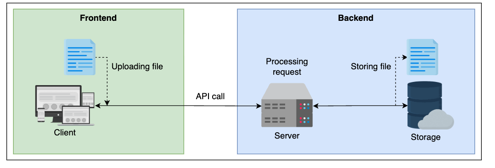
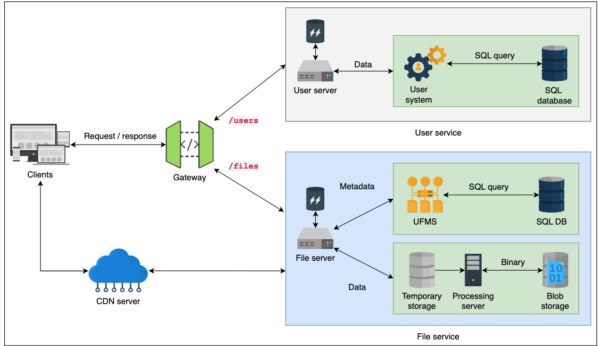
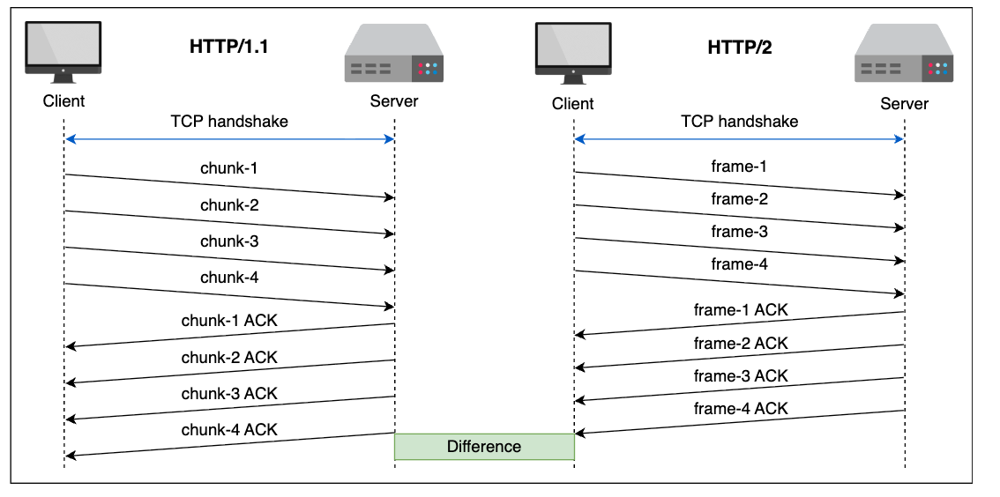

# Definition
File or cloud storage services offer reliable and cheaper storage for various media like photos, videos, and documents, allowing users to upload and download data on demand. These services abstract complex backend systems into simple API calls for clients.

# Non-functional requirements
- Upload: Securely upload files to remote storage.
- Download: Retrieve uploaded files from remote storage.
- Delete: Allow file owners to delete their uploaded files.
- List: Enable file owners to list their uploaded files.

# Non-functional Requirements
- Reliability: Ensure data is not lost or corrupted during transfer and is persistently stored.
- Security: Implement appropriate mechanisms for secure data access.
- Scalability: Handle an increasing number of users and files.
- Availability: Provide high availability for upload/download operations.
- Low latency: Achieve fast upload and download speeds.

# Design decision


## Components and services detail
| Component or Service | Details |
| :--- | :--- |
| File servers | • Accept and process file API requests forwarded by the API gateway<br>• Split requests into metadata (user and file information) and file content |
| Processing server | • Performs encoding/decoding of data into different encoding schemes<br>• Encrypt/decrypt data at-rest to prevent unauthorized access |
| User to file mapping system (UFMS) | • Maps users to files and where those files can be found in storage |
| Blob storage | • Stores binary data objects (file content) |
| Temporary storage | • Stores files and objects temporarily before processing |
| User server | • Handles user related requests forwarded by the API gateway |
| SQL database | • Stores information related to files and users (metadata) |
| CDN servers | • Geographically distributed network for serving data to the user from a nearby location instead of serving it from the blob storage |
| API gateway | • Forwards client requests to the appropriate application server<br>• Authenticates and authorizes client requests<br>• Rate-limits client requests to keep the server from overburdening |
| Client | • The consumer of the API service<br>• Can perform lossless compression before sending a file |

## Workflow
- Client to API gateway:

    Client authentication and authorization for read/write access. After verification, clients can upload, download, list, or delete files via HTTP requests.
- API gateway to downstream services:

    - Upload: Gateway forwards requests to the application server. Metadata (user ID, file name, size, location) is extracted and sent to UFMS, which stores it in a SQL database. File content is stored in temporary storage, processed (compressed, encrypted), and then moved to blob storage. Multiple copies are made for reliability and faster delivery (CDN, backup).
    - Download: Client requests reach the gateway, forwarded to the application server, which queries UFMS for information. The server retrieves file contents from blob storage (or CDN), compiles the response, and returns it.

## Consideration
### Architecture style
- REST: Chosen as the primary communication protocol (client-to-API Gateway and API Gateway-to-downstream services). It's well-suited for basic operations on a single resource (files) and provides a standardized approach, avoiding unnecessary complexity.
- gRPC: Less suitable due to its focus on communication-intensive systems and persistent connections, which may not be fully utilized for individual file uploads.
- GraphQL: Not ideal as the service does not involve managing different resources with a single request or addressing overfetching/underfetching from multiple endpoints.

The discussion above suggests we should use REST because it has better support for different operations in our file API and avoids unnecessary complexity. Therefore, we propose REST as a communication protocol from client to API gateway and from API gateway to downstream services.

### Data format
- JSON: Chosen for metadata (user and file information) and requests/responses due to its human readability, compactness, ease of implementation, and built-in JavaScript parser support.
- XML: Less suitable due to larger encoded sizes and lack of built-in parser support.
- Binary: Used for the actual file content transfer, storage, and retrieval due to its speed and compactness, while JSON handles the human-readable parts.

The actual file content is transmitted in binary format. Only the requests and responses are formatted in JSON for processing.

### HTTP version



-`Chunk and frame`

A chunk is a small portion of bytes in the entire data sequence (complete file). In HTTP/1.1, we can enable chunked data transfers by specifying Transfer-Encoding: chunked in the request header. On the other hand, in HTTP/2.0, all requests are sent in byte ranges (chunk in HTTP/1.1) by default, and these ranges are called frames.

From the explanation above, we conclude that HTTP/2.0 supports segmented data transfers (called frames) by default, whereas in HTTP/1.1, we have to enable segmented transmission of data, referred to as chunks.
| Feature                   | **HTTP/1.1 – Chunk**                                                                                | **HTTP/2 – Frame**                                                                                    | **HTTP/3 – QUIC Frame**                                                                                   |
| ------------------------- | --------------------------------------------------------------------------------------------------- | ----------------------------------------------------------------------------------------------------- | --------------------------------------------------------------------------------------------------------- |
| **Purpose**               | Stream body without knowing total length.                                                           | Binary framing for multiplexing and control.                                                          | Binary framing for multiplexing and control over QUIC (UDP).                                              |
| **Layer**                 | Application-level (part of HTTP body).                                                              | Binary framing layer (on top of TCP).                                                                 | Binary framing layer (on top of QUIC).                                                                    |
| **Encoding**              | Text-based headers and chunk markers (ASCII).                                                       | Binary-encoded frames.                                                                                | Binary-encoded frames.                                                                                    |
| **Carries**               | Only message body (data).                                                                           | Headers, data, settings, priority, etc.                                                               | Headers, data, settings, priority, etc.                                                                   |
| **Multiplexing**          | ❌ None — one request per TCP connection.                                                            | ✅ Yes — multiple logical streams on one TCP connection.                                               | ✅ Yes — multiple streams over QUIC (UDP).                                                                 |
| **Head-of-Line Blocking** | ✅ Yes — if one request blocks, all wait.                                                            | ✅ Yes — still at TCP layer.                                                                           | ❌ No — QUIC isolates streams at the transport level.                                                      |
| **Compression**           | Optional body compression (gzip, deflate).                                                          | HPACK header compression.                                                                             | QPACK (QUIC-safe header compression).                                                                     |
| **Reliability**           | TCP guarantees order and delivery.                                                                  | TCP guarantees order and delivery.                                                                    | QUIC ensures reliability but avoids TCP head-of-line blocking.                                            |
| **Flow Control**          | Basic per-connection flow control.                                                                  | Per-stream and per-connection flow control.                                                           | Independent per-stream flow control.                                                                      |
| **Latency**               | Higher (TCP handshake + sequential).                                                                | Lower (multiplexing).                                                                                 | Lowest (QUIC: 0-RTT, no TCP handshake).                                                                   |
| **Binary File Upload**    | ✅ Supported (binary data inside text-based chunks).                                                 | ✅ Supported (binary-safe frames).                                                                     | ✅ Supported (binary-safe frames).                                                                         |
| **Transport Protocol**    | TCP                                                                                                 | TCP                                                                                                   | QUIC (built on UDP).                                                                                      |
| **Analogy**               | 🚚 **One truck carrying one big box** — chunks just split it into pieces, but it’s still one route. | 🚚 **One truck carrying many labelled boxes** — frames from different streams interleave efficiently. | 🚀 **Many trucks driving in parallel on faster roads** — QUIC streams run independently without blocking. ||


| Layer                     | **HTTP/1.1**               | **HTTP/2**              | **HTTP/3 (QUIC)**                |
| ------------------------- | -------------------------- | ----------------------- | -------------------------------- |
| **Framing Type**          | Chunked (text-based)       | Binary frame            | Binary QUIC frame                |
| **Transport**             | TCP                        | TCP                     | QUIC (UDP-based)                 |
| **Multiplexing**          | ❌ No                       | ✅ Yes                   | ✅ Yes                            |
| **Head-of-Line Blocking** | ✅ Yes                      | ✅ Yes (TCP-level)       | ❌ No                             |
| **Header Compression**    | ❌ None                     | ✅ HPACK                 | ✅ QPACK                          |
| **Setup Time**            | 1–2 RTT (TCP + TLS)        | 1–2 RTT                 | ⚡ 0-RTT (QUIC handshake)         |
| **File Upload (Binary)**  | ✅ Supported via chunks     | ✅ Supported             | ✅ Supported                      |
| **Best For**              | Simplicity & compatibility | Faster content delivery | Low-latency, mobile-friendly web |

#### Example

```
═══════════════════════════════════════════════════════════════
        HTTP/1.1 — Chunked Transfer Encoding (Text-based)
═══════════════════════════════════════════════════════════════
Client                                           Server
│                                                  │
│  Request:                                        │
│  ┌──────────────────────────────┐                │
│  │ POST /upload HTTP/1.1        │                │
│  │ Transfer-Encoding: chunked   │                │
│  └──────────────────────────────┘                │
│                                                  │
│  Response Body (chunks sent sequentially):       │
│   ┌──────────┐                                   │
│   │4\r\nWiki │──► Chunk 1 (4 bytes)              │
│   │5\r\npedia│──► Chunk 2 (5 bytes)              │
│   │0\r\n     │──► End of chunks                  │
│   └──────────┘                                   │
│                                                  │
│  ➤ Chunks are *text-based* metadata (size) but carry
│    *binary-safe* data (e.g., images, files, etc.)
│  ➤ Only ONE stream per TCP connection.
│  ➤ Packet loss or slow response blocks everything.
│
│  ❌ Head-of-line blocking
│  ❌ No multiplexing
│  ✅ Simplicity, wide compatibility
▼
═══════════════════════════════════════════════════════════════
        HTTP/2 — Binary Framing Layer (Multiplexed over TCP)
═══════════════════════════════════════════════════════════════
Client                                           Server
│                                                  │
│  ┌───────────── Control Connection (TCP) ─────────────┐
│  │                                                   │
│  │ Stream 1: [HEADERS][DATA][DATA][END_STREAM]       │
│  │ Stream 2:     [HEADERS][DATA][END_STREAM]         │
│  │ Stream 3:         [HEADERS][DATA][END_STREAM]     │
│  │──────────────────────────────────────────────────►│
│  └───────────────────────────────────────────────────┘
│
│  ➤ All streams share ONE TCP connection.
│  ➤ Frames are binary and interleaved:
│       • HEADERS frames carry metadata (compressed via HPACK)
│       • DATA frames carry actual payloads (text or binary)
│  ➤ If one TCP packet is lost → ALL streams wait (TCP reordering).
│
│  ✅ Multiplexing (logical concurrency)
│  ✅ Header compression (HPACK)
│  ⚠️ Still has TCP head-of-line blocking
│  ⚙️ Improved efficiency but limited by TCP semantics
▼
═══════════════════════════════════════════════════════════════
        HTTP/3 — QUIC Frames (Multiplexed over UDP)
═══════════════════════════════════════════════════════════════
Client                                           Server
│                                                  │
│  ┌────────────── QUIC Connection (UDP) ───────────────┐
│  │                                                    │
│  │ Stream 1: [Frame1][Frame2][Frame3]                 │
│  │ Stream 2: [Frame1][Frame2]                         │
│  │ Stream 3: [Frame1]                                 │
│  │───────────────────────────────────────────────────►│
│  └────────────────────────────────────────────────────┘
│
│  ➤ QUIC = UDP + built-in reliability, flow control, and encryption.
│  ➤ Streams are independent:
│       • Lost packet in Stream 1 does NOT block Streams 2 or 3.
│  ➤ Faster connection setup (0-RTT resumption, no TCP handshake).
│  ➤ Uses QPACK (QUIC-friendly header compression).
│
│  ✅ Multiplexing (true concurrency)
│  ✅ No head-of-line blocking
│  ✅ Built-in TLS 1.3 security
│  ✅ Better loss recovery, lower latency
│  🚀 Designed for real-time web (HTTP/3)
▼
═══════════════════════════════════════════════════════════════

```


# Q & A
-`Which communication style (REST, gRPC, or GraphQL) would you choose for each stage, and why`

For the client to API Gateway stage, REST is a good choice because it’s simple, widely supported, and well-suited for standard HTTP operations like upload and download. For the API Gateway to internal services, gRPC is ideal because it provides low latency, efficient binary communication, and strong typing with Protocol Buffers, which are perfect for internal service interactions such as metadata extraction, database updates, and file processing.

-`Why don’t we store the metadata in the same database as the actual file content?`

Metadata is being shared with many other services (such as a user service, an authentication and authorization service, etc.), and storing it in blob storage may not be a good idea because we often need to run many queries on it. Moreover, the actual file content is not being used by the API service and can be encrypted to store in permanent blob storage. Apart from that, having the same server do multiple tasks is not good for scalability. Finally, a failure of one service will not result in the failure of another if metadata and file content are stored separately.


-`Why don’t we use File Transfer Protocol (FTP) requests to transfer data between the client and server?`
FTP, by default, transmits data in plaintext, and it’s less suitable for frequent requests to upload small files. On the other hand, HTTP works well with interrupted requests (by asking for a specific byte number in the file instead of starting afresh) and firewalls, making it suitable for small file uploads.
