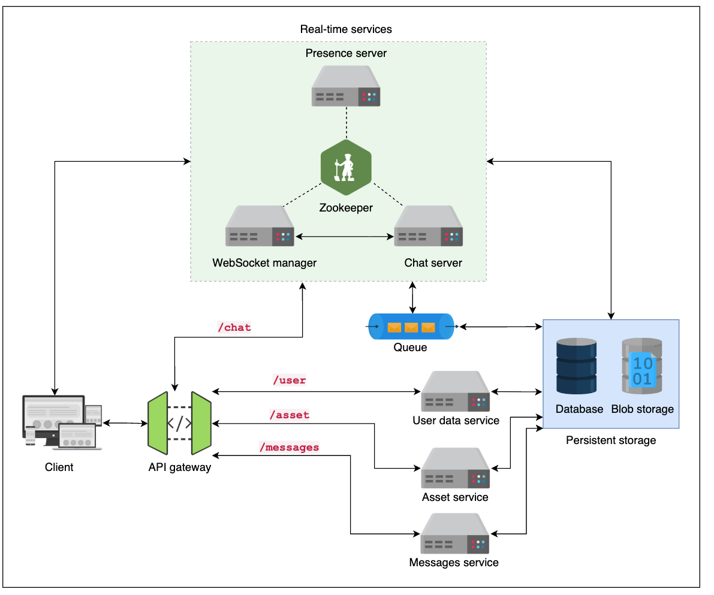
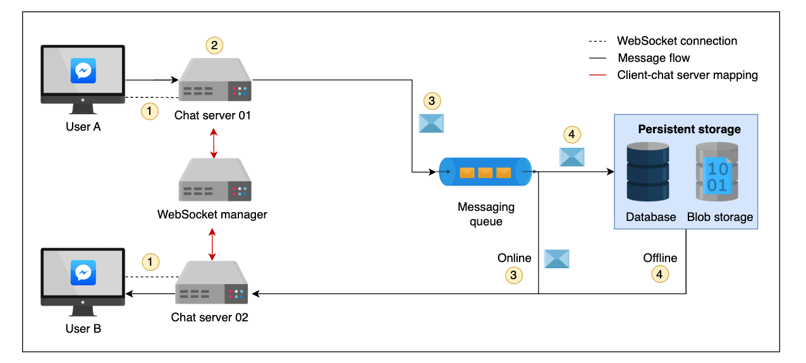

# Functional requirements
- Conversation: The Messenger API should allow users to send one-to-one messages, as well as group messages.

- Sharing of media files: The API should allow the sharing of media files, including audio, images, and videos.

- Message status: The API should allow users to check the status of a message, such as sent, failed, delivered, and read.

- A paginated list of chats: The Messenger API should provide a paginated list of messages from a chat. These messages should be able to be viewed without an internet connection, so they should be stored locally on the client side.

# Non-functional requirements#
- Scalability: The Messenger API should be able to handle a large number of users and messages without performance degradation.
- Consistency: Messages should be delivered in the order they were sent by the user, and the API should provide similar message history across different clients/devices.
- Low latency: The Messenger API should provide low latency for sending and receiving messages to ensure a smooth user experience.
- Security: The Messenger API should ensure the security and privacy of user data, including end-to-end encryption for messages.
- Reliability: The Messenger API should be highly reliable, with minimal downtime and robust error handling.
- Extensibility: The Messenger API should be designed to allow for future enhancements
- Availability: The Messenger API should be available 24/7 with minimal downtime.
- Performance: The Messenger API should be optimized for fast response times and efficient resource usage.
- Maintainability: The Messenger API should be designed for easy maintenance and updates.

# Design decision




| Component or Service | Details |
| :--- | :--- |
| **User data service** | • User relevant data is accessed or stored via this service in the relevant database |
| **Asset service** | • Responsible for storing/retrieving media files in the blob storage |
| **Messages service** | • Facilitates retrieval of messages on new/alternative devices |
| **Messaging queue** | • Serves as buffer space for temporarily holding users' messages<br>• Enables asynchronous communication between chat service and persistence storage<br>• Decouples services aiding system scalability |
| **Zookeeper** | • A service discovery that keeps a check on the health of various servers |
| **WebSocket manager** | • Keeps mapping of active/online users and the ports assigned to them |
| **Chat server** | • Facilitates message delivery between sender and receiver |
| **Presence server** | • Responsible for managing users' online status |
| **API gateway** | • Authenticates and authorizes a user request<br>• Performs request throttling and caches responses to frequently made API calls. For example, data related to specific conversations or user profiles can be cached to reduce the load on the backend servers. |

## Work flow
Login: Initiated via API gateway, authenticated by user data service.

Message Sending: A WebSocket connection is established between sender and a chat server. The WebSocket manager updates user-port mapping. Zookeeper monitors server health.

Messaging Queue: Acts as an intermediate buffer, delivering messages to the receiver's chat server and storing them persistently for both online/offline scenarios. This ensures reliability and allows message retrieval from multiple devices.

Media Sharing: Files are uploaded to persistent storage via the asset service, and their URIs are shared in chat. Receivers download via the asset service after validation.

## 1-1 chat — detailed workflow and explanations


This expands the short workflow into a step-by-step flow showing what happens from connection setup through delivery, persistence, and client synchronization. Focus areas: correctness (ordering, deduplication), reliability (persist/ack/retry), and UX (low-latency delivery, statuses).

1. Connection & authentication
- Client opens a WebSocket (or long-lived connection) to an assigned chat server (chat-01 for User A, chat-02 for User B). The WebSocket manager maps user -> chat server and updates presence.
- The client authenticates (token exchange) over the socket. Authentication result is cached for the connection lifetime. On success, presence server marks user online and stores last-available timestamp.

2. Compose & local enqueue (sender side)
- User A composes a message. The client:
    - Assigns a local temporary ID and persists the message to local storage so it is available offline and for immediate UI feedback.
    - Optionally computes metadata: client timestamp, conversation ID, sender ID, device ID, and a monotonic sequence or logical clock for ordering.
    - Encrypts the payload if E2EE is used, producing ciphertext + metadata.

3. Send to chat server (chat-01)
- The client sends the message over the WebSocket to chat-01.
- chat-01 validates authentication, verifies conversation membership and rate limits, then:
    - Produces or finalizes a canonical message ID (e.g., UUID) and attaches server timestamp.
    - Assigns a per-conversation sequence number or vector to help ordering across devices (important for concurrent sends).
    - Persists the canonical record to a durable write-ahead/persist queue (or forwards to the messaging queue) before acknowledging the client.
- Acknowledgement flow:
    - chat-01 immediately sends an acknowledgment (ACK) back to User A containing the canonical ID, server timestamp, and preliminary status "sent". The client reconciles its local temporary ID with the server canonical ID and updates UI.

4. Publish to messaging queue / persistence
- chat-01 forwards the canonical message to the messaging queue (topic/partition keyed by conversation ID). The queue is durable and replicates messages to storage.
- A persistence worker (or the queue consumer) writes the message to the messages store (primary DB or append-only log) for long-term storage and cross-device sync.
- Persist-before-deliver ensures that a message can be retrieved later by offline recipients or other devices.

5. Route to recipient chat server (chat-02)
- The messaging queue routes the message to the partition for the recipient (keyed by conversation or recipient user ID). Delivery routing may use the WebSocket manager lookup:
    - If chat-02 is the server mapped to User B, the queue forwards to chat-02's delivery queue or notifies chat-02.
    - If the recipient is on the same server (chat-01), routing is local and cheaper.

6. Real-time delivery attempt
- chat-02 attempts immediate delivery to User B:
    - If User B has an active WebSocket, chat-02 pushes the message over the socket and expects an application-layer delivery ACK.
    - On successful push, chat-02 updates message status to "delivered" in the messages store and emits a delivery event.
    - chat-02 may also send a push notification (APNs/FCM) if the client is backgrounded or the mobile OS closed the socket.

7. Offline or failed delivery
- If User B is offline (no active socket) or delivery fails:
    - chat-02 leaves the message stored in the persistent messages store and marks status "pending" or "undelivered".
    - The message remains in the messaging queue or a retry/backoff queue so delivery is attempted again when the recipient becomes available.
    - Optionally trigger a push notification to the device(s) to prompt reconnection.

8. Receipt & read receipts
- When User B's client receives the message:
    - It persists the message locally for offline access and sends a delivery ACK back to chat-02.
    - chat-02 updates the messages store with "delivered" and notifies chat-01 (or a central sync service) to inform the sender's device(s).
- When User B opens/reads the message:
    - The client sends a read event to chat-02 which updates the store to "read" and propagates that event to sender(s) (chat-01 or directly if connected), updating UI on all sender devices.

9. Cross-device synchronization
- For users with multiple devices, the messages store + sync service ensures all devices receive the canonical message and status changes:
    - Devices subscribe to conversation changes (via WebSocket or polling).
    - Sequence numbers or per-device clocks prevent reordering and aid idempotency.
    - Newly-connected devices pull historical messages (paginated) from the messages store and merge with local cache.

10. Ordering, idempotency, and deduplication
- Use conversation-scoped sequence numbers or strictly ordered append log (per convo partition) so all consumers see the same ordering.
- Message IDs + deduplication logic ensure that retries or reconnections do not create duplicates.
- Idempotent APIs and retained message metadata (e.g., origin device ID + client sequence) help in safe replays.

11. Reliability, retries and backpressure
- Messaging queue implements retries, dead-lettering, and exponential backoff for delivery failures.
- Chat servers apply backpressure if a downstream persistence or delivery subsystem is slow (reject or throttle new writes with appropriate client error/ retry hints).
- Metrics and health checks (Zookeeper/service discovery) route traffic away from unhealthy servers.

12. Security & privacy considerations
- End-to-end encryption: encrypt message payload client-side; servers only route blobs, store ciphertext, and cannot read content.
- Authenticate and authorize membership in conversation before accepting/forwarding messages.
- Protect message metadata in transit (TLS) and at rest (encryption at rest) as required by policy.

13. Client UX behaviors
- Immediate optimistic UI: show message as "sending" until server ACK; update to "sent", "delivered", and "read" as events come.
- Offline composition: allow compose and queue locally; sync when connection resumes, reconciling server IDs and statuses.
- Pagination and local caching: fetch message history from local storage first, then sync newer messages from server for seamless offline/online experience.

Summary (concise)
- Sender persists locally → sends to chat server → server assigns canonical ID and persists to durable queue → queue/persistence stores message → recipient server attempts delivery (real-time if online; else queued) → delivery and read ACKs flow back to update sender and other devices. Throughout, maintain ordering, idempotency, retries, and privacy (E2EE/TLS) to ensure a consistent and reliable 1:1 chat experience.

Remember: Each user will establish a single connection with a chat server. Each new message sent from the client side will have a senderID, receiverID, messageID, orderNumber according to the session, and the corresponding message text. The chat servers will use this information to deliver the message in the right sequence.

# API models

## API endpoints

| Feature | Method | Endpoint Path | Protocol |
| :--- | :--- | :--- | :--- |
| WebSocket connection | GET | `/chat?encoding=text` | HTTP/2.0 |
| Retrieve an asset | GET | `/asset/[mediaFilesID]` | HTTP/2.0 |
| Upload an asset | POST | `/asset` | HTTP/2.0 |
| Retrieve a list of messages | GET | `/messages/([userID]?after_id=[messageID]&limit=[count])` | HTTP/2.0 |

## Data entity
### Message Entity
```
type message
{
  senderId: string          // Represents a sender
  receiverId: string        // Represents a receiver
  groupId: string           // Represents a group
  messageId: string         // A unique ID of a message
  timestamp:  string        // The time when the message is created
  attachment: boolean       // Shows whether the message has an attachment
  attachmentURI: list       // Contains the path(s) to the attachment(s) in the Blob storage
  messageText: string       // Shows text of the message
  receivedServer: boolean   // Shows whether the message is sent to the server or not
  delivered: boolean        // Shows whether the message is delivered to the receiver or not
  read: boolean             // Shows whether the message is read by the receiver or not
}
```

### Message
1. Reqeust
```
{
  "connection_id": "rLCkwH/SKGAsO9H/ZShrBAFTDKU=",
  "payload": [
    {
      "senderId"       : "Rtnukkald=",
      "receiverId"     : "IJUkalxUl=",
      "messageId"      : "Pqwnkilsx=",
      "timestamp"      : "9:47PM 12-1-2023",
      "attachment"    : false,
      "attachmentURI" : "",
      "messageText"    : "Hello, Welcome!"
   }
  ]
}
```
2. Response
```
{
  "connection_id": "rLCkwH/SKGAsO9H/ZShrBAFTDKU=",
  "payload": [
    {
      "senderId"       : "Rtnukkald=",
      "receiverId"     : "IJUkalxUl=",
      "messageId"      : "Pqwnkilsx=",
      "timestamp"      : "9:48PM 12-1-2023",
      "receivedServer" : true,
      "delivered"      : true,
      "read"           : true

   }
  ]
}
```
When a client sends a media file in a message, the attachment attribute is set to true, and the file is uploaded to the blob store via the asset service. The URI of the file is also mentioned in the attachmentURI attribute. On the receiver side, the attachment is downloaded using the same URI as the media file.

### Retrieving offline messages

When the presence server determines that some user's status is offline, the messages intended for them are stored in the database and marked undelivered. When a user comes online, the presence server receives a heartbeat event from them, the chat server is notified, and the WebSocket connection is established

```
{
"messages": [
     {
       "payload": [
           {  //message-01
              "senderId"       : "Rtnukkald=",
              "receiverId"     : "IJUkalxUl=",
              "messageId"      : "Pqwnkilsx=",
              "timestamp"      : "9:47:30PM 12-1-2023",
              "attachment"    : true,
              "attachmentURI" : "/v1.0/asset/{id}",
              "messageText"    : "Hello, Welcome!"
          },
         {   //message-02
             "senderId"       : "alnukRtkald=",
             "receiverId"     : "IJUkalxUl=",
             "messageId"      : "Xkilqwnsx=",
             "timestamp"      : "9:47:50PM 12-1-2023",
             "attachment"    : true,
             "attachmentURI" : "/v1.0/asset/{id}",
             "messageText"    : "Hi!"
        },
       ...
       //and so on.
    ]}
  }
```


# Q & A
`How do we determine whether a user is disconnected and has no active Internet connection?`

The user disconnection is determined via the presence server. When a user has an active Internet connection, and the client application runs in the background, they send periodic heartbeat events to the presence server. A user is considered disconnected if the presence server doesn’t receive any heartbeat event within a specified time, say 5 seconds. The presence server also shows the status of a user to their online contacts.

`How do we determine whether a user is online?`
When a user opens the client application, it establishes a WebSocket connection with a chat server. Hence, the online or offline status is determined by checking whether the client has an active WebSocket connection with the chat server. We then store the most recent availability timestamp of a user in the database. This is because we want to display the last seen online status of the user to their online contacts. Note that we store this information in the database because we want to ensure the durability of the service.

The WebSocket connection remains open when the user is online. However, as the user goes offline, the connection is automatically terminated.
