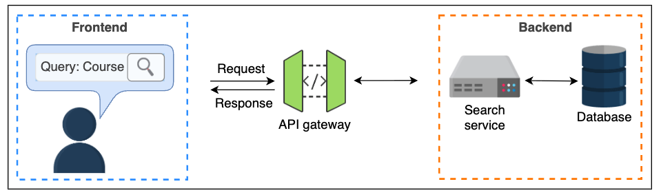

# Functional Requirements
- Searching: The API should return data relevant to the user query.

- Sorting: The API should sort data as per the client's preference.

- Pagination: The API should allow pagination functionality if the number of returned entries is large.

# Non-Functional Requirements
- Availability: The API should be highly available to the users.

- Scalability: The API should have the ability to scale with the increasing amount of data and the number of search queries.

- Security: APIs should allow users to obtain results tailored to individual user behavior in a secure manner.

- Low latency: Our API should focus on generating responses with low latency irrespective of the size of the query and data set to search.
- Consistency: The API should ensure that the search results are consistent across multiple requests for the same query.
- Monitoring: The API should have monitoring in place to track performance, usage patterns, and potential issues.
- Documentation: The API should be well-documented to facilitate ease of use and integration by developers.
- Rate Limiting: The API should implement rate limiting to prevent abuse and ensure fair usage among all users.
- Error Handling: The API should provide meaningful error messages and handle exceptions gracefully.
- Compliance: The API should comply with relevant data protection regulations and standards.
- Maintainability: The API should be designed in a way that allows for easy updates and maintenance over time.
- Reliability: The API should be reliable, ensuring that it consistently performs as expected without failures.
- Usability: The API should be user-friendly, with clear endpoints and parameters for ease of use by developers.
- Interoperability: The API should be compatible with various platforms and technologies to ensure broad usability.
- Caching: The API should implement caching mechanisms to improve response times for frequently requested data.
- Versioning: The API should support versioning to manage changes and updates without disrupting existing users

# High level


# Design decision


### Design detail
| Component or Service | Details |
| :--- | :--- |
| Search service | • Performs searching, pagination, and sorting |
| Recommendation service | • Recommends other search phrases related to the user's searched query |
| User service | • Stores and provides user information to other services<br>• Records the previous search history of users<br>• Collaborates with the ads service for personalized ads<br>• Interacts with the search service to filter or sort search results |
| Ads service | • Returns advertisements based on the search query |
| API gateway | • Authenticates and authorizes incoming requests<br>• Throttles requests based on rate limiting<br>• Caches the response to frequently made search queries<br>• Routes the request to appropriate search, recommendation, and ads services |
| Database | • NoSQL distributed database cluster to store the application data and index table |

### Workflow

The query simultaneously reaches the search, recommendation, and ads services.

The search service generates results, incorporating information from the user service for filtering, sorting, and pagination.

Ads and recommendation services provide their respective responses.

The API gateway consolidates all responses and presents them to the user.
Each query is stored for future intelligence.


### Data format
We employ JSON data formats for the communication between the interacting entities: client, API gateway, and back-end services. Query requests via the search API are made via the GET HTTP method, which contains no body; however, the data received should be readable to humans for debugging purposes and easily renderable by the browsers. The data in the response contains the searched and filtered data, including media files; therefore, a suitable option for REST is to go with the JSON data format.

# API model

Modeling the search API to meet functional requirements, defining essential data entities, and structuring requests and responses for various endpoints.

### API enpoint
* **Search**:

    The search keywords are passed as a `query` parameter along with the base URL.

    Sort: The `order` defines the sequence of the records (such as descending or ascending). Additionally, the `sort` parameter sorts the results based on the field provided in the query par

    Pagination: This endpoint takes various parameters based on the type of pagination we aim to perform. For example, using the bucket pattern requires a skip parameter in the query.

    * `GET /v1.0/search?query={string} HTTP/1.1`
    * `GET /v1.0/search?query={string}&sort={field}&order={ascending} HTTP/1.1`
    * `GET /v1.0/search?query={string}&skip={value} HTTP/1.1`
* **Recommendation**:
    * `GET /v1.0/recommendations?query={string} HTTP/1.1`
* **Ads**
    * `GET /v1.0/ads?query={string} HTTP/1.1`

### The message format for API endpoints

#### Search data entities

Data entities are the key-value pairs sent in the request and response messages between the client and endpoints to exchange data.

```
type search
{
    query: string            \\ This is the search term entered by the user
    sort: string             \\ This is a name of field that needs to be sorted
    order: string            \\ The sequence of results e.g. ascending or descending order
    count: integer           \\ This represents the total number of results
    pageNumber: integer
    limit: integer           \\ The maximum number of results displayed on a page
    results: list
    recommendations: list
    adsSuggestions: list
    partialResponse: boolean \\ This flags the response to be partial due to processing timeout
}
```
# Q & A

# Design Evaluation
### Non-functional requirements

- Availability

Enhanced through rate limiting, API monitoring, and circuit breakers to prevent system overload and cascaded failures.

- Scalability

Achieved by backend server redundancy, caching frequently searched queries, and utilizing caching technologies between client and services for static content. Replicating services

- Security

Supports TLS 1.2+ for secure communication. For unauthenticated users, API keys are used. For logged-in users, credentials (username/password) or JWTs provide personalized responses.

- Low latency

Techniques include high-speed caches in the API gateway for generic queries, setting a maximum time threshold for server-side query execution (returning results found within the limit), pagination to reduce payload, and filtering results before passing them to the search server.

### Latency Budget
#### Request Size:
Assumed to be 1.5 KB (due to query parameters like query, sort, filter).

#### Response Size:
Estimated based on 10 search results (1KB each), 5 recommendations (5KB), and 2 ads (5KB), totaling 20 KB.

`Size_response = (Size_results × Number_results) + Size_recommendations + Size_ads`

`Size_response = (1 × 10) + 5 + 5 = 20 KB`

#### Latency:
Based on "Back-of-the-Envelope Calculations for Latency," average Round-Trip Time (RTT) is consistent for GET requests, and response download time is `~0.4 ms per KB`.

`Time_latency_min = Time_base_min + RTT_get + (0.4 * size_of_response_in_KBs) = 120.5+70+0.4×20=198.5 ms`


`Time_latency_max = Time_base_max + RTT_get + (0.4 * size_of_response_in_KBs) = 201.5+70+0.4×20=279.5 ms`

#### Response Time Calculation:
`Time_Response = Time_latency + Time_processing`

`Time_Response_min = Time_latency_min + Time_processing_min = 198.5 ms+4 ms=202.5 ms`

`Time_Response_max = Time_latency_max + Time_processing_max = 279.5 ms+12 ms=291.5 ms`

We considered the minimum processing time (in the case of a parallel execution of API calls on all services) is 4 ms, and the maximum processing time (assuming services are not executing in parallel) is 12 ms.


