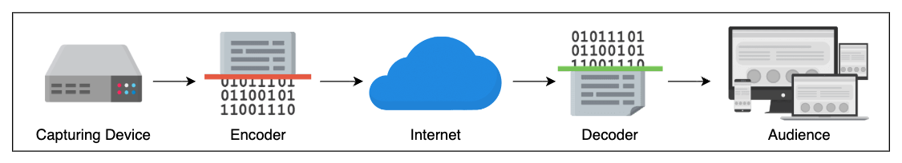

# Functional requirements
- Video searching: Users should be able to search for a video through the vast repository of YouTube videos.
- Video streaming: Users should be able to stream a video uninterruptedly.
- Video preview: This service should allow users to obtain video trailers.
- Rating a video: Each video needs to have a like or dislike button.
- Video uploading: Users should be able to upload videos.
- Comment on a video: Users should be able to add multiple comments on a video.

# Non-functional requirements
- Scalability: The system should be scalable to handle the - ever-increasing number of users.
- Availability: The system should be highly available to - provide uninterrupted services.
- Flexibility/adaptability: Since YouTube is a popular service, - a number of devices are used to access it. This requires the - API to be flexible and consistent across various devices like - TVs, mobile phones, desktop computers, laptops, and so on.
- Security: The API should allow only privileged users to - manipulate their content. Furthermore, users should be able - to communicate securely with the API.
- Low latency: The system should be adaptable to changing network conditions, such as low bandwidth and occasional network congestion.

# Terminologies involved in media streaming
- Encoding: The process of representing data in bits to remove redundant information, primarily for compression. An encoder compresses raw media at the sender's end, and a decoder decompresses it at the receiver's end. This enables sending large media files over the Internet but can result in lossy quality (though lossless algorithms exist). Popular video encoding algorithms include H.264, H.265, VP9, and AV1, while audio examples are MP3, AAC, and Dolby AC-3. The existence of numerous formats is attributed to technical limitations (e.g., storage for AVI), legal issues (licensing), support problems (e.g., browser compatibility for newer formats), resource consumption, complexity, and flexibility.
- Transcoding: The conversion of an uploaded raw video into various formats and bitrates. This is crucial for adapting content to varying client-side bandwidths and screen resolutions, enabling a graceful degradation of user experience. While it allows for adaptive streaming, a disadvantage is the need to store the same raw media file in multiple formats on the server.
- Segmentation: The process of breaking down a transcoded video into small, timed chunks, typically 2 to 10 seconds long, called segments. This eliminates the need to download the entire media file at once and requires clients to download a manifest file (which lists available segments).
- Adaptive Bitrate (ABR): The ability to dynamically change the streaming media quality (bitrate) during playback based on network conditions and screen resolution. ABR relies on media segments of differing quality being created and sent to the client as needed, significantly enhancing user experience by reducing buffering.
- Buffering: The pre-downloading of a certain amount of data before playback. Buffering occurs when the playback rate exceeds the download rate, and ABR helps minimize this delay.

# Q & A
`How much data should be buffered to avoid streaming lag or playback stall?`

The answer to this question depends upon several factors. Ideally, the buffer size allocation should be large enough to support a smooth playback. Of course, the playback device will need a good RAM size to support a large buffer size. The amount of buffered media should be balanced so that it neither overflows the buffer nor falls too low. If it overflows, the media will have to be sent back, whereas, if little content is buffered, there is a chance of streaming lag.

Therefore, we must define some thresholds for the available buffers to avoid overflow or lag. To achieve this behavior, an algorithm will be devised in the player on the client side that will request media segments depending on the latency of segment arrival and availability of buffer space. For example, in the figure below, the lower boundary of the threshold would initiate a request from the client to the server for segments, whereas the higher threshold boundary would halt further requests because we have enough content for playback.
