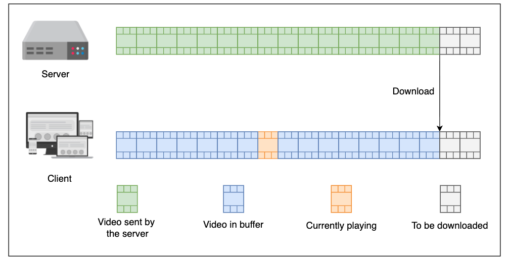
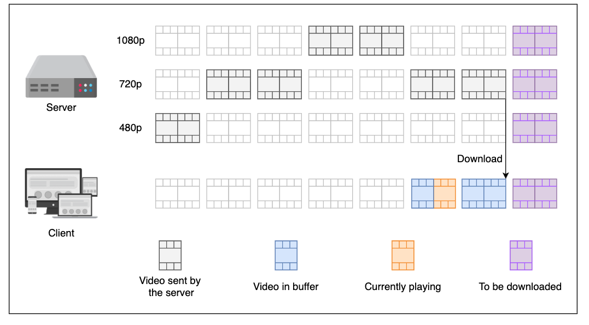
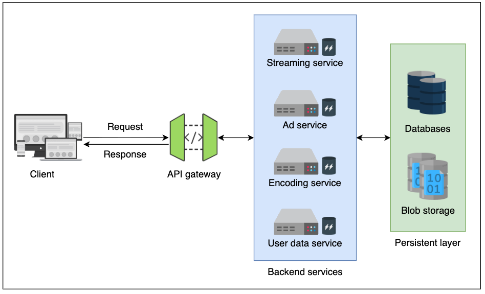
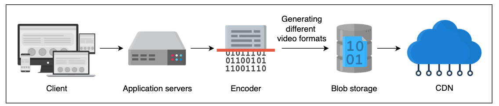
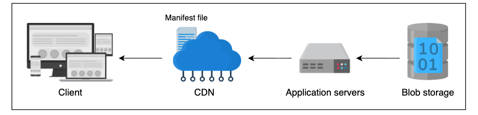

# Functional requirements
- Video searching: Users should be able to search for a video through the vast repository of YouTube videos.
- Video streaming: Users should be able to stream a video uninterruptedly.
- Video preview: This service should allow users to obtain video trailers.
- Rating a video: Each video needs to have a like or dislike button.
- Video uploading: Users should be able to upload videos.
- Comment on a video: Users should be able to add multiple comments on a video.

# Non-functional requirements
- Scalability: The system should be scalable to handle the - ever-increasing number of users.
- Availability: The system should be highly available to - provide uninterrupted services.
- Flexibility/adaptability: Since YouTube is a popular service, - a number of devices are used to access it. This requires the - API to be flexible and consistent across various devices like - TVs, mobile phones, desktop computers, laptops, and so on.
- Security: The API should allow only privileged users to - manipulate their content. Furthermore, users should be able - to communicate securely with the API.
- Low latency: The system should be adaptable to changing network conditions, such as low bandwidth and occasional network congestion.

# Terminologies involved in media streaming
- Encoding: The process of representing data in bits to remove redundant information, primarily for compression. An encoder compresses raw media at the sender's end, and a decoder decompresses it at the receiver's end. This enables sending large media files over the Internet but can result in lossy quality (though lossless algorithms exist). Popular video encoding algorithms include H.264, H.265, VP9, and AV1, while audio examples are MP3, AAC, and Dolby AC-3. The existence of numerous formats is attributed to technical limitations (e.g., storage for AVI), legal issues (licensing), support problems (e.g., browser compatibility for newer formats), resource consumption, complexity, and flexibility.
- Transcoding: The conversion of an uploaded raw video into various formats and bitrates. This is crucial for adapting content to varying client-side bandwidths and screen resolutions, enabling a graceful degradation of user experience. While it allows for adaptive streaming, a disadvantage is the need to store the same raw media file in multiple formats on the server.

- Segmentation: The process of breaking down a transcoded video into small, timed chunks, typically 2 to 10 seconds long, called segments. This eliminates the need to download the entire media file at once and requires clients to download a manifest file (which lists available segments).
- Adaptive Bitrate (ABR): The ability to dynamically change the streaming media quality (bitrate) during playback based on network conditions and screen resolution. ABR relies on media segments of differing quality being created and sent to the client as needed, significantly enhancing user experience by reducing buffering.

- Buffering: The pre-downloading of a certain amount of data before playback. Buffering occurs when the playback rate exceeds the download rate, and ABR helps minimize this delay.


# Evolution of video streaming
- **Progressive Download**: The simplest form of video streaming, where the entire video file is downloaded to the client before playback begins. This method is straightforward but can lead to long wait times and buffering issues. However, it lacks ABR, making buffering probable, and the full file is accessible in the client's cache.


- **Adaptive bitrate streaming**: Videos are played segment by segment. A manifest file (Media Presentation Description - MPD) lists all segments with different resolutions, bitrates, and URLs. The client requests segments based on available bandwidth.


## Streaming protocols
- **HTTP Live Streaming (HLS)**: Developed by Apple, HLS is widely used for delivering video content over the internet. It breaks the overall stream into a sequence of small HTTP-based file downloads, each representing a short segment of the overall content. HLS supports adaptive bitrate streaming, allowing the client to switch between different quality levels based on network conditions.
- **Dynamic Adaptive Streaming over HTTP (DASH)**: An international standard for streaming multimedia content over the internet. Like HLS, DASH divides content into small segments and allows for adaptive bitrate streaming. It is codec-agnostic and can work with various media formats.
- **Real-Time Messaging Protocol (RTMP)**: Originally developed by Macromedia (now Adobe), RTMP is used for streaming audio, video, and data over the internet. It maintains a persistent connection between the client and server, allowing for low-latency communication. However, it is less commonly used today compared to HLS and DASH.
- **WebRTC**: A real-time communication protocol that enables peer-to-peer audio, video, and data sharing directly between browsers without requiring plugins. It is primarily used for video conferencing and live streaming applications.


# How does streaming work
## Codec
This is the first layer, where we encode and decode the video and audio data. The codecs describe the actual bit-level detail of the media file. We have already mentioned some popular video and audio encoding schemes above.

## Container formta
The encoded video and audio data are then packed into a container format. The container format defines how the different data streams (video, audio, subtitles, metadata) are organized within a single file. Popular container formats include MP4, MKV, AVI, and MOV. The choice of container format can affect compatibility with different devices and platforms.

## Transport protocol
The container file is then transmitted over the network using a transport protocol. Common transport protocols for video streaming include HTTP, HTTPS, RTMP, and WebRTC. The choice of transport protocol can impact latency, reliability, and compatibility with different devices and networks.

# Design decision
## Over view


| Component or Service | Details |
| :--- | :--- |
| Streaming service | \* Provides video streaming service<br>\* Provides videos in a multi-protocol format based on the client's devices and requirements |
| Advertisements service | \* Updates the manifest file to decide which advertisement is suitable to be played against a video<br>\* Decides the interval and number of advertisements to be shown to a user<br>\* Directs the advertisement requests to the respective servers |
| Encoding service | \* Performs encoding, transcoding, and segmentation of videos after upload |
| User data service | \* Provides user data to other services to improve user experience |
| API gateway | \* Fanout requests to the appropriate services<br>\* Performs the identity and access management (IAM) operations<br>\* Throttles requests and caches frequent API responses |
| Databases | \* Stores users' data, video metadata, and so on |
| Blob storage | \* Stores audios and videos, preferably in segments/chunks |

## Workflow
### Video publishing
The video publishing process begins by first capturing a video and uploading it to the back-end storage. During this process, complex operations are performed over raw data, such as the encoding, compression, and segmentation of videos and their associated audio files. Moreover, the segments are stored in multiple formats to provide flexibility and an uninterrupted streaming experience to end users. These video segments are later sent to edge servers, like CDN, for the viral and most-watched videos, providing a better user experience.


### Video streaming
When a user requests a video, the streaming server sends a manifest file to the client before the video. Using the manifest file, the client fetches video segments with different bitrates based on the network condition and type of the device. The manifest file also includes advertisement information that is played at different intervals during a video via the advertisement service.

A single video consists of many segments; therefore, the client sends multiple requests for each video segment. The segments are generated with different bitrates in the publishing stage; therefore, the streaming service (CDN, in the illustration below) supports different devices and network conditions. On the client side, the video is decoded, decompressed, and played in a video player.

Note that we use CDN in the illustration below to show that many clients requesting the same stream can be served simultaneously via CDN.


# API model
## Endpoints
| Feature | Method | Endpoint Path | Protocol |
| :--- | :--- | :--- | :--- |
| Streaming - Manifest file | GET | `v1.0/videos/[videoId]` | HTTP/2 |
| Streaming - Playback - Video | GET | `v1.0/videos/playback?vidSegId=[videoSegmentId]` | HTTP/2 |
| Streaming - Playback - Audio | GET | `v1.0/videos/playback?audSegId=[audioSegmentId]` | HTTP/2 |
| Streaming - Playback - Subtitles | GET | `v1.0/videos/playback?subtitleId=[subtitleId]` | HTTP/2 |
| Streaming - Playback - Events | POST | `v1.0/videos/playback?cmdId=[commandId]` | HTTP/2 |
| Streaming - Preview | GET | `v1.0/videos/preview/[videoId]` | HTTP/2 |
| Upload video | POST | `v1.0/videos` | HTTP/2 |
| Search | GET | `v1.0/videos/search?query=[string]` | HTTP/2 |
| Comment | POST | `v1.0/videos/[videoId]/comments` | HTTP/2 |
| Rate | POST | `v1.0/videos/[videoId]/ratings` | HTTP/2 |

## Message for
### Entity
```
type video
{
 id: string            \\ This is the ID of the video.
 publisherId: string   \\ This is the ID of the user who published the video.
 channelId: string     \\ This is the unique ID of the channel that the video is associated to.
 title: string         \\ This is the title of the video.
 url: hyperLink        \\ This is the link of the video.
 playlistId: list      \\ Specify the playlist(s) the video is associated with.
 thumbnails: list      \\ List containing links to preview images of different chapters of video.
 next: hyperLink       \\ Link to next recommended video.
 category: string      \\ Text describing niche/category of video.
 description: string   \\ Text containing additional information about the video.
 uploadTimeStamp: date \\ The date and time at which the particular video is uploaded.
 preview: hyperLink    \\ This is the url of image/gif file to preview the video on hover.
 fileSize: long        \\ Total size of a video file in bytes.
 segments: list        \\ A list of urls of video/audio chunks of the video being streamed.
 tags: list            \\ A list of keywords that help in better search for the video.
 permissions: list     \\ This list describes the access privileges for this video.
 qualities: list       \\ This is a list of available resolutions for a specific video.
 ads: list             \\ A list of ad links to embed when the video is played.
 statistics: list      \\ A list of values (likeCount,dislikeCount,viewCount,etc.) of this video.
}
```
### Manifest file
- ***Request***
```
GET /v1.0/videos/id=t_RSQBw7w1k HTTP/2
HOST: api.youtube.com
X-API-Key: "API Key"
Accept: application/json
```
- ***Repsonse***

The manifest file contains all the necessary information required by the client to stream a video. It includes metadata about the video, such as its title, description, channel ID, and other relevant details.

The segments array contains details about mapping each chunk of video to the playback timestamp. Any information about dynamic embed ads that will play at a specific timestamp in the video will also be provided here.

The video array contains details (URL, encoding, etc.) about the actual content of the video segments to be played by the video player on the client side.

Similarly, the audio array contains details about the audio clips to play with the video and are given in the list.

```
HTTP/2 200 OK
ETag: "34aa3868eb00"
Accept-Ranges: bytes
Content-Length: xyz
Content-Type: application/json

{
  "id": "t_RSQBw7w1k",
  "title": "Welcome to Educative",
  "description": "Discover how Educative can help you learn.",
  "channelId": "UCXkVkpFJSQstdaGBYx-cn-Q",
  "metadata":{ // Contain information such as length, category, tags, etc., about the video
      "thumbnails": [ ... ],
      "categoryId": "pFJRSQSQs7w"
      "uploadTimeStamp": "",
      "tags": [...],
      "content-details": [
        {
          "length": "40.5",
          "language": "English",
          "location": "en",
        }
      ],
      "statistics": [
        "viewCount": "3057",
        "likeCount": "25",
        "dislikeCount": "0",
        "favoriteCount": "17",
        "commentCount": "12"
      ]
       ...
  },
  "media":{ // Contain details about all types of media objects such as audio, video, subtitles, etc.
    "width": 900,
    "height": 600,
    "number-of-segments": 5,
    "segments":[
      {
        "init": 0,
        "end": 7.4,
        "urn": "/../../segment-id-1",
      },
      {
        "init": 7.4,
        "end": 18.0,
        "urn": "/../../segment-id-2",
      },
       ... ,
      {
        "init": 31.9,
        "end": 40.5,
        "urn": "/../../segment-id-5",
      }
    ],
    "video": [ // Contain information about all the segments of the video
      {
        "segmentID": "segment-id-1",
        "codec":  "avc1.64001F",
        "format": "mp4",
        "mime_type": "video/mp4",
        "url":"/../../segment-id-1.mp4?range=..."
      },
      {
        "segmentId": "segment-id-2",
        "codec":  "avc1.64001F",
        "format": "mp4",
        "mime_type": "video/mp4",
        "url":"/../../segment-id-2.mp4?range=..."
      },
       ... ,
      {
        "segmentId": "segment-id-5",
        "codec":  "avc1.64001F",
        "format": "mp4",
        "mime_type": "video/mp4",
        "url":"/../../segment-id-5.mp4"
      }
    ],
    "audio": [...],
     ...
  }
}
```

# Q & A
`How much data should be buffered to avoid streaming lag or playback stall?`

The answer to this question depends upon several factors. Ideally, the buffer size allocation should be large enough to support a smooth playback. Of course, the playback device will need a good RAM size to support a large buffer size. The amount of buffered media should be balanced so that it neither overflows the buffer nor falls too low. If it overflows, the media will have to be sent back, whereas, if little content is buffered, there is a chance of streaming lag.

Therefore, we must define some thresholds for the available buffers to avoid overflow or lag. To achieve this behavior, an algorithm will be devised in the player on the client side that will request media segments depending on the latency of segment arrival and availability of buffer space. For example, in the figure below, the lower boundary of the threshold would initiate a request from the client to the server for segments, whereas the higher threshold boundary would halt further requests because we have enough content for playback.

`Why are segmentation and adaptive bitrate streaming (ABR) important in media streaming, and do they need to be used together?`
Segmentation and adaptive bitrate streaming (ABR) are crucial components in modern media streaming systems, each serving distinct but complementary roles.

Segmentation involves breaking down a video into smaller, manageable chunks or segments, typically ranging from 2 to 10 seconds in duration. This approach allows for more efficient data transfer over the internet, as clients can download and buffer smaller pieces of content rather than waiting for an entire video file to download. Segmentation also facilitates easier handling of network fluctuations and reduces latency, as clients can start playback sooner by downloading the initial segments while subsequent ones continue to load in the background.

Adaptive Bitrate Streaming (ABR), on the other hand, is a technique that dynamically adjusts the quality of the video stream based on the viewer's current network conditions and device capabilities. By having multiple versions of each segment encoded at different bitrates, ABR enables the streaming service to switch between these versions seamlessly. If a user's internet connection slows down, the player can automatically switch to a lower bitrate segment to maintain smooth playback without buffering interruptions. Conversely, if the connection improves, it can switch back to higher quality segments.

While segmentation and ABR serve different purposes, they are often used together in modern streaming architectures. Segmentation provides the necessary structure for ABR to function effectively, as it allows for multiple bitrate versions of each segment to be available for selection based on real-time network performance. This combination enhances the overall user experience by ensuring that viewers receive the best possible video quality without interruptions, regardless of their network conditions.


`Despite the transcoding and ABR, why do we still require codecs?`
Even though transcoding reduces the size of the media files, its main goal is to support the different clients and ABR. That’s why, in many cases, these media files are still too large to be transmitted over the network. Therefore, it is imperative to compress these raw files through encoding to reduce their sizes and avoid extra bandwidth consumption during transmission.

`Is the manifest file generated statically during video processing or dynamically depending on the requests of individual users?`
Manifest files can be generated statically or dynamically, depending upon the requirements and choice of video streaming services. It also depends on the complexity of the streamed content.

Static (one-time) manifest files are pre-generated and delivered to clients as soon as the streaming session begins. This means that the same manifest file is shared with all the users requesting the stream.

In contrast, dynamic manifest files are generated on-the-fly as soon as the request is placed on the server. Each generated manifest file takes into consideration the client’s location, device specifications, network conditions, preferences, etc., to generate a tailored response.

Although dynamic manifest files produce a better user experience and are suitable for dynamic ad insertion, their generation is resource-intensive and complex as compared to the static approach.

`What happens if a user pauses a video, goes away for an extended time, comes back, and plays it again?`
Since streaming is accomplished through a reliable transmission control protocol (TCP) connection, it will be terminated after the user goes away for a while. When a user resumes playback, only the buffered media will be played, after which the client playback device will request to establish a new TCP connection and request the next chunk/segment in the sequence.

`What happens if the connection is lost while streaming a video?`

This will cause all the ongoing GET requests for new segments to fail. However, that is probably not a big deal if the connection is lost for a small interval, since most HTTP streaming clients don’t play the video segments immediately after receiving them. They usually buffer content and can tolerate small delays due to network congestion and retransmission. If the client has enough buffering capacity, it can prefetch a reasonable playback time to withstand reconnects.
