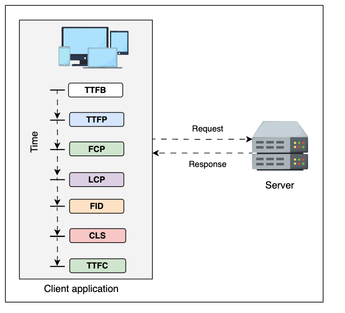
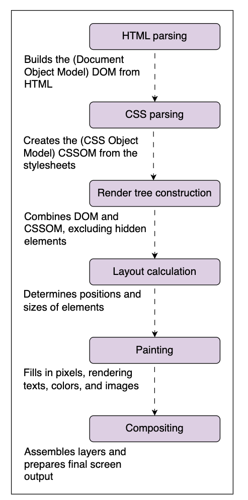
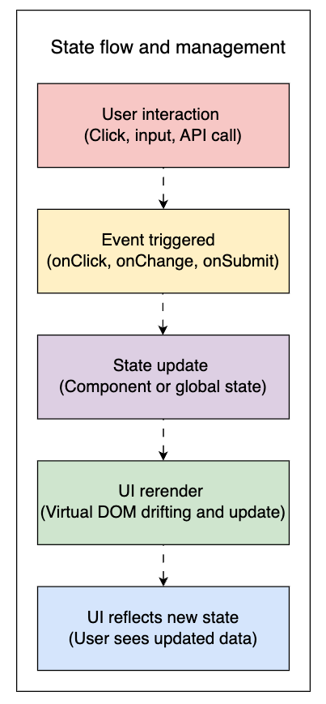
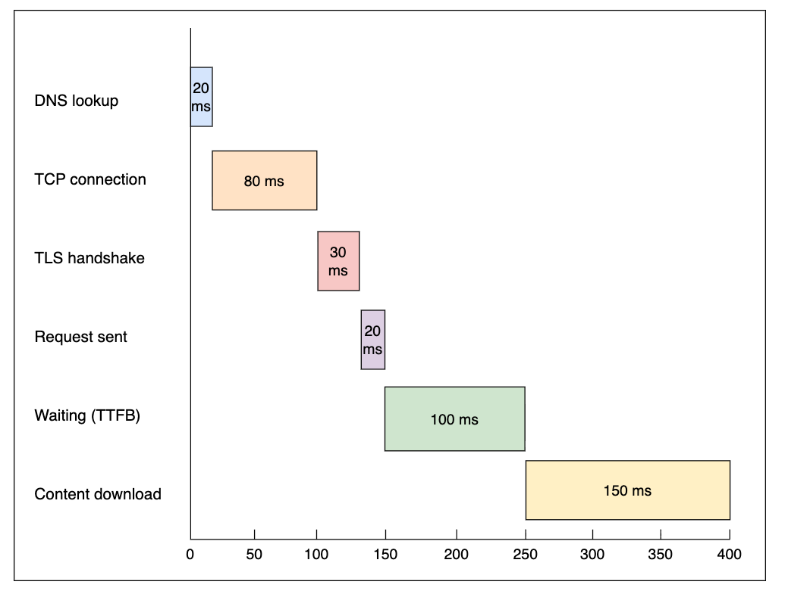

# Non-functional Requirements in Front-end System Design

When designing front-end systems, it is crucial to consider various non-functional requirements (NFRs) that impact the overall user experience, performance, and maintainability of the application. Here are some key NFRs to keep in mind:

1. **Performance**: Ensure that the application loads quickly and responds promptly to user interactions. This includes optimizing assets, minimizing HTTP requests, and leveraging caching strategies.
2. **Scalability**: Design the front-end to handle increasing loads, whether it's more users, more data, or more complex interactions. This may involve using component-based architectures and lazy loading techniques.
3. **Usability**: Focus on creating an intuitive and user-friendly interface. This includes clear navigation, accessibility features, and responsive design to accommodate various devices and screen sizes.
4. **Maintainability**: Write clean, modular, and well-documented code to facilitate future updates and collaboration among developers. Use version control systems and follow coding standards.
5. **Security**: Implement measures to protect user data and prevent vulnerabilities such as cross-site scripting (XSS) and cross-site request forgery (CSRF). Use secure communication protocols and validate user inputs.
6. **Reliability**: Ensure that the application functions correctly under various conditions and recovers gracefully from errors. Implement error handling and logging mechanisms.
7. **Accessibility**: Design the application to be usable by people with disabilities. Follow accessibility guidelines (e.g., WCAG) to ensure that all users can access and interact with the application effectively.
8. **SEO (Search Engine Optimization)**: Optimize the front-end for search engines to improve visibility and ranking. This includes using semantic HTML, optimizing meta tags, and ensuring fast load times.
9. **Internationalization and Localization**: Design the application to support multiple languages and regional settings, allowing for a broader audience reach.
10. **Cross-Browser Compatibility**: Ensure that the application works consistently across different web browsers and versions, providing a uniform experience for all users.
By addressing these non-functional requirements during the front-end system design phase, developers can create robust, efficient, and user-centric applications that meet both business goals and user expectations.

## Performance
### Key performance metrics:



- **Load Time**: The time it takes for the application to become interactive after a user initiates a request.
- **Time to First Byte (TTFB)**: The time taken for the browser to receive the first byte of data from the server.
- **Time to first pixel (TTFP)**: The time taken for the first pixel to be rendered on the screen.
- **First Contentful Paint (FCP)**: The time it takes for the first piece of content to be rendered on the screen.
- **Largest Contentful Paint (LCP)**: The time it takes for the largest content element to be rendered on the screen.
- **First Input Delay (FID)**: The time it takes for the application to respond to the first user interaction.
- **Cumulative Layout Shift (CLS)**: A measure of visual stability, indicating how much the layout shifts during the loading phase.
- **Time to first complete (TTFC)**: The time it takes for the entire page to load and be fully interactive.
### Factors affecting performance
- **Network Latency**: The time it takes for data to travel between the client and server.
- **Render-blocking Resources**: External scripts and stylesheets that prevent content from being displayed, resulting in performance issues. A website with multiple large CSS files may delay rendering until all styles are loaded, causing users to see a blank screen.
- **Asset Size**: The size of images, scripts, and stylesheets that need to be downloaded by the browser.
- **JavaScript Execution**: The time taken to execute JavaScript code on the client side.

- **Server Response Time**: The time taken by the server to process requests and send responses.
- **Client-Side Rendering**: The time taken by the browser to render the application on the client side.

- **Third-Party Scripts**: The impact of external scripts on load times and performance.

- **Rendering Performance**: The efficiency of the browser in rendering the application.

# Fundamental Front-end System Design Concepts
## Content renderding process in browsers

When a user requests a web page, the browser goes through several steps to render the content on the screen. Here is a high-level overview of the content rendering process in browsers

### 1. **HTML Parsing**:
The browser receives the HTML document from the server and begins parsing it to create the Document Object Model (DOM) tree, which represents the structure of the web page.

The browser reads the HTML file and converts it into the DOM, a tree-like structure representing all HTML document elements. The DOM is the foundation for everything displayed, and errors can break the rendering process. Each HTML tag becomes a node in this hierarchical structure.



### 2. **CSS Parsing**:

Simultaneously, the browser fetches and parses CSS files to create the CSS Object Model (CSSOM) tree, which defines the styles and layout of the web page.

After the DOM, the browser fetches and parses CSS files to construct the CSSOM, a structured representation of all style rules. The CSSOM acts as a style guide, mapping rules like colors, fonts, sizes, and layouts to specific elements in the DOM, enabling correct display according to defined styles.

### 3. **Constructing the Render Tree**:
The browser combines the DOM and CSSOM trees to create the render tree, which contains only the visible elements and their styles.

### 4. **Layout: Calculating posiution and size**:
The browser calculates the exact position and size of each element in the render tree based on the styles defined in the CSSOM.

In the layout phase, the browser determines the exact position and size of each visible element based on dimensions, CSS rules, and relationships between elements. It computes element dimensions, positioning rules, display properties, and inter-element dependencies. Complex layouts can increase computation time.

### 5. **Painting: Drawing elements on the screen**:
The browser paints the pixels on the screen based on the information in the render tree.

The browser takes the layout information and begins filling in pixels on the screen. Text, colors, borders, and images are drawn based on computed styles from the CSSOM. Each visual element is converted into paint commands processed by the GPU or CPU.

### 6. **Compositing: Assembling layers**:
The browser assembles different layers of the page (e.g., background, text, images) into a final image that is displayed to the user.

The browser combines multiple painted layers into a final image to display on the screen. Modern browsers break elements into separate layers, allowing specific parts of the page to update without redrawing everything (e.g., fixed headers, animations, scrolling elements). This ensures seamless changes, reduces flickering, and improves visual stability.

## DOM and virtual DOM
Imagine a real-time social feed where posts update, and users can instantly react to content. Every scroll, click, or like triggers an update to the page’s content. However, if these updates are inefficient, the interface may lag, freeze, or feel unresponsive, leading to user frustration. You might have noticed this sluggish behavior when interacting with highly dynamic web applications. This mainly occurs when rendering and update processes are not optimized, affecting the overall user experience.

One way to ensure a smooth user experience is to understand how the DOM and virtual DOM handle rendering to efficiently manage large-scale UI updates. However, optimizing performance also involves strategies beyond the DOM, such as asynchronous rendering, efficient state management, and minimizing unnecessary reflows. This lesson will equip us with key techniques to keep interfaces responsive, maintainable, and scalable.

- **Document Object Model (DOM)**: A structured, hierarchical representation of a web page's content. Direct manipulation is powerful but costly due to frequent reflows and repaints.

- **Virtual DOM (VDOM)**: An in-memory abstraction of the real DOM used by modern frameworks (e.g., React, Vue). Changes are first applied to the VDOM, then compared (diffing) with the previous VDOM, and finally, only the necessary changes are batched and applied to the real DOM. This minimizes reflows and improves responsiveness.

### Example of reducing DOM updates:
While we’ve covered strategies like batching updates and minimizing repaints to improve user experience, it’s equally important to see how these are applied in practice. Let’s walk through some concrete examples to understand how each technique works in real scenarios:
1. Minimizing unnecessary reflows and repaints
```javascript
// Inefficient: multiple reflows
const element = document.getElementById('myElement');
for (let i = 0; i < 10; i++) {
  element.style.width = `${100 + i}px`;
}

// Efficient: Batching updates
// Apply multiple changes at once to reduce layout recalculations
const element = document.getElementById('myElement');
element.style.cssText = `
  background: #f0f0f0;
  width: 200px;
  height: 100px;
`;
```
2. Batching DOM updates
```javascript
// Inefficient: Appending elements individually
const list = document.getElementById('list');
for (let i = 0; i < 100; i++) {
  const item = document.createElement('li');
  item.textContent = `Item ${i}`;
  list.appendChild(item); // Triggers reflow each time
}

// Efficient: Using document fragment
// Use a document fragment to batch updates. A document fragment allows changes to be made off-screen before applying them to the DOM:
const list = document.getElementById('list');
const fragment = document.createDocumentFragment();

for (let i = 0; i < 100; i++) {
  const item = document.createElement('li');
  item.textContent = `Item ${i}`;
  fragment.appendChild(item);
}

##

list.appendChild(fragment); // Single reflow and repaint
```

### Handling large-scale UI updates
1. Event delegation: For event-heavy applications, event delegation is a great approach. Instead of attaching separate event listeners to each child element, we attach a single listener at a parent level
```javascript
document.getElementById('parent').addEventListener('click', function(e) {
  if (e.target && e.target.matches('button.like-button')) {
    // handle like button click
  }
});
```


2. Incremental rendering: For large lists or feeds, consider rendering items incrementally as the user scrolls (infinite scrolling) or using pagination to load content in chunks.

## State Management
State management controls how data changes over time in frontend systems and how those changes are reflected in the user interface. The "state" represents dynamic information determining an application's behavior. Inefficient state management can cause slow UIs, unpredictable behavior, scalability challenges, increased debugging complexity, memory leaks, excessive API calls, and synchronization issues.

As applications scale, handling state transitions inefficiently can lead to issues like:
- Slow user interfaces
- Unpredictable behavior
- Scalability challenges
- Increased debugging complexity
- Memory leaks leading to increased resource consumption
- Excessive API calls increasing network load
- Synchronization issues between different parts of the application



### State transition
State transitions occur when the application state changes due to user interactions, API responses, or other events. Efficiently managing these transitions is crucial for maintaining a responsive UI.


#### Types of State
- **Local State**: Data specific to individual components (toggles, form inputs). Encapsulates behavior within the component, ideal for unshared state.
- **Global State**: Data shared across multiple components (user authentication, theme settings). Requires a centralized store for consistency.
- **Server State**: Data fetched from external sources (APIs). Needs synchronization with local and global state.
- **URL State**: Data in the URL (query parameters, route paths). Reflects application state in the URL for bookmarking and sharing.
- ** Session and Persistent State**: Data that persists across sessions (user preferences, shopping cart contents). Stored in cookies, local storage, or databases.

#### Challenges in State Management
- **Concurrency**: Simultaneous access to shared state can lead to race conditions, deadlocks, or inconsistent reads. This is especially tricky when multiple users or processes try to update the same data at once.
- **Data Consistency**: Synchronizing state across devices or services is difficult due to delays, dropped connections, or replication lag. This makes real-time apps vulnerable to out-of-sync data.
- **Fault tolerance and recovery**: If a system crashes or a network call fails, recovering the last known good state becomes difficult. Without proper handling, data loss or corruption can occur.
- **Stateful interactions and transitions**: Interactive UIs often rely on complex state changes (e.g., multistep forms or drag-and-drop). Managing these transitions reliably can be unpredictable and hard to test.
- **Complexity and maintainability**: As applications grow, state management logic can become convoluted, making it hard to understand and maintain. This can lead to bugs and slow development cycles.


| Challenge | Potential Solution(s) |
| :--- | :--- |
| Concurrency handling | • Use locking mechanisms (e.g., mutex, semaphores).<br>• Implement optimistic concurrency control.<br>• Apply transactional consistency models. |
| Ensuring consistency in distributed systems | • Use consensus algorithms (Raft, Paxos).<br>• Implement event-driven architectures.<br>• Employ distributed caching strategies. |
| Fault tolerance and recovery | • Apply replication and checkpointing.<br>• Use distributed storage solutions.<br>• Implement failover mechanisms. |
| Managing stateful interactions and transitions | • Utilize finite state machines (FSM).<br>• Apply event sourcing.<br>• Use structured state modeling. |
| Complexity and maintainability issues | • Adopt modular architectures.<br>• Use state management libraries (Redux, Zustand).<br>• Leverage microservices for scalability. |

#### Advanced State Management Techniques
- **Immutable State**: Using immutable data structures to prevent unintended side effects and make state changes predictable.
- **State Normalization**: Structuring state to avoid redundancy and improve efficiency, especially in large applications.
- **Selectors and Memoization**: Using selectors to derive computed state and memoization to optimize performance by caching results of expensive computations.
- **Middleware**: Implementing middleware to handle side effects, logging, and asynchronous actions in state management.
- **Keep state minimal**: Only store essential data in the state to reduce complexity and improve performance.
- **Use derived state**: Compute values on-the-fly instead of storing them, reducing redundancy and potential inconsistencies.
- **Manage async explicitly**: Represent all async states clearly, such as loading, success, and error, to improve predictability and user feedback.


| Strategy | Why It Matters | How It Helps |
| :--- | :--- | :--- |
| Modular state slices | Isolates feature-specific state. | Keeps codebase maintainable and scalable. |
| Async state handling (e.g., with React Query) | Deals with API latency, caching, and retries. | Reduces boilerplate and improves UX. |
| Memoized selectors (`reselect`) | Avoids recalculations and re-renders. | Boosts performance in large apps. |
| Persisted state | Retains user preferences or carts. | Enhances continuity between sessions. |
| Event-driven updates | Decouples features in large systems. | Keeps communication flexible and testable. |


# Performance and Optimization
## Key Network performance metrics
- **Latency**: The time it takes for a data packet to travel from the client to the server and back.
- **Throughput**: The amount of data that can be transmitted over a network in a given amount of time.
- **Bandwidth**: The maximum rate of data transfer across a network path.
- **Time to First Byte (TTFB)**: The time it takes for the browser to receive the first byte of data from the server.
- **Page Load Time**: The total time it takes for a web page to fully load


## HTTP optimization techniques

- **Minimize HTTP Requests**: Reduce the number of requests by combining files, using CSS sprites, and inlining small assets.
- **Use Content Delivery Networks (CDNs)**: Distribute content across multiple servers to reduce latency and improve load times.
- **Enable Compression**: Use Gzip or Brotli compression to reduce the size of transferred files.
- **Leverage Browser Caching**: Set appropriate cache headers to allow browsers to cache static assets.
- **Optimize Images**: Use appropriate formats, compress images, and implement lazy loading.
- **Use HTTP/2 or HTTP/3**: Take advantage  of multiplexing and improved performance features of newer HTTP versions.
- **Implement Lazy Loading**: Load resources only when they are needed to reduce initial load times
- **Connection Keep-Alive**: Maintain persistent connections to reduce the overhead of establishing new connections for each request.

## Caching strategies for faster load times
- **Browser Caching**: Utilize HTTP headers like Cache-Control and ETag to enable browsers to cache static resources.
- **Service Workers**: Implement service workers to cache assets and API responses for offline access and
- **Network caching techniques**: Use CDNs and reverse proxies to cache content closer to users. reduce server load.
- **Application-level caching**: Cache frequently accessed data in memory or local storage to reduce redundant network requests.
- **Data caching**: Cache API responses and database queries to minimize latency and improve performance.


## Optimizing Media Rendering for Faster Frontends

| Optimization Technique | Description | Performance Impact |
| :--- | :--- | :--- |
| **Choosing the right format** | Use efficient image formats like WebP, AVIF, and SVG to reduce file size while maintaining quality. For videos, opt for modern codecs like VP9 or AV1 for superior compression. | Reduces file size without sacrificing quality, leading to faster load times. |
| **Responsive and lazy loading** | Use `srcset` to serve the most suitable image resolution for different screen sizes. Apply lazy loading (`loading="lazy"`) to defer offscreen media until needed. | Optimizes bandwidth usage and reduces initial page load times, improving first contentful paint (FCP). |
| **Image and video compression** | Apply lossy or lossless compression techniques to minimize file sizes without noticeable quality loss. | Minimizes data transfer, crucial for large media-heavy sites, resulting in faster rendering. |
| **Smart streaming with adaptive protocols** | Use HLS (HTTP Live Streaming) and DASH (Dynamic Adaptive Streaming over HTTP) to deliver videos in chunks based on network conditions. | Prevents buffering, optimizes playback across devices, and improves user experience. |
| **Efficient video loading (Lazy and preloading)** | Set a poster image (`poster="preview.jpg"`) to provide a preview before playback, and control preload behavior (`preload="none"` or `"metadata"`). | Reduces unnecessary video loads, improving page responsiveness and reducing data usage. |
| **Accelerating delivery with CDNs** | Distribute optimized images and videos via CDNs to cache content closer to users and reduce server load. | Improves global load times, reduces network congestion, and ensures consistent performance. |
| **Continuous monitoring and performance analysis** | Use Lighthouse, PageSpeed Insights, and Chrome DevTools to measure improvements and adjust optimizations accordingly. | Helps refine strategies over time, ensuring sustained performance gains. |

# Q & A:
1. `Why does the browser create both a DOM and a CSSOM instead of combining them from the start?`
The DOM and CSSOM serve different purposes—while the DOM structures a page’s content, the CSSOM defines its styling. Keeping them separate allows the browser to update styles without re-parsing the entire HTML document, improving efficiency. They are merged later in the rendering process to create the render tree, which ensures only visible elements are considered for layout and painting.

2. `How does caching impact the performance of dynamic content, and what are the trade-offs?`
Caching can significantly improve the performance of dynamic content by reducing server load and decreasing latency for frequently accessed data. However, the trade-offs include the risk of serving stale data if the cache is not properly invalidated or updated. Additionally, caching dynamic content may require more complex strategies to ensure that users receive the most up-to-date information while still benefiting from caching efficiencies.
3. `What are some common pitfalls when implementing state management in large-scale front-end applications?`
Common pitfalls include overcomplicating the state structure, leading to difficulty in maintenance and debugging. Other issues include inefficient state updates causing performance bottlenecks, lack of clear separation between local and global state, and inadequate handling of asynchronous operations. Additionally, failing to document state transitions and dependencies can lead to confusion among team members.
4. `How can developers effectively measure and monitor front-end performance in real-time?`
Developers can use tools like Google Lighthouse, WebPageTest, and browser developer tools to measure key performance metrics such as load time, FCP, LCP, FID, and CLS. Implementing real-time monitoring solutions like New Relic, Datadog, or custom analytics can help track performance over time, identify bottlenecks, and gather user experience data. Additionally, setting up performance budgets and alerts can help maintain optimal performance levels.

5. `What is the difference between browser caching and CDN caching?`
Browser caching improves performance by storing static assets like images, CSS, and JavaScript on a user’s device. This reduces repeated network requests and speeds up page loads for returning visitors. It is managed through HTTP headers like Cache-Control and ETag and is especially effective for repeat access on the same device.

On the other hand, CDN caching stores resources on globally distributed edge servers, allowing users to retrieve content from a location closer to them. This reduces latency for all users, not just repeat visitors, and significantly offloads traffic from the origin server. CDNs also support more advanced caching strategies and better handling of dynamic content.
