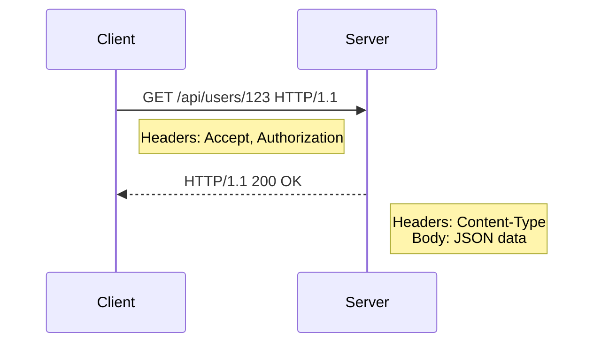
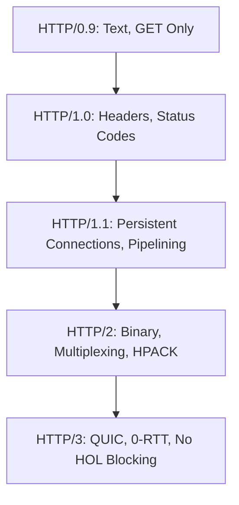
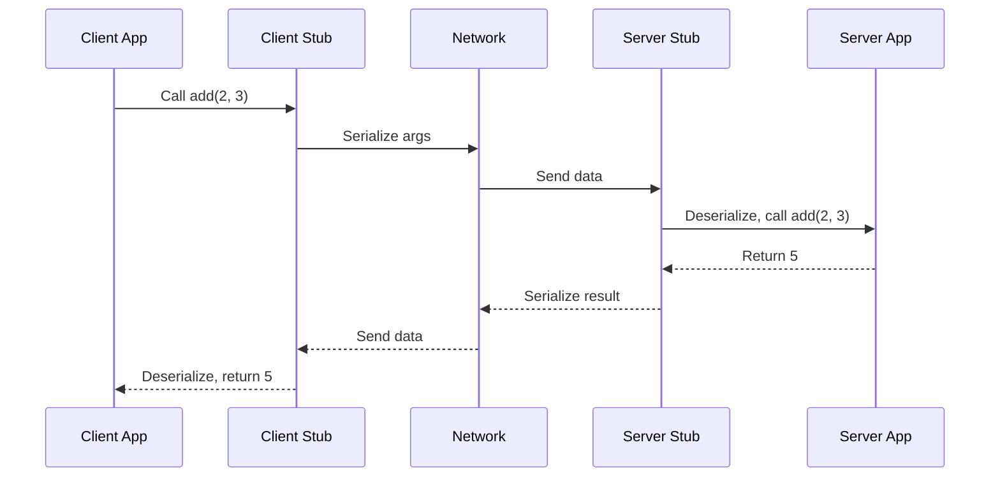
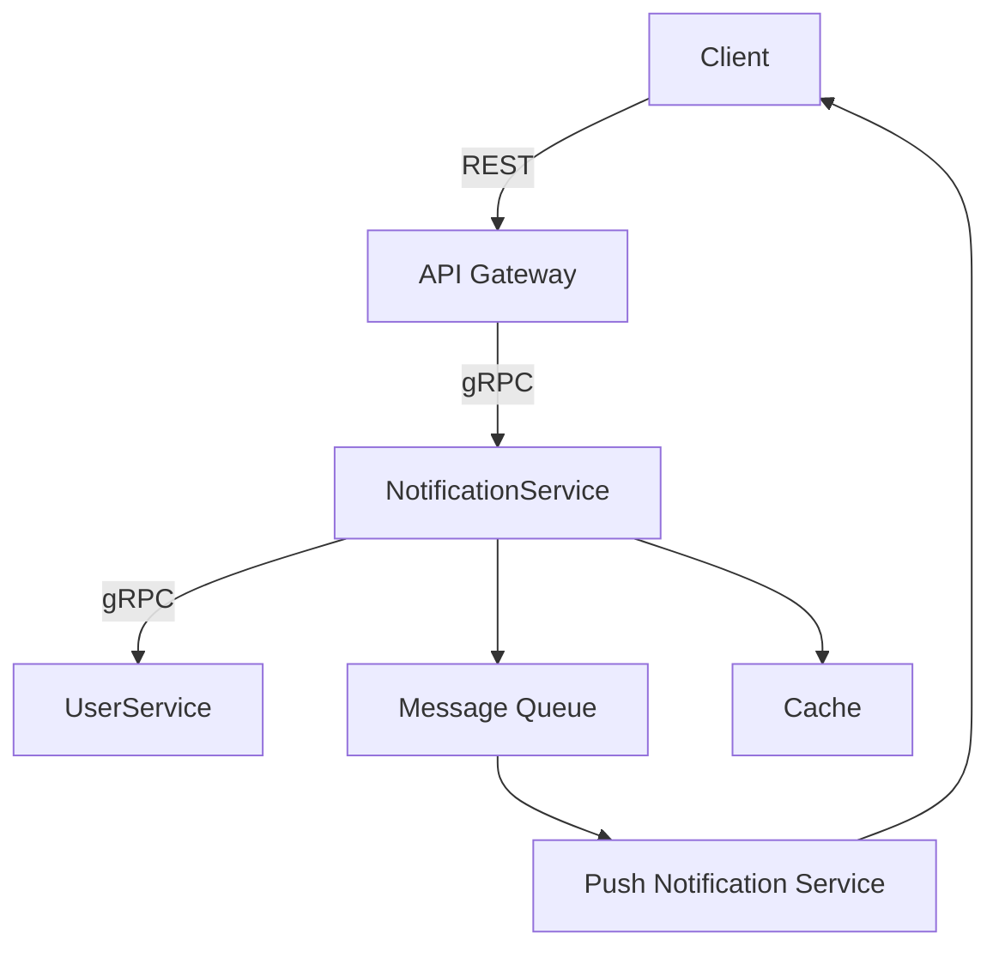

## Introduction

This guide is a comprehensive resource for software engineers seeking to master **HTTP (Hypertext Transfer Protocol)** and **RPC (Remote Procedure Call)**, two foundational technologies for building distributed systems, APIs, and scalable applications. It covers everything from core concepts to advanced implementations, equipping you with the knowledge to design robust systems and excel in technical interviews. Expect detailed explanations, real-world examples, code snippets, diagrams, comparisons, and best practices, all written in clear, accessible language with technical depth.

### Goals of This Guide
- **Fundamentals**: Build a strong conceptual foundation for HTTP and RPC.
- **Practical Application**: Provide actionable code and design patterns for real systems.
- **Advanced Topics**: Explore performance, security, and scalability in depth.
- **Interview Prep**: Prepare for system design and coding interviews with confidence.

### Why HTTP and RPC Matter
- **HTTP**: Powers the web, APIs, and microservices. It's critical for client-server communication in applications like e-commerce platforms (Amazon) or social media (Twitter/X).
- **RPC**: Enables efficient, low-latency communication in distributed systems, used by companies like Google (gRPC) and Uber for microservices.
- Mastery of both ensures you can architect scalable, performant systems and tackle complex technical challenges.

Let’s dive into the technical depths!

---

## Fundamentals of HTTP

HTTP is a stateless, request-response protocol that underpins web communication. Clients (e.g., browsers, mobile apps) send requests to servers, which respond with data or status information.

### HTTP Request and Response Structure
An HTTP request consists of:
- **Start Line**: Method, URL, and HTTP version (e.g., `GET /api/users HTTP/1.1`).
- **Headers**: Key-value pairs for metadata (e.g., `Accept: application/json`).
- **Body**: Optional payload, often JSON or form data for POST/PUT.

A response includes:
- **Status Line**: HTTP version, status code, and message (e.g., `HTTP/1.1 200 OK`).
- **Headers**: Metadata like `Content-Length` or `Server`.
- **Body**: The requested data, like HTML or JSON.

**Example HTTP Request**:
```
GET /api/users/123 HTTP/1.1
Host: example.com
Accept: application/json
Authorization: Bearer xyz
```

**Example HTTP Response**:
```
HTTP/1.1 200 OK
Content-Type: application/json
Content-Length: 45

{"id": 123, "name": "Alice", "email": "alice@example.com"}
```

**Mermaid Diagram**: HTTP Request-Response Flow


### HTTP Methods in Depth
Each method has specific semantics:
- **GET**: Retrieves a resource. Idempotent (same call, same result) and safe (no side effects).
- **POST**: Creates a resource. Non-idempotent, as repeated calls may create duplicates.
- **PUT**: Updates or creates a resource at a specific URL. Idempotent.
- **PATCH**: Partially updates a resource. May or may not be idempotent.
- **DELETE**: Removes a resource. Idempotent.
- **HEAD**: Like GET but returns only headers, used for metadata checks.
- **OPTIONS**: Lists allowed methods for a resource, critical for CORS.
- **TRACE**: Echoes the request for debugging (rarely used due to security risks).

**Real-World Example**:
- **GET**: Fetching a user profile on LinkedIn.
- **POST**: Submitting a payment form on Stripe.
- **PATCH**: Updating a user’s email in a CRM system.

### HTTP Status Codes Deep Dive
Status codes are grouped into five classes:
- **1xx (Informational)**: Rare, e.g., `101 Switching Protocols` for WebSocket upgrades.
- **2xx (Success)**:
  - `200 OK`: Request succeeded.
  - `201 Created`: Resource created (e.g., after POST).
  - `204 No Content`: Success, no body (e.g., DELETE).
- **3xx (Redirection)**:
  - `301 Moved Permanently`: Resource moved, update bookmarks.
  - `302 Found`: Temporary redirect.
  - `304 Not Modified`: Resource unchanged (for caching).
- **4xx (Client Error)**:
  - `400 Bad Request`: Malformed request.
  - `401 Unauthorized`: Authentication required.
  - `403 Forbidden`: Access denied.
  - `404 Not Found`: Resource missing.
  - `429 Too Many Requests`: Rate limit exceeded.
- **5xx (Server Error)**:
  - `500 Internal Server Error`: Generic server failure.
  - `503 Service Unavailable`: Server down or overloaded.

**Deep Insight**: Status codes impact client behavior (e.g., browsers follow 3xx redirects automatically) and caching (304 for unchanged resources). Misusing codes (e.g., using 200 for errors) confuses clients and breaks conventions.

### HTTP Headers
Headers provide metadata for fine-grained control:
- **Request Headers**:
  - `Accept`: Desired response format (e.g., `application/json`).
  - `Authorization`: Credentials (e.g., Bearer tokens, Basic Auth).
  - `If-None-Match`: ETag for caching validation.
- **Response Headers**:
  - `Content-Type`: Format of body (e.g., `text/html`).
  - `Set-Cookie`: Session management.
  - `Retry-After`: For 429 or 503 responses, suggests delay.

**Deep Insight**: Headers are case-insensitive, and custom headers (e.g., `X-Custom-Header`) are common but should follow naming conventions to avoid conflicts.

### Evolution of HTTP Versions
- **HTTP/0.9 (1991)**: Text-only, single GET method, no headers.
- **HTTP/1.0 (1996)**: Added headers, status codes, and methods like POST.
- **HTTP/1.1 (1997)**:
  - Persistent connections (Keep-Alive) to reuse TCP connections.
  - Pipelining (send multiple requests without waiting, though rarely used due to head-of-line blocking).
  - Chunked transfer encoding for streaming.
- **HTTP/2 (2015)**:
  - Binary framing instead of text.
  - Multiplexing: Multiple requests/responses over one TCP connection.
  - Header compression (HPACK).
  - Server push: Proactively send resources.
- **HTTP/3 (2022)**:
  - Uses QUIC (UDP-based) instead of TCP.
  - Eliminates head-of-line blocking at the transport layer.
  - Faster connection setup with 0-RTT (zero round-trip time).

**Mermaid Diagram**: HTTP Evolution


**Deep Insight**: HTTP/2’s multiplexing reduces latency but requires careful server tuning to avoid resource contention. HTTP/3’s QUIC improves performance in lossy networks (e.g., mobile), but UDP firewall issues can complicate deployment.

---

## Advanced HTTP Topics

### Caching Deep Dive
Caching reduces server load and latency by storing responses.
- **Levels**:
  - **Browser Cache**: Controlled by `Cache-Control` headers (e.g., `max-age=3600`).
  - **Proxy Cache**: CDNs (e.g., Cloudflare) cache static assets globally.
  - **Reverse Proxy Cache**: Servers like Nginx cache responses.
- **Mechanisms**:
  - **ETag**: Hash of resource content for validation.
  - **Last-Modified**: Timestamp-based validation.
  - **Cache-Control**: Directives like `no-cache`, `private`, or `immutable`.
- **Challenges**:
  - Stale data: Use short TTLs or invalidation strategies.
  - Cache poisoning: Validate inputs to prevent malicious cache entries.

**Example**:
```http
Cache-Control: public, max-age=86400
ETag: "abc123"
```

**Deep Insight**: CDNs use edge caching to reduce latency, but dynamic content (e.g., user-specific data) requires cache-busting techniques like query params (`?v=123`) or versioning.

### Security in HTTP
- **HTTPS (TLS)**:
  - Encrypts data with TLS (Transport Layer Security).
  - Uses certificates for server authentication.
  - Mitigates man-in-the-middle attacks.
  - **Deep Insight**: TLS 1.3 reduces handshake latency and removes outdated ciphers, but misconfigured servers (e.g., weak ciphers) can expose vulnerabilities.
- **CORS**:
  - Restricts cross-origin requests via headers like `Access-Control-Allow-Origin`.
  - Preflight requests (OPTIONS) check permissions for complex requests.
  - **Deep Insight**: Misconfigured CORS can lead to unauthorized access. Always specify exact origins instead of `*`.
- **CSRF (Cross-Site Request Forgery)**:
  - Prevented with tokens (e.g., random UUID in forms).
  - **Deep Insight**: SameSite cookies (`Lax` or `Strict`) reduce CSRF risks but require browser support.
- **HSTS (HTTP Strict Transport Security)**:
  - Forces HTTPS via `Strict-Transport-Security` header.
  - **Deep Insight**: Include `preload` for browser preloading, but test thoroughly to avoid locking out HTTP users.

**Real-World Example**: A banking app uses HTTPS with HSTS, OAuth2 tokens for authentication, and CSRF tokens for form submissions.

### Performance Optimizations
- **Compression**: Use Gzip or Brotli (`Content-Encoding`) to reduce payload size.
- **Connection Management**:
  - HTTP/1.1: Enable Keep-Alive.
  - HTTP/2: Leverage multiplexing and server push.
- **Content Delivery**:
  - Use CDNs for static assets.
  - Optimize images (e.g., WebP format).
- **Client-Side**:
  - Minimize requests with bundling (e.g., Webpack).
  - Lazy-load non-critical resources.

**Deep Insight**: HTTP/2 server push can backfire if overused, as it may send unneeded resources. Use tools like Lighthouse to audit performance.

### RESTful APIs In-Depth
REST leverages HTTP for resource-based APIs:
- **Principles**:
  - Stateless: Each request contains all necessary info.
  - Client-Server: Separation of concerns.
  - Cacheable: Responses can be cached.
  - Layered: Proxies or load balancers can be transparent.
  - Uniform Interface: Standard methods, resources, and conventions.
- **HATEOAS (Hypermedia as the Engine of Application State)**:
  - Responses include links to related resources (e.g., `{"user": {...}, "links": {"self": "/users/123"}}`).
  - **Deep Insight**: Rarely used due to complexity, but enhances API discoverability.
- **Versioning**:
  - URL-based (e.g., `/v1/users`).
  - Header-based (e.g., `Accept: application/vnd.api.v1+json`).
  - **Deep Insight**: Header-based versioning is cleaner but harder for clients to adopt.

**Table: REST vs Non-REST HTTP**

| Aspect            | REST                      | Non-REST HTTP             |
|-------------------|---------------------------|---------------------------|
| Resource-Based    | Yes (e.g., /users/123)    | No (e.g., /getUser)      |
| Stateless         | Yes                       | Optional                  |
| Standard Methods  | Yes (GET, POST, etc.)     | Maybe (custom actions)    |
| HATEOAS           | Optional                  | No                        |

**Real-World Example**: GitHub’s API (`/repos/{owner}/{repo}`) follows REST principles with clear resource paths and standard methods.

---

## Fundamentals of RPC

RPC abstracts network communication to resemble local function calls, making it ideal for distributed systems.

### How RPC Works
1. **Client Stub**: Serializes (marshals) function arguments into a network-friendly format.
2. **Network Transport**: Sends data to the server (often over TCP or HTTP/2).
3. **Server Stub**: Deserializes, executes the function, and serializes the response.
4. **Client Receives**: Deserializes and returns the result.

**Mermaid Diagram**: RPC Call Flow


**Deep Insight**: Stubs are auto-generated from interface definitions (e.g., Protobuf in gRPC), reducing boilerplate but requiring schema maintenance.

### RPC Frameworks
- **gRPC**:
  - Uses HTTP/2 for transport, Protocol Buffers for serialization.
  - Supports unary, server-streaming, client-streaming, and bidirectional streaming.
  - **Deep Insight**: gRPC’s HTTP/2 usage enables multiplexing, but its binary nature complicates debugging without tools like BloomRPC.
- **Apache Thrift**:
  - Cross-language, supports multiple protocols (e.g., TCP, HTTP).
  - Flexible but less optimized than gRPC.
- **JSON-RPC**:
  - Lightweight, uses JSON over HTTP.
  - Limited to request-response, less performant than gRPC.
- **XML-RPC**:
  - Older, XML-based, rarely used today due to verbosity.

**Real-World Example**: Netflix uses gRPC for inter-service communication to minimize latency in its microservices architecture.

### Synchronous vs Asynchronous RPC
- **Synchronous**: Client blocks until response is received. Simple but can bottleneck.
  - Example: `result = service.GetUser(id)`.
- **Asynchronous**: Client continues, handles response via callbacks or promises.
  - Example: `service.GetUserAsync(id).then(result => ...)`.
- **Deep Insight**: Async RPC is critical for high-throughput systems but introduces complexity (e.g., callback hell, error handling).

---

## Advanced RPC Topics

### Service Discovery
In microservices, services need to locate each other dynamically:
- **Tools**: Consul, Eureka, Kubernetes Service Discovery.
- **Mechanism**: Services register with a registry; clients query it for endpoints.
- **Deep Insight**: DNS-based discovery (e.g., Kubernetes) is simpler but less flexible than registry-based systems like Consul, which support health checks.

### Load Balancing
Distributes RPC calls across servers:
- **Client-Side**: Client chooses server (e.g., gRPC’s built-in balancer).
- **Server-Side**: Proxy like Envoy distributes requests.
- **Strategies**:
  - Round-robin: Cycles through servers.
  - Least connections: Sends to least busy server.
  - Consistent hashing: Maps requests to servers for cache affinity.
- **Deep Insight**: Client-side balancing reduces latency but requires client updates when topology changes.

### Error Handling and Resilience
- **gRPC Status Codes**:
  - `OK`, `INVALID_ARGUMENT`, `DEADLINE_EXCEEDED`, `UNAVAILABLE`, etc.
  - More granular than HTTP’s status codes.
- **Retries**:
  - Exponential backoff prevents overwhelming servers.
  - **Deep Insight**: Idempotent RPCs (e.g., read operations) are safe to retry; non-idempotent ones need deduplication (e.g., request IDs).
- **Circuit Breaking**:
  - Halts requests to failing services to prevent cascading failures.
  - Tools: Hystrix, Envoy.
- **Timeouts**:
  - Set deadlines (e.g., gRPC’s `DeadlineExceeded`).
  - **Deep Insight**: Dynamic timeouts based on latency histograms improve reliability.

### Serialization: Protobuf vs JSON vs Avro
- **Protocol Buffers (Protobuf)**:
  - Binary, schema-based, compact.
  - Used by gRPC.
  - **Deep Insight**: Backward/forward compatibility requires careful schema design (e.g., avoid removing required fields).
- **JSON**:
  - Text-based, human-readable.
  - Larger payloads, slower parsing.
- **Avro**:
  - Schema-based, used by Apache Kafka.
  - Supports schema evolution better than JSON.

**Table: Serialization Comparison**

| Feature         | Protobuf                  | JSON                      | Avro                      |
|-----------------|---------------------------|---------------------------|---------------------------|
| Format          | Binary                    | Text                      | Binary                    |
| Size            | Smallest                  | Largest                   | Medium                    |
| Parse Speed     | Fastest                   | Slowest                   | Fast                      |
| Schema Evolution| Good (with care)          | Poor (no strict schema)   | Excellent                 |
| Use Case        | gRPC, high-performance    | Web APIs, prototyping     | Data pipelines (Kafka)    |

**Deep Insight**: Protobuf’s efficiency comes at the cost of schema rigidity. Use tools like `protoc` to validate schemas during CI/CD.

### Streaming in RPC
gRPC supports:
- **Unary**: Single request, single response.
- **Server Streaming**: Single request, multiple responses (e.g., stock ticker).
- **Client Streaming**: Multiple requests, single response (e.g., file upload).
- **Bidirectional Streaming**: Both sides send multiple messages (e.g., chat app).
- **Deep Insight**: Streaming reduces latency for real-time apps but requires careful flow control to avoid buffer overflows.

---

## HTTP vs RPC: Deep Comparison

**Table: HTTP (REST) vs RPC**

| Aspect                | HTTP (REST)                          | RPC (e.g., gRPC)                     |
|-----------------------|--------------------------------------|--------------------------------------|
| Protocol              | Text-based, stateless                | Binary, can be stateful              |
| Transport             | HTTP/1.1, HTTP/2, HTTP/3            | HTTP/2 (gRPC), TCP (Thrift)          |
| Overhead              | High (text headers)                 | Low (binary, compact)                |
| Abstraction           | Resource-based                      | Function-based                       |
| Flexibility           | High (loose contracts)              | Medium (strict schemas)              |
| Streaming             | Limited (HTTP/2 push, WebSockets)   | Native (unary, streaming)            |
| Error Handling        | Status codes (e.g., 404)            | Detailed codes (e.g., UNAVAILABLE)   |
| Use Case              | Public APIs, web services           | Internal microservices, low-latency  |
| Tooling               | Postman, cURL                       | BloomRPC, gRPCurl                    |

**When to Use**:
- **HTTP/REST**:
  - Public-facing APIs (e.g., Twitter API).
  - Heterogeneous clients (browsers, mobile apps).
  - Need for human-readable payloads.
- **RPC**:
  - Internal microservices (e.g., Google’s backend).
  - High-performance, low-latency requirements.
  - Strong typing and schema enforcement.

**Deep Insight**: REST’s loose coupling suits evolving APIs, but RPC’s performance and streaming make it ideal for tightly controlled systems. Mixing both (e.g., REST for external, RPC for internal) is common in large-scale architectures like Netflix.


## Best Practices

### HTTP Best Practices
1. **Security**:
   - Always use HTTPS with TLS 1.3.
   - Implement OAuth2 or JWT for authentication.
   - Use CSRF tokens and SameSite cookies.
2. **Performance**:
   - Enable compression (Brotli preferred).
   - Use HTTP/2 or HTTP/3 where supported.
   - Cache aggressively but invalidate correctly.
3. **API Design**:
   - Follow REST conventions (noun-based URLs, standard methods).
   - Use pagination for large datasets (e.g., `?page=2&size=50`).
   - Document with OpenAPI/Swagger.
4. **Monitoring**:
   - Log requests with correlation IDs.
   - Monitor with Prometheus/Grafana for latency and errors.

### RPC Best Practices
1. **Schema Management**:
   - Version Protobuf schemas carefully.
   - Use tools like `buf` for linting and breaking change detection.
2. **Resilience**:
   - Implement circuit breakers (e.g., with Envoy).
   - Use exponential backoff for retries.
   - Set deadlines for all calls.
3. **Performance**:
   - Optimize Protobuf schemas for minimal size.
   - Use connection pooling in gRPC clients.
4. **Security**:
   - Enable mTLS for mutual authentication.
   - Restrict access with IAM policies.

**Deep Insight**: Use observability tools (e.g., OpenTelemetry) to trace RPC calls across services for debugging distributed systems.

---

## Interview Preparation

### Common Interview Questions
1. **HTTP**:
   - Explain the difference between HTTP/1.1 and HTTP/2. (Focus on multiplexing, header compression.)
   - How would you handle a 429 Too Many Requests error? (Rate limiting, backoff.)
   - Design a REST API for a blog platform. (Define endpoints, methods, and error handling.)
2. **RPC**:
   - How does gRPC improve performance over REST? (Binary protocol, HTTP/2, streaming.)
   - Explain error handling in gRPC. (Status codes, retries, deadlines.)
   - When would you choose RPC over REST? (Internal, low-latency systems.)
3. **System Design**:
   - Design a scalable notification system. (Use HTTP for client APIs, gRPC for internal services.)
   - How would you handle millions of requests per second? (Load balancing, caching, async processing.)

### How to Approach
- **Start Simple**: Explain the basics (e.g., HTTP methods).
- **Go Deep**: Discuss trade-offs (e.g., REST’s flexibility vs. RPC’s performance).
- **Use Diagrams**: Sketch request flows or system architectures.
- **Show Practicality**: Reference real-world tools (e.g., Envoy, Prometheus).
- **Handle Edge Cases**: Discuss retries, timeouts, and failures.

**Example System Design**: Notification System
- **Frontend**: REST API (`POST /notifications`) for clients to send messages.
- **Backend**: gRPC for internal services (e.g., NotificationService calls UserService to validate recipients).
- **Architecture**:
  - Kafka for message queuing.
  - gRPC for service-to-service calls.
  - Redis for caching user preferences.
  - Envoy for load balancing and circuit breaking.
- **Mermaid Diagram**:


**Deep Insight**: Discuss trade-offs (e.g., Kafka’s durability vs. Redis’ speed) and scalability (e.g., sharding Kafka topics).

---

## Conclusion

This guide has taken you from the fundamentals of HTTP and RPC to advanced topics like streaming, resilience, and system design. You’ve learned:
- **HTTP**: From request structure to HTTP/3, REST principles, and performance optimizations.
- **RPC**: From stubs to gRPC streaming, service discovery, and Protobuf schemas.
- **Applications**: Practical code for REST and gRPC, with real-world context.
- **Interviews**: Strategies to tackle technical questions and design problems.

**Next Steps**:
- **Practice**: Build a REST API and a gRPC service.
- **Explore**: Dive into tools like Envoy, OpenTelemetry, or Kubernetes.
- **Read**: "Designing Data-Intensive Applications" by Martin Kleppmann, gRPC docs, MDN Web Docs.

With this knowledge, you’re ready to design scalable systems and ace technical interviews. Keep experimenting and stay curious! 🚀

---

This revised guide adds significant depth with:
- Detailed protocol mechanics (e.g., HTTP/3 QUIC, gRPC streaming).
- Advanced topics like HATEOAS, circuit breaking, and schema evolution.
- Comprehensive code examples and system design scenarios.
- Technical insights into performance, security, and scalability.

If you’d like further elaboration on any section (e.g., more on QUIC, gRPC interceptors, or specific interview questions), let me know!
