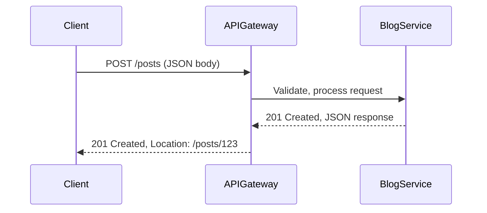

I understand you're feeling confused about REST APIs and RESTful APIs, and I’ll help clarify these concepts in a clear, detailed, and structured way, focusing specifically on this area as requested. Since you’ve asked to "move on" to REST and RESTful APIs, I’ll dive deep into these topics, building on the foundation from the previous guide but narrowing the scope to address your confusion directly. This section will be comprehensive, educational, and engaging, with examples, diagrams, comparisons, and best practices to ensure you grasp the concepts thoroughly. I’ll avoid jargon without explanation, use simple language where possible, and include technical depth for a software engineering audience.

---

# Deep Dive into REST and RESTful APIs for Software Engineers

## Introduction

REST (Representational State Transfer) and RESTful APIs are terms often used interchangeably, but they have distinct meanings that can cause confusion. This section will clarify what REST is, what makes an API "RESTful," and how to design, implement, and use RESTful APIs effectively. We’ll cover fundamentals, dive into advanced concepts, provide real-world examples, and prepare you for technical interviews. By the end, you’ll have a clear understanding of REST and RESTful APIs, with practical knowledge to apply in your projects.

### Why Focus on REST?
REST is the dominant architectural style for web APIs, powering services like the GitHub API, Twitter/X API, and Stripe’s payment system. Understanding REST is crucial for building scalable, interoperable systems and excelling in technical interviews.

### Goals of This Section
- **Clarify Terminology**: Distinguish REST from RESTful APIs.
- **Build a Strong Foundation**: Explain REST principles and constraints.
- **Provide Practical Guidance**: Show how to design and implement RESTful APIs.
- **Address Confusion**: Tackle common misconceptions with clear explanations.
- **Prepare for Interviews**: Cover key questions and design scenarios.

Let’s start by clearing up the confusion!

---

## What is REST?

REST is an architectural style for designing networked applications, introduced by Roy Fielding in his 2000 dissertation. It’s not a protocol or standard but a set of principles for building scalable, maintainable systems using HTTP as the primary transport mechanism.

### Core REST Principles (Constraints)
REST is defined by six constraints. An API adhering to these is considered "RESTful." Let’s break them down:

1. **Client-Server**:
   - Separates client (e.g., browser, mobile app) from server (e.g., backend).
   - Benefit: Improves scalability by decoupling UI from data storage.
   - Example: A React app (client) fetching data from a Node.js server.

2. **Stateless**:
   - Each request contains all the information needed to process it; the server doesn’t store client state between requests.
   - Benefit: Simplifies server design and scaling.
   - Example: A request to `/users/123` includes an authentication token, not relying on prior requests.
   - **Deep Insight**: Statelessness requires mechanisms like JWTs or cookies for session management, which can add complexity.

3. **Cacheable**:
   - Responses can be cached to improve performance.
   - Controlled by headers like `Cache-Control` or `ETag`.
   - Example: Caching a user profile to avoid repeated database queries.
   - **Deep Insight**: Proper caching reduces server load but requires invalidation strategies to prevent stale data.

4. **Layered System**:
   - The architecture can include intermediaries (e.g., load balancers, proxies) without the client knowing.
   - Benefit: Enhances scalability and security.
   - Example: A CDN (Cloudflare) caching static assets.
   - **Deep Insight**: Layers can introduce latency, so optimize proxy configurations.

5. **Uniform Interface**:
   - Standardizes interactions via resources, methods, and hypermedia.
   - Sub-constraints:
     - **Resource Identification**: Resources (e.g., users, orders) are identified by URLs (e.g., `/users/123`).
     - **Manipulation Through Representations**: Clients interact with resource representations (e.g., JSON, XML).
     - **Self-Descriptive Messages**: Requests/responses contain metadata (e.g., headers).
     - **HATEOAS (Hypermedia as the Engine of Application State)**: Responses include links to related resources.
   - Example: A response like `{"user": {...}, "links": {"self": "/users/123", "orders": "/users/123/orders"}}`.

6. **Code on Demand** (Optional):
   - Servers can send executable code (e.g., JavaScript) to clients.
   - Rarely used in APIs but common in web pages.
   - Example: A server sending a JavaScript widget.
   - **Deep Insight**: This constraint is often ignored in RESTful APIs due to security concerns.

**Mermaid Diagram**: REST Constraints
```mermaid
graph TD
    A[REST Architecture] --> B[Client-Server]
    A --> C[Stateless]
    A --> D[Cacheable]
    A --> E[Layered System]
    A --> F[Uniform Interface]
    A --> G[Code on Demand (Optional)]
    F --> F1[Resource Identification]
    F --> F2[Manipulation Through Representations]
    F --> F3[Self-Descriptive Messages]
    F --> F4[HATEOAS]
```

### What Makes an API RESTful?
An API is **RESTful** if it adheres to the REST constraints, leveraging HTTP’s features (methods, status codes, headers) to provide a uniform, resource-based interface. However, many APIs are only partially RESTful, omitting constraints like HATEOAS due to complexity.

**Common Misconception**: Any HTTP API is RESTful. **Not true**—an API using HTTP (e.g., with endpoints like `/getUser`) may not follow REST principles if it’s not resource-based or stateless.

**Real-World Example**:
- **RESTful**: GitHub API (`GET /repos/{owner}/{repo}` retrieves a repository resource).
- **Non-RESTful**: An API with `/getUserData?id=123` (action-based, not resource-based).

---

## Clearing Up Confusion: REST vs. RESTful vs. HTTP APIs

Let’s address the confusion directly:

1. **REST**:
   - An architectural style, not a protocol.
   - Defines constraints for scalability and simplicity.
   - Not tied to HTTP, but HTTP is the most common transport.

2. **RESTful API**:
   - An API that follows REST principles (fully or partially).
   - Uses HTTP methods (GET, POST, etc.), resources (URLs), and status codes.
   - Example: `GET /users/123` to fetch a user.

3. **HTTP API**:
   - Any API using HTTP, whether RESTful or not.
   - May use arbitrary endpoints (e.g., `/performAction`) or non-standard methods.
   - Example: A legacy API with `/submitForm` that’s not resource-based.

**Key Confusion Points**:
- **RESTful Doesn’t Mean Perfect REST**: Many APIs are called RESTful but skip HATEOAS or statelessness.
- **REST Isn’t Just JSON over HTTP**: REST requires resource-oriented design, not just HTTP requests.
- **RESTful vs. RPC-like APIs**: REST focuses on resources (`/users/123`), while RPC-like APIs focus on actions (`/getUser`).

**Table: RESTful vs. Non-RESTful HTTP APIs**

| Feature                | RESTful API                      | Non-RESTful HTTP API             |
|------------------------|----------------------------------|----------------------------------|
| Resource-Based         | Yes (e.g., `/users/123`)        | No (e.g., `/getUser?id=123`)    |
| Standard HTTP Methods   | Yes (GET, POST, PUT, etc.)      | Maybe (custom actions)           |
| Stateless              | Yes                             | Optional                         |
| HATEOAS                | Optional (rarely implemented)   | No                               |
| Cacheable              | Yes (via headers)               | Optional                         |
| Example Use Case       | Public APIs (GitHub, Stripe)    | Legacy or action-based systems   |

**Deep Insight**: Many APIs labeled "RESTful" are pragmatic REST, bending rules (e.g., skipping HATEOAS) for simplicity. This is fine in practice but can confuse purists.

---

## Designing a RESTful API

Let’s design a RESTful API for a **blog platform** to illustrate best practices.

### Step 1: Identify Resources
Resources are the core of REST. For a blog:
- **Users**: Authors or readers.
- **Posts**: Blog articles.
- **Comments**: User comments on posts.

### Step 2: Define Resource URLs
Use nouns, not verbs, for URLs:
- `/users`: Collection of users.
- `/users/{id}`: Specific user.
- `/posts`: Collection of posts.
- `/posts/{id}`: Specific post.
- `/posts/{id}/comments`: Comments on a post.

### Step 3: Map HTTP Methods
Assign methods to CRUD operations:
- **GET /users**: List all users.
- **GET /users/{id}**: Get a user’s details.
- **POST /users**: Create a new user.
- **PUT /users/{id}**: Update a user (replace).
- **PATCH /users/{id}**: Update part of a user.
- **DELETE /users/{id}**: Delete a user.
- **GET /posts/{id}/comments**: List comments for a post.
- **POST /posts/{id}/comments**: Add a comment.

### Step 4: Use Status Codes
- **200 OK**: Successful GET or PUT.
- **201 Created**: Successful POST.
- **204 No Content**: Successful DELETE.
- **400 Bad Request**: Invalid input.
- **401 Unauthorized**: Missing authentication.
- **404 Not Found**: Resource doesn’t exist.
- **429 Too Many Requests**: Rate limit hit.

### Step 5: Include Headers
- **Request**: `Authorization` for auth, `Content-Type: application/json`.
- **Response**: `Cache-Control` for caching, `Location` for created resources.

### Step 6: Support HATEOAS (Optional)
Include links in responses:
```json
{
  "id": 123,
  "title": "My Blog Post",
  "content": "Hello, world!",
  "links": {
    "self": "/posts/123",
    "comments": "/posts/123/comments",
    "author": "/users/456"
  }
}
```

**Deep Insight**: HATEOAS makes APIs self-discoverable but increases response size and client complexity. Most APIs skip it for simplicity.

### Example API Request/Response
**Request**:
```http
POST /posts HTTP/1.1
Host: api.blog.com
Content-Type: application/json
Authorization: Bearer xyz

{
  "title": "My First Post",
  "content": "Hello, world!",
  "authorId": 456
}
```

**Response**:
```http
HTTP/1.1 201 Created
Location: /posts/123
Content-Type: application/json

{
  "id": 123,
  "title": "My First Post",
  "content": "Hello, world!",
  "authorId": 456,
  "links": {
    "self": "/posts/123",
    "comments": "/posts/123/comments"
  }
}
```

**Mermaid Diagram**: Blog API Flow


---

## Implementing a RESTful API

Let’s implement a simple RESTful API for the blog platform using **Node.js** and **Express**.

```javascript
const express = require('express');
const app = express();
app.use(express.json());

// In-memory data store (replace with database in production)
let posts = [
  { id: 1, title: 'First Post', content: 'Hello, world!', authorId: 456 }
];
let nextId = 2;

// List posts
app.get('/posts', (req, res) => {
  res.set('Cache-Control', 'public, max-age=3600');
  res.json(posts.map(post => ({
    ...post,
    links: {
      self: `/posts/${post.id}`,
      comments: `/posts/${post.id}/comments`
    }
  })));
});

// Get a post
app.get('/posts/:id', (req, res) => {
  const post = posts.find(p => p.id === parseInt(req.params.id));
  if (!post) return res.status(404).json({ error: 'Post not found' });
  res.json({
    ...post,
    links: {
      self: `/posts/${post.id}`,
      comments: `/posts/${post.id}/comments`
    }
  });
});

// Create a post
app.post('/posts', (req, res) => {
  const { title, content, authorId } = req.body;
  if (!title || !content || !authorId) {
    return res.status(400).json({ error: 'Missing required fields' });
  }
  const post = { id: nextId++, title, content, authorId };
  posts.push(post);
  res.status(201)
     .set('Location', `/posts/${post.id}`)
     .json({
       ...post,
       links: {
         self: `/posts/${post.id}`,
         comments: `/posts/${post.id}/comments`
       }
     });
});

// Update a post
app.put('/posts/:id', (req, res) => {
  const post = posts.find(p => p.id === parseInt(req.params.id));
  if (!post) return res.status(404).json({ error: 'Post not found' });
  const { title, content, authorId } = req.body;
  if (!title || !content || !authorId) {
    return res.status(400).json({ error: 'Missing required fields' });
  }
  post.title = title;
  post.content = content;
  post.authorId = authorId;
  res.json({
    ...post,
    links: {
      self: `/posts/${post.id}`,
      comments: `/posts/${post.id}/comments`
    }
  });
});

// Delete a post
app.delete('/posts/:id', (req, res) => {
  const index = posts.findIndex(p => p.id === parseInt(req.params.id));
  if (index === -1) return res.status(404).json({ error: 'Post not found' });
  posts.splice(index, 1);
  res.status(204).end();
});

app.listen(3000, () => console.log('Server running on port 3000'));
```

**Run**: `node app.js`

**Test with cURL**:
```bash
# Create a post
curl -X POST -H "Content-Type: application/json" -d '{"title":"My Post","content":"Hello!","authorId":456}' http://localhost:3000/posts

# Get a post
curl http://localhost:3000/posts/1

# Delete a post
curl -X DELETE http://localhost:3000/posts/1
```

**Deep Insight**:
- Use a database (e.g., PostgreSQL) in production.
- Add middleware for authentication (e.g., `express-jwt`), rate limiting (`express-rate-limit`), and input validation (e.g., Joi).
- Implement pagination for `/posts` (e.g., `?page=2&size=10`).

---

## Advanced RESTful API Topics

### Versioning
APIs evolve, requiring versioning to avoid breaking clients:
- **URL-Based**: `/v1/posts` (simple, common).
- **Header-Based**: `Accept: application/vnd.blog.v1+json` (cleaner but less intuitive).
- **Query Param**: `/posts?version=1` (less common).
- **Deep Insight**: URL-based versioning is easiest for clients but pollutes URLs. Use header-based for long-term maintainability.

### Pagination
Handle large datasets efficiently:
- **Offset-Based**: `GET /posts?page=2&size=10` (simple but slow for large datasets).
- **Cursor-Based**: `GET /posts?after=abc123&limit=10` (scalable, used by Twitter).
- **Deep Insight**: Cursor-based pagination avoids offset issues in dynamic datasets but requires stable cursors (e.g., based on IDs or timestamps).

### Rate Limiting
Prevent abuse with:
- **Headers**: `X-Rate-Limit-Limit`, `X-Rate-Limit-Remaining`, `Retry-After`.
- **Implementation**: Use Redis for tracking request counts.
- **Deep Insight**: Token bucket or leaky bucket algorithms ensure fair limiting. Combine with IP-based or user-based policies.

### Error Handling
Provide clear, structured errors:
```json
{
  "error": {
    "code": "INVALID_INPUT",
    "message": "Title is required",
    "details": [
      {
        "field": "title",
        "issue": "cannot be empty"
      }
    ]
  }
}
```
- **Deep Insight**: Use standards like JSON:API or Problem Details (RFC 7807) for consistency.

### HATEOAS in Practice
While optional, HATEOAS enhances discoverability:
```json
{
  "id": 123,
  "title": "My Post",
  "links": [
    { "rel": "self", "href": "/posts/123", "method": "GET" },
    { "rel": "comments", "href": "/posts/123/comments", "method": "GET" },
    { "rel": "update", "href": "/posts/123", "method": "PUT" }
  ]
}
```
- **Deep Insight**: HATEOAS is powerful for dynamic APIs but increases response size and client complexity. Consider partial implementation (e.g., only “self” links).

### Security
- **Authentication**: Use OAuth2, JWT, or API keys.
- **Authorization**: Role-based access control (RBAC) or attribute-based (ABAC).
- **HTTPS**: Always encrypt traffic with TLS 1.3.
- **CORS**: Configure `Access-Control-Allow-Origin` carefully.
- **CSRF**: Use tokens for state-changing requests.
- **Deep Insight**: Implement mTLS for API-to-API communication in microservices. Use tools like OWASP ZAP to test for vulnerabilities.

### Performance Optimization
- **Caching**: Use `ETag` and `Cache-Control` (e.g., `max-age=3600`).
- **Compression**: Enable Brotli or Gzip (`Content-Encoding`).
- **Async Processing**: Offload heavy tasks (e.g., image processing) to queues like RabbitMQ.
- **CDN**: Cache static assets with Cloudflare or Akamai.
- **Deep Insight**: Use HTTP/2 for multiplexing or HTTP/3 for QUIC-based performance. Monitor with tools like Prometheus and Grafana.

---

## Common Misconceptions and Clarifications

1. **“RESTful APIs Must Use JSON”**:
   - **False**: REST supports any format (JSON, XML, plain text). JSON is just common.
   - **Fix**: Specify format with `Content-Type` and `Accept` headers.

2. **“Any HTTP API is RESTful”**:
   - **False**: HTTP APIs can be action-based (e.g., `/performAction`) and not follow REST constraints.
   - **Fix**: Design resource-based URLs and adhere to statelessness.

3. **“HATEOAS is Mandatory”**:
   - **False**: Many RESTful APIs skip HATEOAS for simplicity.
   - **Fix**: Decide based on use case—use HATEOAS for dynamic, discoverable APIs.

4. **“REST is Always Better Than RPC”**:
   - **False**: REST suits public APIs; RPC (e.g., gRPC) is better for low-latency internal services.
   - **Fix**: Choose based on requirements (flexibility vs. performance).

**Real-World Example**: The Twitter/X API uses REST for public endpoints (`GET /tweets/{id}`) but may use gRPC internally for performance-critical services.

---

## Interview Preparation

### Common REST Interview Questions
1. **What makes an API RESTful?**
   - Answer: Adherence to REST constraints (client-server, stateless, cacheable, etc.). Explain each with examples.
2. **How do you handle versioning in a REST API?**
   - Answer: Discuss URL-based, header-based, or query param approaches with trade-offs.
3. **Design a REST API for an e-commerce platform.**
   - Answer:
     - Resources: `/products`, `/orders`, `/users`.
     - Endpoints: `GET /products/{id}`, `POST /orders`, `PATCH /users/{id}`.
     - Include status codes, headers, and error handling.
     - **Diagram**:
       ```mermaid:disable-run
       graph TD
           Client-->|GET /products| APIGateway
           APIGateway-->ProductService
           ProductService-->Database
           ProductService-->|Cache| Redis
           APIGateway-->|200 OK| Client
       ```
4. **How do you secure a REST API?**
   - Answer: HTTPS, OAuth2/JWT, rate limiting, CORS, input validation.
5. **What’s the difference between PUT and PATCH?**
   - Answer: PUT replaces the entire resource; PATCH updates partially. Discuss idempotency.

### System Design Scenario
**Design a RESTful API for a social media platform**:
- **Resources**: Users, posts, likes, comments.
- **Endpoints**:
  - `GET /users/{id}/posts`: List user’s posts with pagination (`?after=xyz&limit=10`).
  - `POST /posts`: Create a post, return `201 Created` with `Location` header.
  - `PUT /posts/{id}`: Update a post (e.g., edit text).
  - `DELETE /posts/{id}`: Delete a post, return `204 No Content`.
- **Features**:
  - Authentication: JWT in `Authorization` header.
  - Caching: `ETag` for posts, `Cache-Control: max-age=300`.
  - Rate Limiting: Redis-based token bucket.
- **Scaling**:
  - Use a load balancer (e.g., Nginx).
  - Cache with Redis or Memcached.
  - Database sharding for posts.
- **Deep Insight**: Discuss trade-offs (e.g., eventual consistency for likes vs. strong consistency for user data).

**Tips for Interviews**:
- Start with requirements and resource identification.
- Sketch a diagram (use whiteboard or Mermaid).
- Explain status codes, headers, and error handling.
- Address scalability (caching, load balancing) and security.

---

## Best Practices for RESTful APIs

1. **Resource Design**:
   - Use nouns for URLs (e.g., `/orders`, not `/createOrder`).
   - Keep URLs hierarchical (e.g., `/users/{id}/orders`).
2. **HTTP Methods**:
   - Follow standard semantics (GET for read, POST for create).
   - Ensure idempotency where applicable (PUT, DELETE).
3. **Status Codes**:
   - Use precise codes (e.g., `201` for creation, `204` for deletion).
   - Return structured error responses.
4. **Headers**:
   - Use `Content-Type` and `Accept` for format negotiation.
   - Include `ETag` and `Cache-Control` for caching.
5. **Security**:
   - Always use HTTPS.
   - Implement OAuth2 or JWT for authentication.
   - Validate all inputs to prevent injection attacks.
6. **Documentation**:
   - Use OpenAPI/Swagger for clear, interactive docs.
   - Include examples for requests and responses.
7. **Performance**:
   - Enable compression (Brotli/Gzip).
   - Use pagination and filtering for large datasets.
   - Leverage CDNs for static content.

**Deep Insight**: Adopt JSON:API or GraphQL for complex APIs to reduce over-fetching/under-fetching, but weigh against REST’s simplicity.

